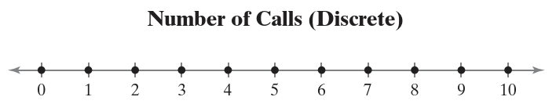
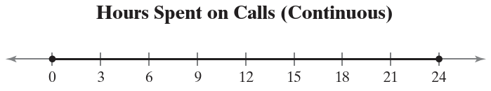
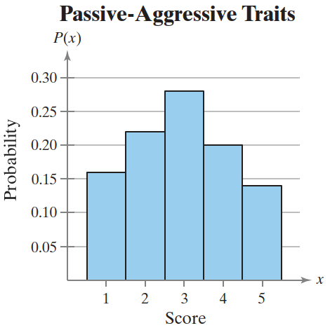
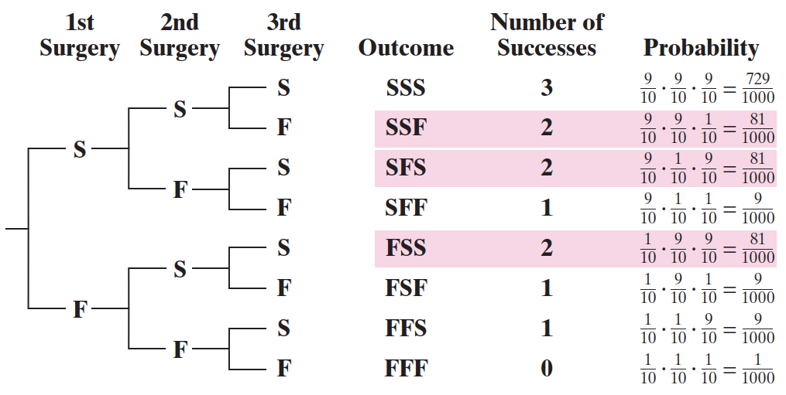
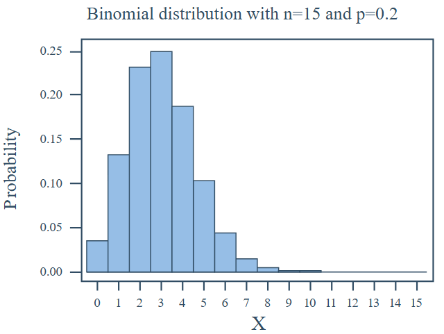
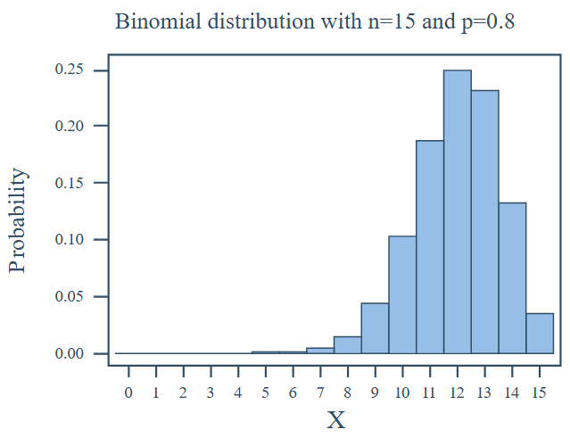
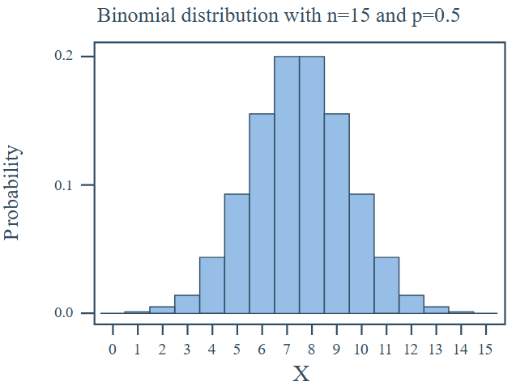
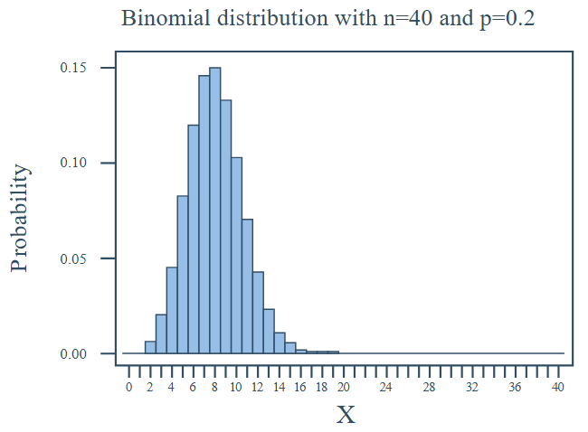

# 离散概率分布

2024-11-12⭐
@author Jiawei Mao
***

## 1. 概率分布

### 随机变量

概率实验的结果通常是计数或测量值(measure)，称为**随机变量**，记为 $x$。

随机变量有两种类型：

- 离散（discrete）：随机变量的可取值是有限的
- 连续（continuous）：随机变量具有无数种可能结果

在大多数应用中，离散随机变量表示**计数数据**，而连续随机变量表示**测量数据**。例如，电话营销公司一天拨打的电话数就是离散分布，可以表示为数轴上的点：



如果研究电话营销公司一天内打电话的时间（小时），打电话时间可以是 0 到 24 之间的任何数字，所以 x 是连续随机变量，可以在数轴上用区间表示：



离散随机变量可以列出变量所有的可能取值，但不可能列出连续随机变量的所有取值。

### 离散概率分布简介

离散随机变量的每个值都可以分配一个概率。列出离散随机变量的每个值以及对应的概率，就形成了**离散概率分布**（discrete probability distribution）。

离散概率分布**必须满足如下条件**：

1. 离散随机变量的每个值的概率在 0 到 1 之间

$$
0\le P(x)\le 1
$$

2. 所有概率加和为 1

$$
\sum P(x)=1
$$

概率代表了相对频率，可以用相对频率直方图（relative frequency histogram）来绘制离散概率分布。

**构建离散概率分布**

令 $x$ 为离散随机变量，可能取值包括 $x_1,x_2,\cdots,x_n$。

1. 生成所有可能取值的频率分布
2. 计算频率加和
3. 将每个可能结果的频率除以频率和，得到该结果的概率
4. 检查每个概率是否在 0 到 1 之间，所有概率加和是否为 1

**示例：** 心理学家对150名员工进行了一项关于被动攻击性性格测试。每个人给一个 从 1 到 5 的整数打分，1 表示极其被动，5 表示极其攻击性，3 表示特征。结果如下：

| 打分 | 频率 |
| ---- | ---- |
| 1    | 24   |
| 2    | 33   |
| 3    | 42   |
| 4    | 30   |
| 5    | 21   |

对应离散概率分布：

| x    | P(x) |
| ---- | ---- |
| 1    | 0.16 |
| 2    | 0.22 |
| 3    | 0.28 |
| 4    | 0.20 |
| 5    | 0.14 |

可以发现， x 的每个概率值在 0 到 1 之间，概率之和为 1，所以该分布为离散概率分布。分布图如下：



每个 bar 的宽度为 1，因此每个 bar 的面积等于对应概率值。此外，事件的概率为该事件所含结果的面积之和。例如，“打分为 2 和 3”时间的概率等于 bar 2 和 bar3 的面积之和。

### 均值、方差和标准差

可以用平均值（mean）来衡量概率分布的中心，用方差（variance）和标准差（standard deviation）来衡量变异性。

**离散随机变量的均值**为：

$$
\mu=\sum xP(x)
$$

每个 $x$ 的值乘以其概率，然后将乘积相加。

随机变量的平均值代表概率实现的理论平均值。

**离散随机变量的方差**（variance）为：
$$
\sigma^2=\sum(x-\mu)^2P(x)
$$

**标准差**（standard deviation）为：
$$
\sigma=\sqrt{\sigma^2}=\sqrt{\sum(x-\mu)^2P(x)}
$$

### 期望值

随机变量的平均值，也称为**期望值**（expected value）。

即，离散随机变量的期望值等于该随机变量的平均值：
$$
\text{Expected Value}=E(x)=\mu=\sum xP(x)
$$

## 2. 二项分布

### 二项试验

每次试验只有两种可能结果，例如，一名篮球运动员罚球，要么投中、要么投不中，这类概率实验称为**二项试验**（Binomial Experiment）。

满足如下条件的二项试验为概率实验：

1. 试验次数（trial）固定为 $n$，每次试验互相独立
2. 每次试验只有两种结果，可以归类为成功（S）或失败（F）
3. 每次试验成功的概率相同
4. 随机变量 $x$ 表示试验成功的次数

二项分布包括参数 $n$ 和 $p$。

符号：

- 试验次数：$n$
- 单次试验成功的概率：$p$
- 单次试验失败的概率：$q=1-p$
- 表示 $n$ 次试验成功次数的随机变量：$x=0,1,2,\cdots,n$

**示例：** 从一副扑克牌中抽一张牌，看是否为梅花，然后放回。重复试验 5 次，所以 $n=5$。每次试验的结果可以分为两类：$S$ 选中梅花和 $F$ 没有选到梅花。概率：

$$
p=\frac{1}{4}\\
q=1-\frac{1}{4}=\frac{3}{4}
$$

随机变量 $x$ 表示 5 次试验中选中梅花的次数。因此，随机变量的可能取值为 $x=0,1,2,3,4,5$。因为能够列出 $x$ 的可能取值，所以 $x$ 为离散随机变量。

> [!NOTE]
>
> 对无放回随机抽样得到的样本，事件之间是相关的。但是，当样本量不超过总体 5% 时，可以将其视为二项试验，将事件视为独立实验。即 $n\le 0.05N$。

### 二项概率公式

计算二项试验中 $n$ 次试验成功 $x$ 次的概率有多种方法，如树形图和乘法规则。二项式概率公式是最简单的方法。

在二项试验中，$n$ 次试验恰好成功 $x$ 次的概率是：
$$
P(x)=\binom{n}{x}p^xq^{n-x}=\frac{n!}{(n-x)!x!}p^xq^{n-x}
$$

**示例：** 肩袖手术的成功率为 90%。在三名患者身上进行该手术，刚好在两名患者身上成功的概率。

**方法一：** 绘制树形图并使用乘法规则



树形图中，正好有三种结果对应两次成功，概率均为 $\frac{81}{1000}$。因此，恰好两名患者手术成功的概率为 $3\times \frac{81}{1000}=0.243$。

**方法二：** 二项概率公式

在该二项试验，$n=3$, $p=\frac{9}{10}$, $q=\frac{1}{10}$, $x=2$。正好两次成功的概率为：

$$
P(2)=\frac{3!}{(3-2)!2!}(\frac{9}{10})^2(\frac{1}{10})^1=3(\frac{81}{100})(\frac{1}{10})=0.243
$$

列出随机变量 $x$ 的可能值即对应概率，就得到**二项概率分布**（binomial probability distribution）。

### 计算二项概率

除了使用二项概率公式，还有许多工具可以计算二项概率。

#### Excel

`BINOM.DIST(x,n,p,cumulative)`

- `x` 表示成功次数
- n 表示试验次数
- p 表示成功概率
- `cumulative` 为 boolean 类型，是否计算累计概率

### 二项分布图示

二项分布为离散分布，因此可以使用 histogram 绘制。

二项分布的形状受两个参数影响：

1. 独立试验次数 $n$
2. 成功概率 $p$

**当 $n$ 小，$p$ 小**，二项分布的直方图为**右偏分布**（skew right），即大部分概率落在较小的数字上，而分布向右逐渐减小。例如，下面是 $n=15$, $p=0.5$ 的二项分布图：



**当 n 小，p 大**，二项分布的直方图为**左偏分布**（skew left），即大部分概率落在较大数字上，而分布向左的概率逐渐减小。例如，下面是 $n=15$, $p=0.8$ 的二项分布图：



> [!TIP]
>
> 右偏分布的尾巴在右边，左偏分布的尾巴在左边。

**当 $p=0.5$，不管 n 大小**，二项分布的直方图都是对称的。例如，下图是 $n=15$, $p=0.5$ 的二项分布图：



当 n 大，p 小，二项分布接近对称。例如，当 $p=0.2$, n 很小时，二项分布会右偏，但是当 n 很大时，分布几乎是对称的。例如，$n=40$, $p=0.2$ 的二项分布图：



### 均值、方差和标准差

二项分布也是离散概率分布，因此可以使用[离散概率分布的平均值、方差和标准差公式](#均值方差和标准差)。不过二项分布还有更简介的计算公式：

平均值：

$$
\mu=np
$$

方差：

$$
\sigma^2=npq
$$

标准差：

$$
\sigma=\sqrt{npq}
$$

## 3. 几何分布

生活中许多动作都会重复进行，直到成功。例如，多次发送一封电子邮件，直到成功发送。几何分布就是获得一次成功所需进行的伯努利实验次数 $x$ 的分布。

满足如下条件的离散随机变量 $x$ 服从**几何分布**（geometric distribution）：

1. 重复试验，直到成功
2. 重复试验彼此独立
3. 每次试验成功的概率相同，记为 $p$
4. 随机变量 $x$ 表示到第一次成功的试验次数

在第 $x$ 次实验第一次成功的概率是：
$$
P(x)=pq^{x-1}
$$
其中，$q=1-p$。

**示例：** 某型号手机的故障率为 43%，随机选择 4 部该型号手机，计算第 4 部手机第一个出现故障的概率。

$p=0.43$, $q=0.57$, $x=4$，因此：

$$
P(4)=0.43(0.57)^{3}\approx 0.08
$$

因此，第 4 部手机首次出现故障的概率约为 0.08.

### 均值、方差和标准差

**几何分布的平均值**：

$$
\mu=\frac{1}{p}
$$

**示例：** 假设成功的概率为 0.8，同时符合几何分布，那么期望值为：

$$
E(x)=\frac{1}{p}=\frac{1}{0.8}=1.25
$$

所以，期望试验 1.25 次会成功。

**几何分布的方差：**

$$
\sigma^2=\frac{1-p}{p^2}
$$

## 4. 泊松分布

二项分布是找到 $n$ 次试验成功 $x$ 次的概率。如果想知道给定时间、面积或体积内发生特定次数的概率，则可以使用**泊松分布（Poisson distribution）**。

泊松分布是满足如下条件的离散概率分布：

1. 实验为计算给定区间（interval）内时间发生的次数 $x$，该区间可以是时间、面积或体积
2. 事件在每个 interval 发生的概率相同
3. 一个 interval 事件发生的次数与另一个 interval 事件发生的次数无关（独立假设）

在某个 interval 正好发生 $x$ 次的概率为：

$$
P(x)=\frac{\mu^xe^{-\mu}}{x!}
$$

其中 e 为无理数，约为 2.71828，$\mu$ 是一个 interval 单元事件发生的平均次数。

**示例：** 某个路口每月发生事故的平均次数为 3.在任意一个月，该路口发生 4 次事故的概率？

这里 interval 为时间，其 1 个月，平均值 $\mu=3$，$x=3$，概率为：

$$
P(4)=\frac{3^4e^{-4}}{4!}\approx 0.168
$$

### commons-math

`PoissonDistribution` 参数为泊松分布均值，用 `probability(x)` 计算指定 x 个概率：

```java
PoissonDistribution dis = new PoissonDistribution(3);
dis.probability(4);
```

**示例：**一块地里每亩平均有 3.6 只兔子，计算每亩地平均发现 7 只兔子的概率：

```java
PoissonDistribution dis = new PoissonDistribution(3.6);
System.out.println(dis.probability(7));
// 0.042484140269309405
```

因此，在任意一亩地发现 7 只兔子的概率为 0.0425，由于 0.0425 小于 0.05，因此这可以视为异常事件（unusual-event）。

**示例：** 将 2000 条鳟鱼放入一个小湖，该湖的容积为 20,000 立方米。计算任意给定立方的湖中发现 3 条鳟鱼的概率：

```java
double p = 2000 / 20000.;
PoissonDistribution dis = new PoissonDistribution(p);
System.out.println(dis.probability(3));
// 1.508062363393265E-4
```

### 应用

泊松分布在商业、社会学、计算机等领域有着不计其数的应用。例如，消防部分需要统计平均每天需要应对的救援情况，如果平均每天 15 起，那有一天出现了 19 起，是否为异常事件？

另外，使用泊松分布的一个常见误区是将期望值当作发生概率最大的情况，例如，如果消防事件每天 15 起，尽管这是期望值，但是其概率只有 0.102，而大于 15 的概率为 0.432，如果只准备了应对 15 起消防任务的物资，就有 43.2% 的可能应对不足。

## 参考

- 概率论与数理统计-陈希孺
- Elementary Statistics: Picturing the World, 7ed
- https://www.statology.org/dbinom-pbinom-qbinom-rbinom-in-r/
- https://rpubs.com/mpfoley73/458411
- https://online.stat.psu.edu/stat414/lesson/10/10.4
- https://en.wikipedia.org/wiki/Geometric_distribution
