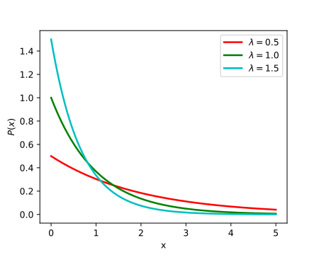

# 指数分布

## 简介

指数分布的概率密度函数：

$$
f(x)=\begin{cases}
    \lambda e^{-\lambda x}, &\text{当 } x>0 \text{ 时}\\
    0, &\text{当 } x\le 0 \text{ 时}
\end{cases}
$$

图示：

说明：

- 当 $x\le 0$ 时 $f(x)=0$，表示随机变量取负值的概率为 0；
- $\lambda e^{-\lambda x}$ 在 $x=0$ 处的值 $\lambda > 0$，估密度函数 $f(x)$ 在 $x=0$ 处不连续。

指数分布的分布函数：

$$
\begin{aligned}
F(x)&=\int_{-\infty}^x f(t)dt\\
    &=\begin{cases}
        0, &\text{当} x\le 0 \text{时}\\
        1-e^{-\lambda x}, &\text{当} x>0 \text{时}
    \end{cases}
\end{aligned}
$$

其中 $\lambda^{-1}$ 就是均值。

## 应用

指数分布最常见的一个场合是**寿命分布**。指数分布描述了**无老化**时的寿命分布，但“无老化”是不可能的，因此只是一种近似。对一些寿命长的元件，在初期老化现象较小，此时指数分布比较确切地描述其寿命分布。

比如人的寿命，一般在 50 或 60 之前，生理上老化的因素是次要的，若排除意外情况，人的寿命分布在这个阶段也接近指数分布。

## 参考

- https://en.wikipedia.org/wiki/Exponential_distribution