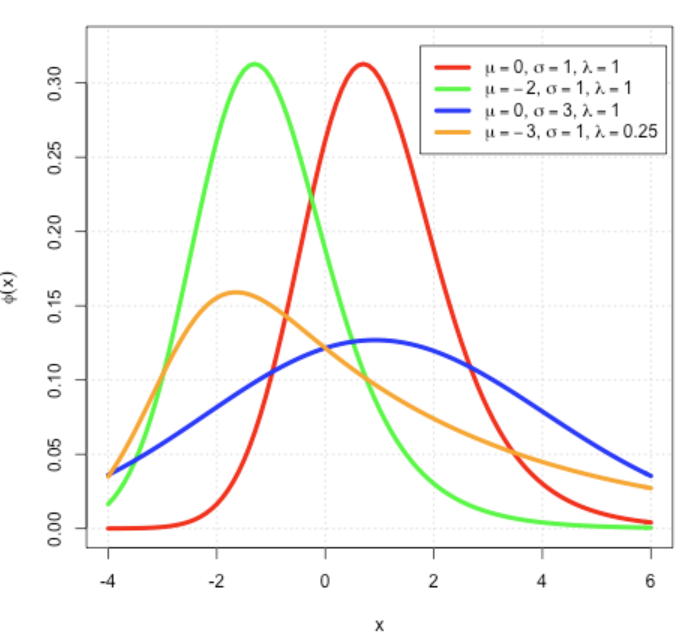

# 指数修正高斯分布

## 简介

指数修饰高斯分布（Exponentially Modified Gaussian Distribution, EMG）是独立的正态随机变量与指数随机变量之和。EMG 随机变量 $Z$ 可以表示为 $Z=X+Y$，其中 $X$ 和 $Y$ 相互独立，$X$ 服从高斯分布，均值为 $\mu$，方差为 $\sigma^2$；$Y$ 是参数为 $\lambda$ 的指数分布。EMG 由于指数分布整体正正偏态。如下图：

EMG 的概率密度函数：
$$
f(x;\mu,\sigma,\lambda)=\frac{\lambda}{2}\exp[\frac{\lambda}{2}(2\mu+\lambda\sigma^2-2x)]\text{erfc}(\frac{\mu+\lambda\sigma^2-x}{\sqrt{2}\sigma})
$$
其中，`erfc` 是互补误差函数，定义为：
$$
\text{erfc}(x)=1-\text{erf}(x)=\frac{2}{\pi}\int_x^\infty e^{-t^2}dt
$$
该密度函数通过正态和指数概率密度函数的卷积得到。

## 另一种定义形式

EMG 分布的另一种等效形式用于描述色谱中峰的形状。如下所示：
$$
f(x;h,\mu,\sigma,\tau)=\frac{h\sigma}{\tau}\sqrt{\frac{\pi}{2}}\exp(\frac{1}{2}(\frac{\sigma}{\tau})^2-\frac{x-\mu}{\tau})\text{erfc}(\frac{1}{\sqrt{2}}(\frac{\sigma}{\tau}-\frac{x-\mu}{\sigma}))
$$
其中：

- $h$ 为高斯振幅
- $\tau=1/\lambda$ 指数弛豫时间，$\tau^2$ 为指数概率密函函数的方差

由于数值溢出，该函数对部分参数（如 $\tau=0$）无法计算值。Delley 等提出了另一种等效写法：
$$
f(x;h,\mu,\sigma,\tau)=h
$$

## 色谱峰拟合

## 参考

- https://en.wikipedia.org/wiki/Exponentially_modified_Gaussian_distribution

- https://pfchrom.com/Html_MS/EMG.htm