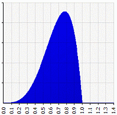
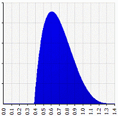
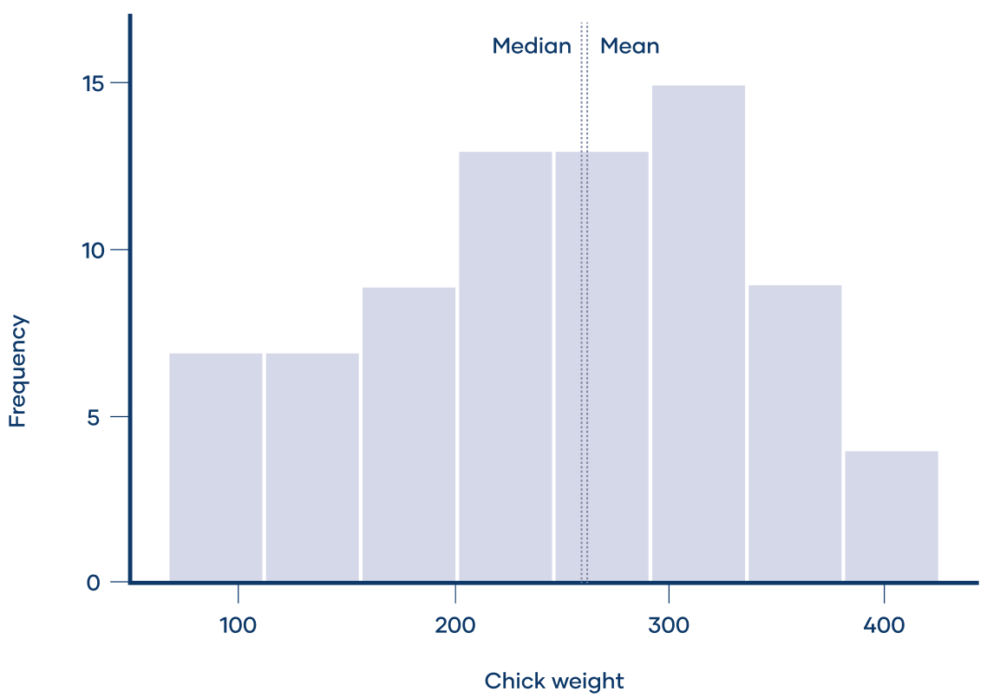
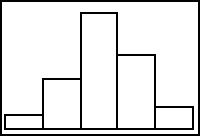
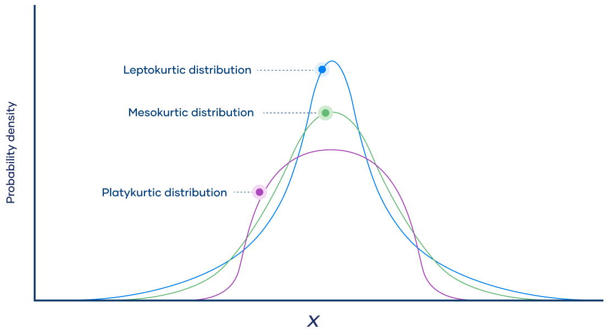

# 衡量分布的形状

## 简介

直方图可以让我们对数据分布的形状有一个大致了解，偏度和峰度则给出了更精确的衡量标准：

- **偏度**（skewness）：分布偏离水平对称性的方向和程度
- **峰度**（kurtosis）：相对标准钟形曲线的高度和锐度

偏度和峰度可用于正态性检验：许多统计推断要求分布为正态或近似正态分布。正态分布的偏度为 0，如果检验的分布接近该值，说明它可能近似正态分布。

## 偏度

对分布的形状，首先看它是单峰还是多峰。如果是单峰（**unimodal**），在看它是对称的（**symmetric**）还是偏向一侧（**skewed**）：
- 如果大部分数据位于左侧，**右边尾巴较长**，就称其向**右偏**（**skewed right**）或正向偏（positively skewed）
- 如果大部分数据位于右侧，**左边尾巴较长**，就称其向**左偏**（**skewed left**）或负向偏（negatively skewed）

如下图所示，两个分布具有相同的均值和方差：$\mu=0.6923$, $\sigma=0.1685$，但是形状不同：



> **左偏**：Beta(α=4.5, β=2) skewness= -0.5370
>
> beta 分布是数学建模中常使用的偏态分布之一。



> **右边**：1.3846 - Beta(α=4.5, β=2) skewness= +0.5370

第一个分布向左偏：左尾较长，大分部分布在右侧。

第二个分布向右偏：右尾较长，大部分分布在左侧。

我们将衡量倾斜程度的统计量称为**偏度**，它应该具有如下特性：

- 当偏度为 0，分布两侧对称，即左右两侧呈镜像分布

正态分布的偏度为 0，但不是唯一偏度为 0 的分布。任何对称分布，如均匀分布，甚至某些双峰分布的偏度也是 0。

检查一个变量的分布是否对称，最简单的方法是绘制直方图。例如，绘制 6 周龄小鸡的体重分布。分布大致对称，峰两侧的分布比较相似，偏度约为 0。



> [!TIP]
>
> 偏度为 0 的分布，其均值和中位数相等。
>
> **右偏分布**（right-skewed）的平均值几乎总是大于中位数。因为右边极值对平均值的影响大于对中位数的影响。
>
> 同理，左偏分布的平均值小于中位数。

上图中，小鸡的平均体重为 261.3 g，中位数为 258g。平均值和中位数大致相等，不完全相等是因为样本分布有轻微倾斜。

虽然理论分布（如 z 分布）的偏度为 0，但实际数据总是有一点倾斜。

### 计算偏度

- **Pearson's median skewness**

衡量偏度的公式有多种。最简单的是 Pearson 中位数偏度，利用倾斜分布中中位数和平均值不想等的特点：
$$
\text{Pearson's median skewness}=3\times\frac{\text{Mean}-\text{Median}}{\text{Standard deviation}}
$$
Pearson 中位数偏度衡量平均值和中位数之间相差多少个标准差。

实际样本很少有 Pearson 中位数偏度为 0，对大样本一般该值在 -0.4 到 0.4 之间就可以认为是对称的。

- moment coefficient of skewness

该定义使用更为广泛。
$$
s=E[(\frac{x-\overline{x}}{\sigma})^3]=\frac{m_3}{m_2^{3/2}}
$$
其中:
$$
m_3=\sum(x-\overline{x})^3/n
$$

$$
m_2=\sum(x-\overline{x})^2/n
$$

$\overline{x}$ 为均值，$n$ 为样本量。$m_3$ 称为数据集的第三矩（third moment），$m_2$ 为方差。

对样本和总体，方差和标准差的计算公式稍微有不同。对 skewness 也是如此，对总体就是上述公式，样本偏度则为：
$$
S=\frac{\sqrt{n(n-1)}}{n-2}s
$$
Excel 也提供了计算偏度功能，总是计算的样本偏度。

#### 示例：大学男生身高

以下是 100 名随机选择的男学生的数据：

| Height (inches) | Class Mark, *x* | Frequency, *f* |
| :-------------: | :-------------: | :------------: |
|    59.5–62.5    |       61        |       5        |
|    62.5–65.5    |       64        |       18       |
|    65.5–68.5    |       67        |       42       |
|    68.5–71.5    |       70        |       27       |
|    71.5–74.5    |       73        |       8        |

直方图显示为左偏：



样本量：
$$
n=5+18+42+27+8=100
$$
平均值：
$$
\overline{x}=(61\times 5+64\times 18+67\times 42+70\times 27+73\times 8)/100=67.45
$$
计算偏度：

| Class Mark, *x* | Frequency, *f* | *xf*  | (*x*−*x̅*) | (*x*−*x̅*)²*f* | (*x*−*x̅*)³*f* |
| :-------------: | :------------: | :---: | :-------: | :-----------: | :-----------: |
|       61        |       5        |  305  |   -6.45   |    208.01     |   -1341.68    |
|       64        |       18       | 1152  |   -3.45   |    214.25     |    -739.15    |
|       67        |       42       | 2814  |   -0.45   |     8.51      |     -3.83     |
|       70        |       27       | 1890  |   2.55    |    175.57     |    447.70     |
|       73        |       8        |  584  |   5.55    |    246.42     |    1367.63    |
||        ∑        |      6745      | *n*/a |  852.75   |    −269.33    |
|| *x̅*, *m*2, *m*3 |     67.45      | *n*/a |  8.5275   |    −2.6933    |

计算总体偏度：
$$
s=\frac{m_3}{m_2^{3/2}}=\frac{-2.6933}{8.5275^{3/2}}=-0.1082
$$
计算样本偏度：
$$
S=\frac{\sqrt{n(n-1)}}{n-2}s=\frac{\sqrt{100\times 99}}{98}\times -0.1082=-0.1098
$$
用 commons-statistics 计算，commons-statistics 默认计算样本 skewness，启用 bias 计算总体 skewness：

```java
@Test
void skew() {
    IntList dataList = new IntArrayList(100);
    repeat(61, 5, dataList);
    repeat(64, 18, dataList);
    repeat(67, 42, dataList);
    repeat(70, 27, dataList);
    repeat(73, 8, dataList);

    double skewness = Skewness.of(dataList.toIntArray()).getAsDouble();
    assertEquals(-0.1098, skewness, 1E-4);
    assertEquals(-0.1082, Skewness.of(dataList.toIntArray()).setBiased(true).getAsDouble(), 1E-4);
}

private void repeat(int x, int n, List<Integer> list) {
    for (int i = 0; i < n; i++) {
        list.add(x);
    }
}
```

### 偏度解释

- 当偏度为正，则数据分布右偏，分布的右尾比左尾长
- 如果偏度为负，则数据左偏，分布的左尾更长
- 如果偏度为 0，则数据完全对称

在现实世界中，偏度恰好为 0 的概率很小，有一个经验法则：

- 偏度小于 -1 或大于 1，分布为高度倾斜
- 偏度在 [-1,-1/2] 或 [1/2,1] 范围，则分布为中等倾斜
- 偏度在 [-1/2,1/2] 之间，则近似对称

上例偏度为 -0.1098，表示学生身高的样本数据近似对称。

### 推断

我们得到的数据通常只是从总体抽取的一个样本。即使总体是对称的，样本也可能倾斜。但是，如果样本偏度太大，无法用随机性进行解释，那么可以得到总体存在偏度的结论。

将样本偏度 $G_1$除以偏度的标准差(standard error of skewness, SES) 得到检验统计量：
$$
Z_{g1}=\frac{G_1}{SES}
$$
其中，SES 等于：
$$
SES=\sqrt{\frac{6n(n-1)}{(n-2)(n+1)(n+3)}}
$$
有些人建议使用 $\sqrt{6/n}$，但是对小样本，该近似效果太差。

在 0.05 显著性水平，对偏度 $\ne 0$ 的双尾检验，临界值 $Z_{g1}$ 近似为 2，因此：

- 如果 $Z_{g1}\lt -2$，则总体很可能左偏（尽管我们不知道有多偏）
- 如果 $Z_{g1}$ 在 -2 到 +2 之间，则无法得出总体偏度的任何结论：它可能对称，也可能向任何方向偏
- 如果 $Z_{g1}\gt 2$，总体很可能有偏（尽管我们不知道有多偏）

千万不要混淆该检验统计量与偏度的含义：

- 偏度告诉你样本的分布有多偏：值越大，样本分布越偏
- 检验统计量告诉你总体是否可能倾斜，但不能告诉你倾斜程度：值越大，概率越高

### 估计

GraphPad 建议偏度的置信区间：
$$
\text{总体偏度的 95\% 置信区间}=G_1\pm 2\text{SES}
$$
https://www.graphpad.com/support/faqid/1577/

### 数据转换

有很多数据分析要求分布是正态分布，对非正态分布，可以对齐进行转换。

| Skew 类型 | Skew 强度 | 转换               |
| --------- | --------- | ------------------ |
| **右偏**  | 轻微      | 不转换             |
|           | 中等      | 平方根             |
|           | 强        | 自然对数           |
|           | 很强      | log10              |
| **左偏**  | 轻微      | 不转换             |
|           | 中等      | reflect + 平方根   |
|           | 强        | reflect + 自然对数 |
|           | 很强      | reflect + log10    |

> [!NOTE]
>
> reflect 指取数据中的最大值 $K$，然后用 $K+1$ 减去每个数据。

## 峰度

另一个衡量形状的指标为**峰度（Kurtosis）**。偏度涉及分布的三阶矩，峰度则包含四阶矩。因此，样本中的 outliers 对峰度的影响比对偏度的影响更大。峰度可以衡量分布中尾部（outlier）厚度的指标。

均值和标准差的单位与原始数据相同，方差的是单位的平方。峰度和偏度一样，没有单位，和 z-score 一样。

峰度值高意味着方差更多是少量极端值导致的。即峰度主要由 tails 贡献，而非中心峰。

峰度参考正态分布定义，正态分布的峰度为 3。**过量峰度**（excess-kurtosis） 定义为 kurtosis-3，例如，Excel 报告的峰度其实就是 excess-kurtosis：

- 正态分布的峰度为 3，其过量峰度为 0。任何峰度 $\approx 3$ (过量峰度 $\approx 0$) 的分布称为 **mesokurtic**
- 峰度 <3 ( excess-kurtosis < 0) 的分布称为 **platykurtic**。相对正态分布，其尾巴更短更薄，中心更宽更低
- 峰度 >3 (excess-kurtosis > 0) 的分布称为 **leptokurtic**。相对正态分布，其尾巴更长更粗，中心更尖更高

尾巴（tails）是分布两侧逐渐变细的末端。它们表示相对平均值很大或很小值（极端值）的概率。换言之，tails 代表 **outlier 发生的概率**。例如：



|                      | Mesokurtic                                                   | Platykurtic | Leptokurtic |
| :------------------- | :----------------------------------------------------------- | :---------- | ----------- |
| Tailedness           | Medium-tailed                                                | Thin-tailed | Fat-tailed  |
| Outlier frequency    | Medium                                                       | Low         | High        |
| Kurtosis             | Moderate (3)                                                 | Low (< 3)   | High (> 3)  |
| Excess kurtosis      | 0                                                            | Negative    | Positive    |
| Example distribution | [Normal](https://www.scribbr.com/statistics/normal-distribution/) | Uniform     | Laplace     |

Mesokurtic 表示 outliers 出现概率适量，不高不低，对应正态分布。

Platykurtic 分布与正态分布相比尾巴更薄，即 outliers 很少，所以：

- Platykurtic 分布的 kurtosis 小于 3
- Platykurtic 分布的 excess-kurtosis 小于 0

### 计算峰度

峰度为分布的标准化四阶矩。总体峰度：
$$
\mu_4=\frac{\mu_4}{\sigma^4}
$$


## 参考

- https://brownmath.com/stat/shape.htm
- https://www.scribbr.com/statistics/skewness/
- https://www.graphpad.com/support/faqid/1577/
