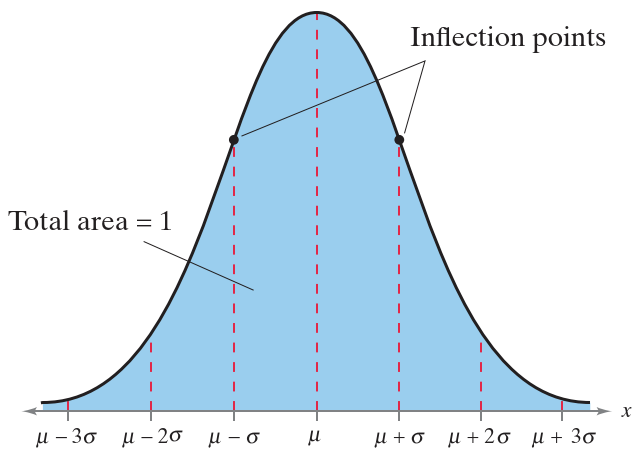
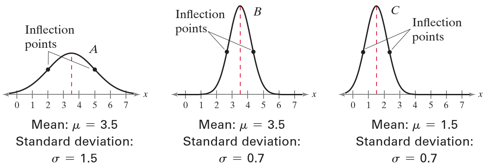
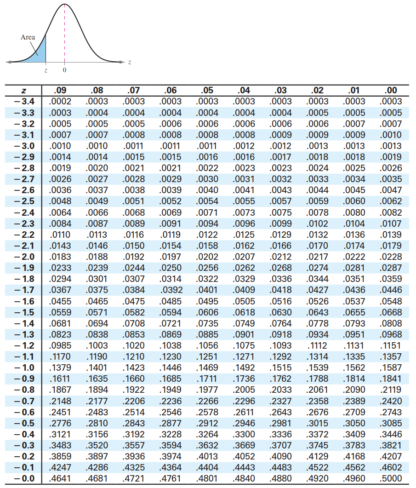
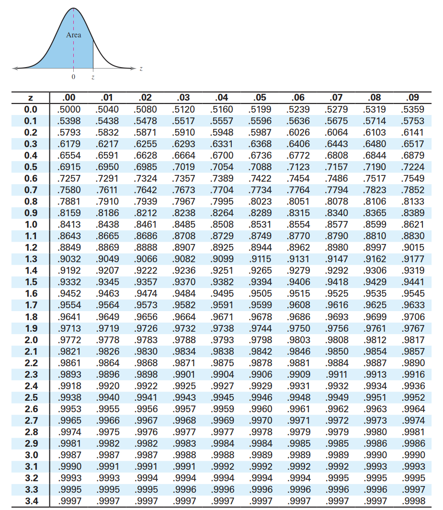
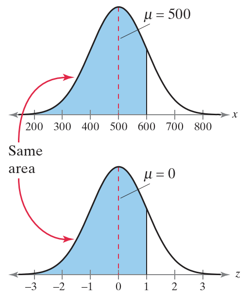
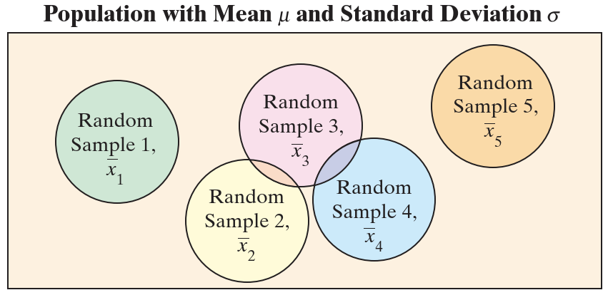
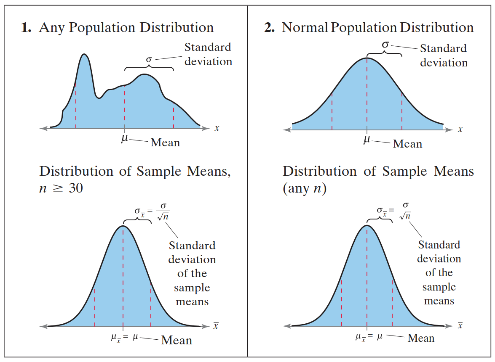
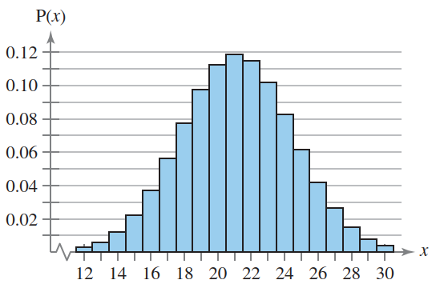
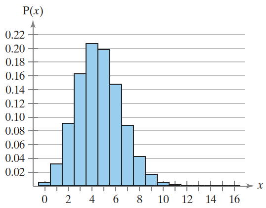
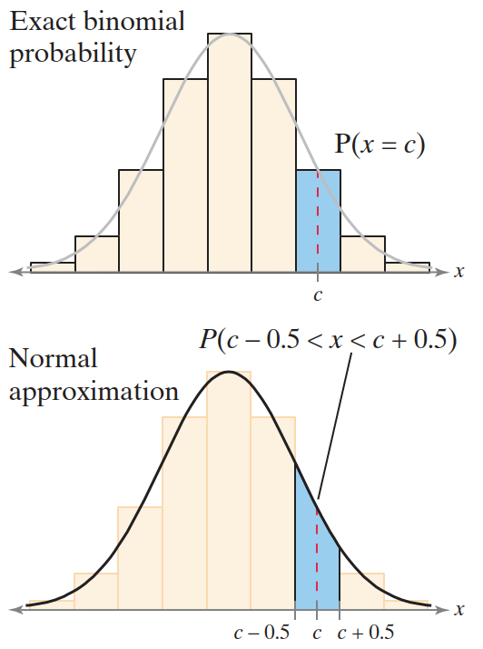

# 正态分布

- [正态分布](#正态分布)
  - [1. 正态分布简介](#1-正态分布简介)
    - [正态分布性质](#正态分布性质)
    - [标准正态分布](#标准正态分布)
  - [2. 正态分布概率](#2-正态分布概率)
  - [3. 计算值](#3-计算值)
  - [4. 抽样分布和中心极限定理](#4-抽样分布和中心极限定理)
    - [抽样分布](#抽样分布)
    - [中心极限定理](#中心极限定理)
    - [概率与中心极限定理](#概率与中心极限定理)
  - [5. 二项分布的正态近似](#5-二项分布的正态近似)
    - [连续性校正](#连续性校正)
    - [计算概率](#计算概率)
  - [应用](#应用)

2024-11-06⭐
@author Jiawei Mao
***

## 1. 正态分布简介

### 正态分布性质

**正态分布**（normal distribution）是最重要的连续概率分布。

正态分布的图形称为**正态曲线**（normal curve）。正态分布性质：

1. mean, median, mode 相等
2. normal-curve 呈钟形，关于 mean 对称
3. normal-curve 下的总面积等于 1
4. 离 mean 越远，normal-curve 约接近 x-axis，但不会碰到 x-axis
5. 在 $\mu-\sigma$ 到 $\mu+\sigma$ 之间（曲线中心），曲线向下弯曲。从 $\mu-\sigma$ 向左和 $\mu+\sigma$ 向右，曲线向上弯曲。曲线从向上弯曲变为向下弯曲的点称为**拐点**（inflection points）。

离散概率分布可以用直方图绘制。而连续概率分布可以用**概率密度函数**（probability density function, pdf）。pdf 有两个要求：

1. curve 下总面积为 1
2. 函数值不能为负数

正态分布的平均值和标准差 $\mu$, $\sigma$ 决定 normal-curve 的形状：

- 平均值确定对称线的位置
- 标准差决定数据的分散程度

下图中，curve-A 和 curve-B 的平均值相同，curve-B 和 curve-C 的标准差相同。每条 curve 下的总面积为 1。此外，在每个图中，在平均值左侧和右侧一个标准差的位置各有一个拐点。

### 标准正态分布

一个均值和一个标准差定义一个正态分布，有无数个正态分布。均值为 0、标准差为 1 的正态分布称为**标准正态分布**（standard normal distribution）。如下图：

标准正态分布的 normal-curve 的水平刻度对应 z-score。z-score 定义为距离均值相差几个标准差。即：

$$
z=\frac{x-\mu}{\sigma}
$$

将正态分布的随机变量 $x$ 的所有数据转换为 z-score，就得到标准正态分布。经过该变换，非标准正态曲线下的指定区间的面积与标准正态曲线相应的 z-score 范围的面积相同。

标准正态分布性质：

1. 在 $z=-3.49$ 附近累计概率接近 0
2. 随着 z-score 增加，累计面积随之增加
3. 当 $z=0$，累计面积为 0.5
4. 当 $z=3.49$，累计面积接近 1

标准正态分布下的面积可以通过查表计算：

## 2. 正态分布概率

当随机变量 $x$ 服从正态分布，可以通过计算区间内的 normal-curve 下的面积来求出 $x$ 位于某个区间的概率。

要计算任何正态曲线下的面积，首先将区间的范围转换为 z-score，然后用标准正态分布计算面积。例如，下面是一条 $\mu=500$, $\sigma=100$ 的 normal-curve。大于平均值一个标准差的 $x=\mu+\sigma=500+100=600$；而对标准正态分布，高于平均值一个标准差的 $z=\mu+\sigma=0+1=1$。由于 z-score 转换不会改变面积，所以下图中 $x=600$ 与标准正态分布 $z=1$ 的阴影面积相同。

## 3. 计算值

上面介绍了给定 $x$ 计算概率，现在介绍给定概率如何计算 $x$。

1. 计算累计面积（即概率）对应的 z-score，例如，概率 0.3632 对应的 z-score

查表知 $z=-0.35$。

2. 将 z-score 转换为 $x$

z-score 的定义为：

$$
z=\frac{x-\mu}{\sigma}
$$

转换得到：

$$
x=\mu+z\sigma
$$

## 4. 抽样分布和中心极限定理

### 抽样分布

**抽样分布**（sampling distribution）指从一个总体重复抽取大小为 $n$ 的随机样本形成的**样本统计量**的概率分布。

如果样本统计量为 sample-mean，则抽样分布为**样本均值的抽样分布**。每个样本统计量都有一个抽样分布。

如下图所示：矩形代表总体，每个圆圈代表一个大小为 $n$ 的随机样本。由于所含 entries 不同，不同样本的样本均值也可能不同。随机样本 1 的样本均值记为 $\overline{x_1}$，随机样本 2 的为 $\overline{x_2}$，依此类推。因此，该总体的大小为 $n$ 样本的样本均值的抽样分布由 $\overline{x_1},\overline{x_2},\overline{x_3}$ 等组成。如果是放回抽样，则可以从总体抽取无数个样本。

**样本均值抽样分布的性质**

1. sample-mean 的均值 $\mu_{\overline{x}}$ 等于总体均值 $\mu$

$$
\mu_{\overline{x}}=\mu
$$

2. sample-mean 的标准差 $\sigma_{\overline{x}}$ 等于总体的标准差 $\sigma$ 除以样本大小 $n$ 的平方根

$$
\sigma_{\overline{x}}=\frac{\sigma}{\sqrt{n}}
$$

sample-mean 的抽样分布的标准差称为**均值的标准误差**（standard error of the mean）。

### 中心极限定理

> [!IMPORTANT]
>
> 中心极限定理使得正态分布得到广泛引用。

**中心极限定理**（The Central Limit Theorem）是统计学中统计推断的基础。该定理描述了样本均值的抽样分布与总体之间的关系，提供了使用样本数据推断总体均值所需的信息。

**中心极限定理**

1. 从均值为 $\mu$, 标准差为 $\sigma$ 的任意总体中抽取大小为 $n$ 的随机样本，$n\ge 30$，那么样本均值的抽样分布近似于正态分布。样本量越大，近似越好。
2. 如果总体服从正态分布，那么无论样本大小 $n$ 多大，样本均值的抽样分布都服从正态分布。

对两种情况，样本均值的抽样分布的均值都等于总体均值：

$$
\mu_{\overline{x}}=\mu
$$

样本均值的抽样分布的方差等于总体方差的 $1/n$，标准差等于总体标准差的 $1/\sqrt{n}$。

$$
\sigma_{\overline{x}}^2=\frac{\sigma^2}{n}
$$

$$
\sigma_{\overline{x}}=\frac{\sigma}{\sqrt{n}}
$$

样本均值的抽样分布的标准差 $\sigma_{\overline{x}}$ 也称为均值的标准误差（standard error of the mean）。

### 概率与中心极限定理

满足中心极限定理的抽样分布，可以通过正态分布计算指定样本均值对应的概率。首先，将样本均值 $\overline{x}$ 转换为 z-score：

$$
z=\frac{\overline{x}-\mu_{\overline{x}}}{\sigma_{\overline{x}}}=\frac{\overline{x}-\mu}{\sigma/\sqrt{n}}
$$

## 5. 二项分布的正态近似

假设一个外科手术成功率为 85%，当医生对 10 位患者进行该手术，可以使用二项公式来找到恰好两次手术成功的概率。

如果医生对 150 名患者进行手术，少于 100 次成功的概率是多少？如果使用二项式公式，需要计算 100 次概率然后求和。这种方法不切实际，更好的办法是使用正态分布来近似二项分布。

**二项分布的正态近似**

如果 $np\ge 5$ 且 $nq \ge 5$，则二项随机变量 $x$ 近似服从正态分布，其均值为：

$$
\mu = np
$$

标准差：

$$
\sigma=\sqrt{npq}
$$

其中，$n$ 为独立试验次数，$p$ 是单次试验成功的概率，$q$ 是单次试验失败的概率。

如下图所示：

可以看到，随着 $n$ 增加，二项分布的形状越接近正态分布。

**例 1** 在一项针对美国 8-18 岁重度媒体用户的调查中，47% 的人表示他们的成绩一般（C 及以下）。随机选择 45 名美国 8-18 岁的重度媒体用户，并询问他们的成绩。

在该二项实验，$n=45$, $p=0.47$, $q=0.53$。因此：

$$
np=45\times 0.47=21.15 \\
nq=45\times 0.53=23.85
$$

因为 np 和 nq 都大于 5，所以可以用正态分布近似，且：

$$
\mu=np=21.15
$$

$$
\sigma=\sqrt{npq}=\sqrt{45\times 0.47\times 0.53}\approx 3.35
$$

二项分布图如下：

可以发现，二项分布 curve 近似钟形。

**例 2** 对上例，如果只有 23% 的人表示他们成绩较差。随机选择 20 名美国 8-18 岁的轻媒体用户，并询问它们的成绩。

在该二项试验中，$n=20$, $p=0.23$, $q=0.77$，因此：

$$
np=20\times 0.23=4.6\\
nq=20\times 0.77=15.4
$$

因为，$np < 5$，所以不能使用正态分布来近似 $x$ 的分布。如下图所示，二项分布向右倾斜。

### 连续性校正

二项分布是离散的，可以用概率直方图表示。要计算精确的二项式概率，可以对 $x$ 的每个值使用二项式公式计算并相加。从几何学上讲，这相当于将概率直方图中的条形面积相加，如下图。每个 bar 的宽度为 1，$x$ 在 bar 中间。

当使用连续的正态分布来近似二项概率，需要将 $x$ 向左右各移动 0.5 单位，以包含 bar 区间内的所有 x 值。该操作就是**连续性校正（continuity correction）**。

下表是如何将数字 $c$ 相应的二项概率转换为正态分布概率。

| Binomial | Normal               | Notes      |
| -------- | -------------------- | ---------- |
| 等于 c   | P(c-0.5 < x < c+0.5) | Includes c |
| 不大于 c | P(x < c+0.5)         | Includes c |
| 小于 c   | P(x< c-0.5)          | Excludes c |
| 不小于 c | P(x > c-0.5)         | Includes c |
| 大于 c   | P(x > c+0.5)         | Excludes c |

### 计算概率

**使用正态分布近似二项概率**

1. 确定二项分布：指定 $n, p, q$
2. 确定是否能用正态分布近似二项分布变量 $x$：$np\ge 5$?, $nq\ge 5$?
3. 计算分布的均值 $\mu$ 和标准差 $\sigma$: $\mu=np$, $\sigma=\sqrt{npq}$
4. 应用连续性校正，以覆盖正态分布对应区域
5. 计算对应的 z-score: $z=\frac{x-\mu}{\sigma}$
6. 计算概率

## 应用

假设一个总体服从正态分布，其平均值为 100，标准差为 15。从该总体抽取单个值 >=115 并不罕见，该情况发生的概率约 16%。但是，从该总体速记抽取 100 个样本，该样本均值 >=115 就不寻常。由于总体为正态分布，样本平均值的抽样分布的平均值也是 100，标准差为 1.5。样本平均值 115 比平均值高 10 个标准差，这是一个极低概率。当发生该情况，就要怀疑原始参数或总体是服从正态分布。

