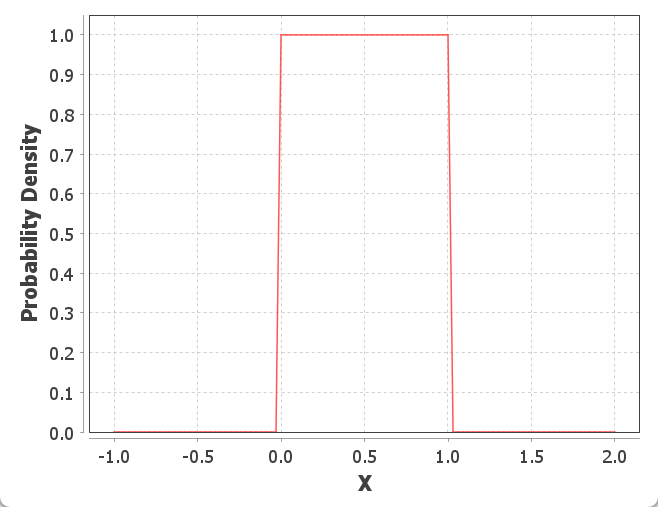

# 均匀分布

2023-05-24⭐
@author Jiawei Mao
****
## 简介

若连续型随机变量 $X$ 具有概率密度（PDF）：

$$
f(x)=\begin{cases}
\frac{1}{\beta-\alpha}, &\text{α<x<β},\\
0, &\text{其它}
\end{cases}\tag{1}
$$

就称 $X$ 在区间 $(\alpha,\beta)$ 上服从均匀分布，记为 $X\sim U(a,b)$ 或 $X\sim Uni(a,b)$。

**均匀分布表示**
$$
X\sim U(\alpha,\beta)
$$
**性质** 在 $(a,b)$ 之间，无论 $x$ 取什么值，概率密度都是 $1/(b-a)$。

**参数**

- $\alpha\in\Reals$, 变量最小值
- $\beta\in\Reals,\beta>\alpha$， 变量最大值
- $x\in[\alpha,\beta]$

**PDF 公式**
$$
f(x)=\begin{cases}
    \frac{1}{\beta-\alpha} & \text{for }x\in[\alpha,\beta]\\
    0& \text{else}
\end{cases}
$$

**CDF 公式**

$$
F(x)=\begin{cases}
    \frac{x-\alpha}{\beta-\alpha}&\text{for }x\in [\alpha,\beta]\\
    0&\text{for }x<\alpha\\
    1&\text{for} x>\beta
\end{cases}
$$

**期望值**

$$
E[X]=\frac{1}{2}(\alpha+\beta)
$$

**方差**

$$
Var(X)=\frac{1}{12}(\beta-\alpha)^2
$$

**PDF 图示**

$\alpha=0, \beta=1$

易知 $f(x)\ge 0$，且 $\int^{\infty}_{-\infty}f(x)dx=1$。

$f(x)$ 和 $F(x)$ 的图形如下所示：

矩形的底长为 (b-a)，高度为 $\frac{1}{b-a}$，所以面积为 1。

## 均匀分布性质

### 均值

$a<x<b$ 之间连续均匀随机变量的均值为：

$$\mu=E(X)=\frac{a+b}{2}$$
证明：

$$
\begin{aligned}
\mu &=E(x)\\
&=\int^{b}_{a}x(\frac{1}{b-a})dx\\
&=\frac{1}{b-a}[\frac{x^2}{2}]_{x=a}^{x=b}\\
&=\frac{1}{2(b-a)}(b^2-a^2)\\
&=\frac{a+b}{2}
\end{aligned}
$$

### 方差

$a<x<b$ 之间连续均匀随机变量的方差为：

$$\sigma^2=Var(X)=\frac{(b-a)^2}{12}$$
上面已经证明了均值公式，因此采用：

$$\sigma^2=E(X^2)-\mu^2$$

来计算方差。下面计算 $E(X^2)$ 部分：

$$
\begin{aligned}
E(X^2)&=\int^{b}_{a}x^2(\frac{1}{b-a})dx\\
&=\frac{1}{b-a}[\frac{x^3}{3}]_{x=a}^{x=b}\\
&=\frac{1}{b-a}\frac{b^3-a^3}{3}\\
&=\frac{a^2+ab+b^2}{3}
\end{aligned}
$$

因此，方差为：

$$
\begin{aligned}
\sigma^2 &= E(X^2)-\mu^2\\
&=\frac{a^2+ab+b^2}{3}-(\frac{a+b}{2})^2\\
&=\frac{a^2+ab+b^2}{3}-\frac{a^2+2ab+b^2}{4}\\
&=\frac{4a^2+4ab+4b^2-3a^2-6ab-3b^2}{12}\\
&=\frac{a^2+b^2-2ab}{12}\\
&=\frac{(b-a)^2}{12}
\end{aligned}
$$

## 示例

设电阻值 R 是一个随机变量，均匀分布在 900Ω~1100Ω。求 R 的概率密度及 R 落在950Ω~1050Ω 的概率。

**解：** 按题意，R 的概率密度为：

$$
f(r)=\begin{cases}
\frac{1}{1100-900}, &900<r<1100,\\
0, &其它
\end{cases}
$$

故有 $P\{950<R\le 1050\}=\int^{1050}_{950}\frac{1}{200}dr=0.5$。

## 参考

- https://online.stat.psu.edu/stat414/lesson/14/14.6
- 《概率论与数理统计》第四版，浙江大学，高等教育出版社
- https://chrispiech.github.io/probabilityForComputerScientists/en/part2/uniform