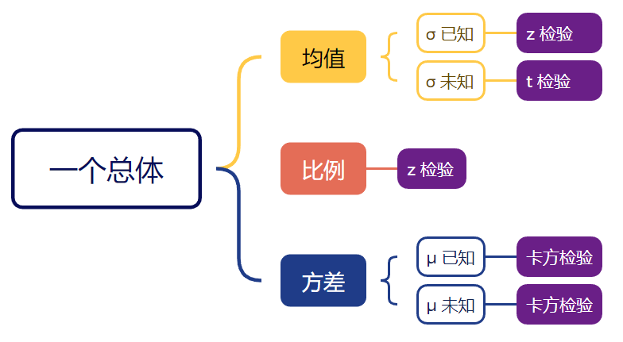
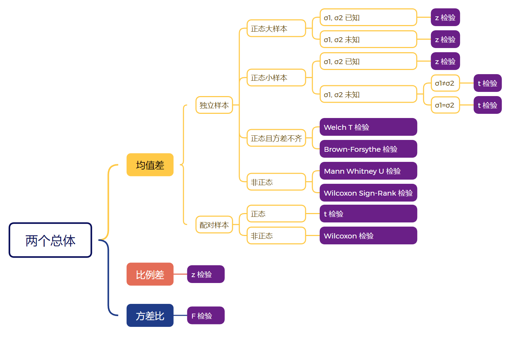

# 假设检验

- [假设检验概述](./test_intro.md)
- [单样本比例检验（z-test）](./test_one_ratio.md)
- [单样本方差检验（卡方检验）](./test_one_variance.md)
- [双独立样本均值差异检验（σ1 和 σ2 已知：z-test）](./test_two_mean_sigma.md)

## 单个总体

单总体均值检验：

- σ 已知，总体为正态分布，**或**样本数 $n\ge 30$：z-test
- σ 未知，总体为正态分布，或样本数 $n\ge 30$：t-test

单总体比例检验：要求 $np\ge 5$, $nq \ge 5$，此时可用正态分布近似 $\hat{p}$ 的抽样分布

- z-test

单总体方差检验：方差检验，要求：

1. 样本随机；
2. 总体为正态分布

### 流程

**声明假设**

- 提出关于总体参数的声明，包括 $\mu$, $p$, $\sigma^2$, $\sigma$；
- 根据声明定义假设：$H_0$ ($\le, \ge, =$) 和 $H_a$ ($>, <, \ne$)；

**指定显著性水平**

- 显著性水平 $\alpha$，拒绝正确 $H_0$ 的最大可接受概率，即允许 I 类错误的最大概率；

**确定样本量**

- 样本量 $n$。

**选择检验类型**

- 均值检验
  - σ 已知：z-test
    - 总体为正态分布：z-test；
    - 总体为任意分布，$n \ge 30$：z-test；
  - σ 未知：t-test
    - 总体为正态分布：t-test；
    - 总体为任意分布，$n\ge 30$：t-test；
- 比例检验
  - $np \ge 5$, 且 $nq \ge 5$，总体为任意分布：z-test
- 方差或标准差检验
  - 总体为正态分布：chi-square test

**计算标准化检验统计量**

- 从总体抽取抽取 $n$ 个样本；
- 计算检验统计量 $\overline{x}$, $\hat{p}$, $s^2$；
- 计算标准化检验统计量 $z$, $t$ 或 $\chi^2$

**下结论**

- 方法一：基于拒绝域
  - 使用 $\alpha$ 计算临界值 $z_0$, $t_0$ 或 $\chi^2_0$，定义拒绝域
  - 当标准化检验统计量落在拒绝域，则拒绝 $H_0$，否则无法拒绝 $H_0$
- 方法二：基于 p-Value
  - 使用标准化检验统计量计算 p-Value
  - 当 $P\le \alpha$，拒绝 $H_0$；
  - 当 $P>\alpha$，无法拒绝 $H_0.

### 假设检验的错误使用

1. **没有使用随机样本**

假设检验的整个理论是基于样本是随机选择的。如果样本不随机，就不能用它来推断关于总体参数的任何信息。

2. **试图证明 null 假设**

当 p-Value 大于显著性水平，并不能证据 null 假设为真，只是没有足够证据来拒绝 null 假设。

3. **犯 Type I 或 Type II 错误**

Type I error 是拒绝一个正确的 null 假设，Type II error 是没能拒绝一个错误的 null 假设。

通过降低显著性水平 $\alpha$ 可以降低犯 Type I error 的概率。但是一般来说，降低犯 Type I 错误的概率，就会增加犯 Type II error 的概率 $\beta$。哪种错误更严重取决于具体情况。例如，在刑事审判中，认为犯 Type I error 更严重，$H_0$ 假定被告无罪，Type I error 将无罪判为有罪。在体检时，$H_0$ 设为健康，那么 Type II error 就更严重，即一个人有病，但是没有检测出来。

通过增加样本量，可以同时减少犯这两类错误的概率。

## 两个总体

