# 卡方检验和 F 分布

- [卡方检验和 F 分布](#卡方检验和-f-分布)
  - [1. 卡方拟合优度检验](#1-卡方拟合优度检验)
  - [2. 独立性检验](#2-独立性检验)
    - [列联表](#列联表)
    - [卡方独立性检验](#卡方独立性检验)
  - [3. 比较两个方差](#3-比较两个方差)
    - [F 分布](#f-分布)
    - [方差的双样本 F 检验](#方差的双样本-f-检验)
  - [4. 方差分析](#4-方差分析)
    - [单因素方差分析](#单因素方差分析)
    - [双因素方差分析](#双因素方差分析)

2024-12-09⭐
@author Jiawei Mao
***

## 1. 卡方拟合优度检验

一家报税公司想要确定使用不同方法报税的人数比例。为了确定这些比例，该公司进行**多项式实验**（multinomial experiment）。多项式实验是一种概率实验，由固定数量的独立试验组成，每次试验都有两种以上的可能结果。每个结果的概率是固定的，并且每个结果都分为几类。

该公司希望测试零售贸易协会使用不同方法报税的人员比例的预期分布。为此，该公司可以将多项式实验获得的比例分布与该协会的预期分布进行比较。为了比较分布，该公司可以执行**卡方拟合优度检验**（chi-square goodness-of-fit test）。

> [!NOTE]
>
> 卡方拟合优度检验用于检验频率分布是否符合预期分布。

要拟合优度检验，首先陈述零假设和备择假设。通常零假设定义为频率分布符合预期分布，备择假设定义为频率分布不符合预期分布。

协会声称使用不同报税方式的人的预期分布为：

| 方式 | 比例 |
| ---- | ---- |
|会计师|24%|
|手动 |20%|
|软件|35%|
|朋友/家人|6%|
|报税服务|15%|

为了检验该协会的说法，该公司使用如下零假设和备择假设进行卡方拟合优度检验：

- $H_0$​：预计报税方法的分布为：会计师 24%，手动 20%，软件 35%，朋友/家人 6%，报税服务 15%。
- $H_a$：报税方法的分布与预期分布不同。

可以使用观测频率和预期频率计算卡方拟合优度检验的检验统计量。对预期频率，首先要假设零假设为 true。

一个类别的**观测频率** O 是样本数据中观察到的该类别的频率。

一个类别的**预期频率** E 可以使用预期分布和样本大小计算。第 i 个类比的预期频率为：
$$
E_i=np_i
$$
其中，$n$ 为样本量，$p_i$ 为第 i 个分类的预期概率。

**例 1** 计算观测频率和预期频率

一家报税公司随机选择了 300 名成年人，并询问他们如何报税。结果如下：

| 方式 | 频率 |
| ---- | ---- |
|会计师|63|
|手动 |40|
|软件|115|
|朋友/家人|29|
|报税服务|53|

计算每种报税方法的观测频率和预期频率（使用协会声称的比例）。

| 方式 | 人数比例 | 发现频率 | 预期频率 |
| ---- | ---- | ---- | ---- |
|会计师|24%|63|300*0.24=72|
|手动 |20%|40|300*0.20=60|
|软件|35%|115|300*0.35=105|
|朋友/家人|6%|29|300*0.06=18|
|报税服务|15%|53|300*0.15=45|

发现频率之和总是等于预期频率之和。

执行卡方优度检验之前，必须满足以下两个条件：

1. 观测频率是从随机样本获得
2. 每个预期频率至少为 5

注意：当某个分类的预期频率小于 5，可以将该类别与另一个类别合并，来满足第二个要求。

如果满足这两个条件，则抽样分布近似于自由度为 $k-1$ 的卡方分布，其中 $k$ 为类别数。**检验统计量**为：
$$
\chi^2=\sum \frac{(O-E)^2}{E}
$$

当观测频率与预期频率非常接近，O 和 E 之间的差异会很小，卡方检验统计量会接近于 0.因此不大可能拒绝零假设。

当观测频率与预期频率存在很大差异，O 和 E 之间的差异很大，从而导致卡方检验统计量很大。较大的卡方检验统计量是拒绝零假设的证据。因此，**卡方优度检验始终是右尾检验**。

**卡方优度检验流程**

1. 确定发现频率是从随机样本获得，预期频率至少为 5
2. 声明零假设和备择假设
3. 指定显著性水平
4. 确定自由度 $\text{d.f.}=k-1$
5. 根据卡方分布和显著性水平确定临界值
6. 确定拒绝域
7. 计算检验统计量

$$
\chi^2=\sum \frac{(O-E)^2}{E}
$$

8. 拒绝或无法拒绝零假设

如果 $\chi^2$ 在拒绝域，则拒绝 $H_0$，否则无法拒绝 $H_0$。

**例 2** 执行卡方优度检验

一家零售业协会声称，成年人的报税方法如下表所示。一家报税公司随机选择 300 名成年人，并询问他们如何报税。结果如下表。在 $\alpha=0.01$ 时，检验该协会的说法。

| 报税方式 | 预期比例 | 发现频率 | 预期频率 |
| ---- | ---- | ---- | ---- |
|会计师|24%|63|300*0.24=72|
|手动 |20%|40|300*0.20=60|
|软件|35%|115|300*0.35=105|
|朋友/家人|6%|29|300*0.06=18|
|报税服务|15%|53|300*0.15=45|

从上表可知预期频率均大于 5，且样本随机。因此可以使用卡方优度检验来检验分布。以下是零假设和备择假设：

- $H_0$​：预计报税方法的分布为：会计师 24%，手动 20%，软件 35%，朋友/家人 6%，报税服务 15%。
- $H_a$：报税方法的分布与预期分布不同。

因为有 5 个分类，因此卡方分布的自由度为 $\text{d.f.}=k-1=4$。

根据 $\text{d.f.}=4$, $\alpha=0.01$，从卡方分布得到临界值 $\chi_0^2=13.277$，因此拒绝域为：
$$
\chi^2>13.277
$$

根据发现频率和期望频率，得到:

$$
\begin{aligned}
    \chi^2&=\sum \frac{(O-E)^2}{E}\\
    &\approx 16.888
\end{aligned}
$$

如下图所示：

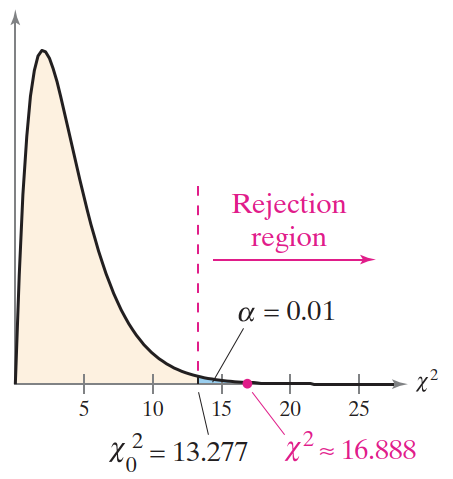

由于 $\chi^2$ 位于拒绝域，因此拒绝零假设。

**结论：** 在 1% 显著性水平下，有足够的证据来拒绝协会声称的报税方式分布。

卡方拟合优度检验常用于**确定分布是否是均匀**的。对于此类检验，类别的预期频率相等。在测试均匀分布时，可以通过将样本大小除以类别数得到每个类别的预期频率。

**例 3** 卡方拟合优度检验

一位研究人员声称 MM 豆中不同颜色糖果的数量是均匀分布的。为了检验该说法，随机选择一袋含有 500 颗巧克力豆的 MM 豆。结果如下表。在 $\alpha=0.10$ 时，检验该研究人员的说法。

|颜色|频率|
|---|---|
|Brown|80|
|Yello| 95|
|Red|88|
|Blue|83|
|Orange|76|
|Green|78|

**解：** 声称分布时均匀的，因此各个颜色的预期频率相等。对每种颜色。预期频率 $E500/6\approx 83.333$。由于每个预期频率大于 5，并且 MM 豆是随机选择的，因此可以使用卡方拟合优度检验来检验预期分布。以下是零假设和备择假设：

- $H_0$：MM 豆袋中不同颜色糖果的预期分布时均匀的
- $H_a$：MM 豆袋中不同颜色糖果的分布不均匀

因为有 6 个类别，因此卡方分布自由度为 $\text{d.f.}=k-1=5$。

根据自由度 $\text{d.f.}=5$, $\alpha=0.10$ 得到临界值为 $\chi^2_0=9.236$。因此，拒绝域为 $\chi^2>9.236$。

计算检验统计量：

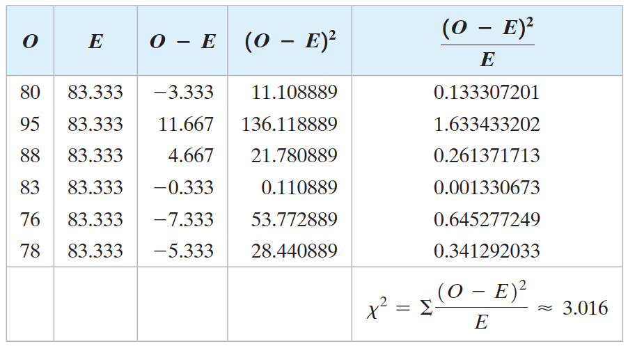

下图显示拒绝域和卡方检验统计量的位置。因此 $\chi^2$ 不在拒绝域，因此无法拒绝零假设：

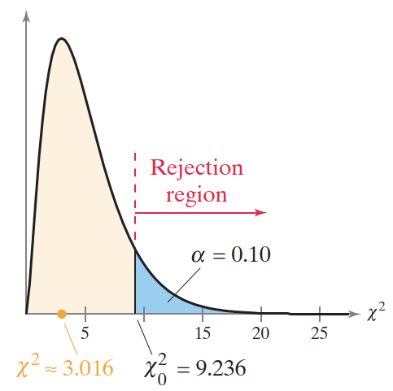

**结论：** 在 10% 显著性水平下，没有足够证据拒绝 MM 豆糖果颜色的分布时均匀的这一说法。

## 2. 独立性检验

### 列联表

当一个事件的发生不影响另一个事件的发生的概率时，两个事件独立。下面使用卡方独立性检验来判断两个变量是否存在关系。要执行卡方独立性检验，先以**列联表**（contingency table）形式组织样本数据。

$r\times c$ 列联表显示两个变量的观测频率。观测频率排列成 r 行 c 列。行和列的交叉点称为**单元格**（cell）。

下面是一个 $2\times 5$ 列联表。它有 2 行 5 列，显示 2197 名成年人的随机样本结果，这些样本按两个样本分类：最喜欢吃冰淇淋的方式和性别。从表中可以看出，喜欢圣代冰淇淋的成年人中有 182 名男性和 158 名女性。

|性别|杯装|甜筒|圣代|三明治|其它|
|---|---|---|---|---|---|
|男|504 |287 |182 |43 |53|
|女| 474| 401 |158 |45 |50|

假设两个变量是独立的，就可以使用列联表计算每个 cell 的期望频率。列联表中单元格 $E_{r,c}$ 的期望频率为：

$$
\text{期望频率} E_{r,c}=\frac{(\text{sum of row r})(\text{sum of column c})}{\text{sample size}}
$$

每列或者每行的加和，成为**边缘频率**（marginal frequency）。边缘频率是某个变量的整个类别出现的频率。例如，在上表中，喜欢甜筒冰淇淋的成年人的边缘频率为 $287+401=688$。在列联表内部观察的频率称为**联合频率**（joint frequency）。

**例 1** 计算期望频率

计算列联表中每个 cell 的期望频率。假设喜欢吃冰淇淋类型和性别两个变量独立。

|性别|杯装|甜筒|圣代|三明治|其它|加和|
|---|---|---|---|---|---|---|
|男|504 |287 |182 |43 |53|1069|
|女| 474| 401 |158 |45 |50|1128|
|加和|978|688|340|88|103|2197|

该列联表已经给出了边缘频率。

**解：** 根据如下公式计算单元格的期望频率：

$$
\text{Expected frequency} E_{r,c}=\frac{(\text{sum of row r})(\text{sum of column c})}{\text{sample size}}
$$

第一行的期望频率：

$$
E_{1,1}=\frac{1069*978}{2197}\approx 475.868
$$

$$
E_{1,2}=\frac{1069*688}{2197}\approx 334.762
$$

$$
E_{1,3}=\frac{1069*340}{2197}\approx 165.435
$$

$$
E_{1,4}=\frac{1069*88}{2197}\approx 42.818
$$

$$
E_{1,5}=\frac{1069*103}{2197}\approx 50.117
$$

第二行的期望频率：

$$
E_{2,1}=\frac{1128*978}{2197}\approx 502.132
$$

$$
E_{2,2}=\frac{1128*688}{2197}\approx 353.238
$$

$$
E_{2,3}=\frac{1128*340}{2197}\approx 174.565
$$

$$
E_{2,4}=\frac{1128*88}{2197}\approx 45.182
$$

$$
E_{2,5}=\frac{1128*103}{2197}\approx 52.883
$$

### 卡方独立性检验

获得期望频率后，就可以使用**卡方独立性检验**（chi-square independence test）来分析变量是否独立。

> [!NOTE]
>
> 卡方独立性检验用于检验两个变量是否独立。通过次检验，可以确定一个变量出现的是否会影响另一个变量的概率。

在进行卡方独立性检验之前，必须确保：

1. 观测到的频率是从随机样本中获得、
2. 每个期望频率不少于 5

满足该条件，检验统计量：
$$
\chi^2=\frac{(O-E)^2}{E}
$$
就近似卡方分布，自由度为：
$$
\text{d.f.}=(r-1)(c-1)
$$

其中 r 和 c 分别为列联表的行数和列数，O 为观测频率，E 为期望频率。

独立性检验的第一步是陈述零假设和备择假设。对卡方独立性检验：

- $H_0$：变量独立
- $H_a$：变量相关

假设两个变量独立，计算出期望频率。如果变量独立，那么频率的观察值和预期值差异很小，卡方检验统计量将接近 0.

对相关变量，频率的观察值和期望值可能相差 很大。当 O 和 E 差异很大时，卡方检验统计量很大，较大的卡方检验是拒绝零假设的证据。因此，**卡方独立性检验始终是右尾检验**。

**卡方独立性检验流程**

1. 确定观察频率从随机样本获得，每个期望频率不小于 5；
2. 声明假设
3. 指定显著性水平
4. 确定自由度：$\text{d.f.}=(r-1)(c-1)$
5. 根据卡方分布确定临界值
6. 确定拒绝域
7. 计算检验统计量

$$
\chi^2=\frac{(O-E)^2}{E}
$$

8. 拒绝或无法拒绝零假设：如果 $\chi^2$ 在拒绝域，则拒绝 $H_0$，否则无法拒绝 $H_0$

**例 2** 执行卡方独立性检验

列联表显示 2197 名成年人的随机样本结果，这些样本按照他们最喜欢的吃冰淇淋类型和性别进行分类。括号内为期望频率。当 $\alpha=0.01$，能够得出 “最喜欢吃冰淇淋的方式” 和 “性别” 这两个变量是相关的结论？

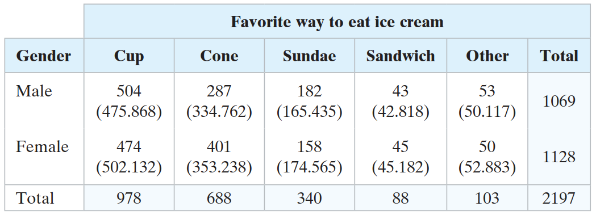

**解：** 每个频率期望值大于 5，并且成年人是随机选择的，因此可以使用卡方独立性检验来检验来检验两个变量是否独立。以下是零假设和备择假设：

- $H_0$：最喜欢吃冰淇淋的方式和性别这两个变量是独立的
- $H_a$：最喜欢吃冰淇淋的方式和性别这两个变量是相关的

列联表有 2 行 5 列，因此卡方分布自由度为：$\text{d.f.}=(r-1)(c-1)=4$。

根据自由度 $\text{d.f.}=4$ 和显著性水平 $\alpha=0.01$，基于卡方分布得到临界值 $\chi^2_0=13.277$。因此拒绝域为 $\chi^2>13.277$。计算卡方检验统计量：

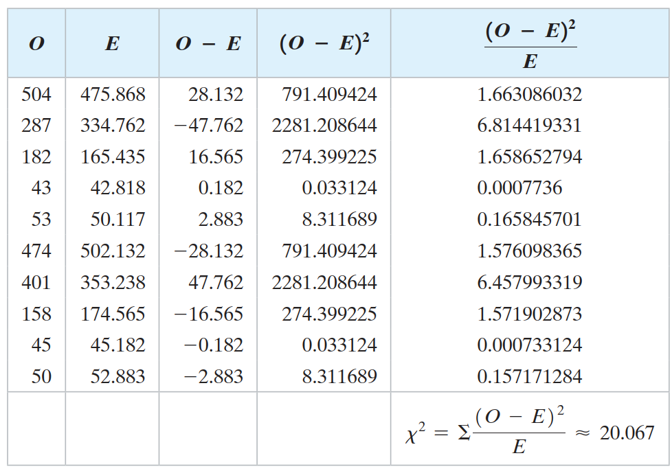

如下图所示：

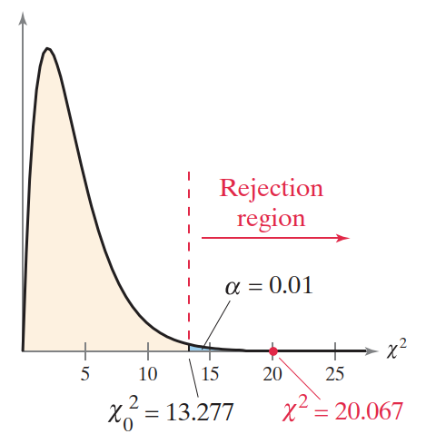

用于卡方检验统计量在拒绝域中，因此拒绝零假设。

**结论：** 在 1% 显著性水平，有足够证据得出 "喜欢吃冰淇淋的方式" 和 "性别" 这两个变量是相关的。

## 3. 比较两个方差

通过**双样本 F 检验**判断两个**总体方差是否相等**。

### F 分布

下面介绍 F 分布以及如何使用它来比较两个方差。

令 $s_1^2$ 和 $s_2^2$ 表示两个不同总体的样本方差。如果两个总体都是正态分布，并且总体方差 $\sigma_1^2$ 和 $\sigma_2^2$ 相等，则：

$$
F=\frac{s_1^2}{s_2^2}
$$

服从 F 分布。

F 分布具有如下性质：

1. F 分布是一个曲线家族，每条曲线由两个自由度决定：分子方差自由度 $\text{d.f.}_N$ 和分母方差自由度 $\text{d.f.}_D$；
2. F 分布呈偏态，即分布不对称（见下图）；
3. F 分布曲线下的总面积为 1；
4. 所有 F 值大于或等于 0；
5. 对所有 F 分布，F 的平均值近似为 1.

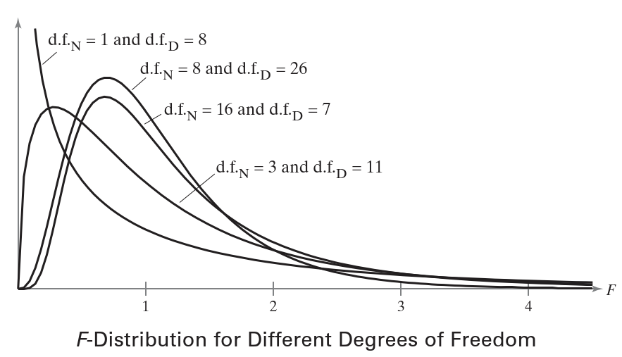

当方差不相等，将较大的方差指定为 $s_1^2$。因此，在 $F=s_1^2/s_2^2$ 抽样分布中，分子的方差大于>=分母的方差，F 始终 >= 1。

因此，**所有单尾检验都是右尾检验**；所有**双尾检验**，**只需要找到右尾临界值**。

**计算 F 分布临界值的流程**

1. 指定显著性水平：$\alpha$
2. 确定分子自由度 $\text{d.f.}_N$
3. 确定分母自由度 $\text{d.f.}_D$
4. 确定临界值

​	a. 对单尾检验，使用 $\alpha$
​	b. 对双尾检验，使用 $0.5\alpha$

**例 1** 计算右尾检验的临界 F 值

令 $\alpha=0.10$, $\text{d.f.}_N=5$, $\text{d.f.}_D=28$。采用代码计算：

```java
public static double getOneTailedCriticalValue(int dfN, int dfD, double alpha) {
    FDistribution distribution = new FDistribution(dfN, dfD);
    return distribution.inverseCumulativeProbability(1 - alpha);
}
```

```java
double criticalValue = FTestUtils.getOneTailedCriticalValue(5, 28, 0.10);
assertEquals(2.06, criticalValue, 0.01);
```

即临界值为 2.06。图示：

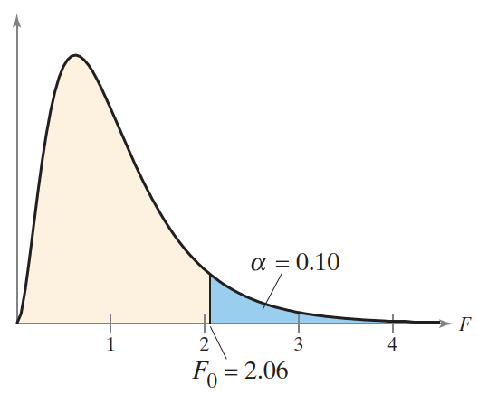

**例 2** 计算双尾检验的 F 值

令 $\alpha=0.05$, $\text{d.f.}_N=4$, $\text{d.f.}_D=8$。

```java
public static double getTwoTailedCriticalValue(int dfN, int dfD, double alpha) {
    FDistribution distribution = new FDistribution(dfN, dfD);
    return distribution.inverseCumulativeProbability(1 - alpha / 2);
}
```

```java
double criticalValue = FTestUtils.getTwoTailedCriticalValue(4, 8, 0.05);
assertEquals(5.05, criticalValue, 0.01);
```

即 F 临界值为 5.05。图示：

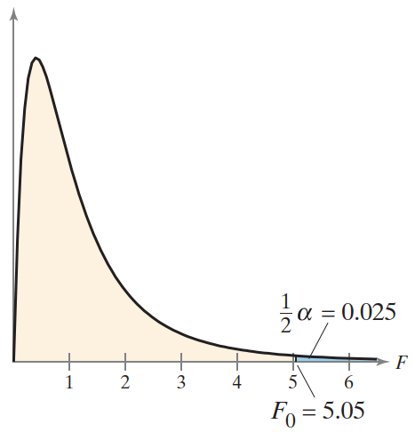

### 方差的双样本 F 检验

下面介绍如何执行双样本 F 检验，使用来自每个总体的样本来**比较两个总体的方差**。

双样本 F 检验用于比较两个总体方差 $\sigma_1^2$ 和 $\sigma_2^2$。要执行该检验，必须满足：

1. 样本随机
2. 样本独立
3. 每个总体都服从正态分布

检验统计量为：

$$
F=\frac{s_1^2}{s_2^2}
$$

其中 $s_1^2$ 和 $s_2^2$ 为样本方差，且 $s_1^2\ge s_2^2$。

分子自由度为 $\text{d.f.}_N=n_1-1$，分母自由度为 $\text{d.f.}_D=n_1-1$。

其中 $n_1$ 是方差为 $s_1^2$ 样本的样本量，$n_2$ 是方差为 $s_2^2$ 样本的样本量。

**使用双样本 F 检验比较 $\sigma_1^2$ 和 $\sigma_2^2$ 的流程**

1. 确定样本随机、独立，总体为正态分布
2. 声明零假设和备择假设
3. 指定显著性水平
4. 确定分子和分母的自由度：$\text{d.f.}_N=n_1-1$, $\text{d.f.}_D=n_2-1$
5. 计算临界值
6. 确定拒绝域
7. 计算检验统计量

$$
F=\frac{s_1^2}{s_2^2}
$$

8. 根据 F 是否在拒绝域，决定是拒绝还是无法拒绝零假设

**例 3** 双样本 F 检验

一位餐厅经理正在试用一个系统，旨在减少顾客用餐前等待时间的方差。在旧系统，随机抽取 10 名顾客，方差为 400；在新系统，随机抽取 21 名顾客，方差为 256。当 $\alpha=0.10$ 时，是否有足够证据说服经理改用新系统？假设两个总体都是正态分布。

**解：** 因为 400>256，所以 $s_1^2=400$, $s_2^2=256$。对于“新系统下的等待时间方差小于旧系统的等待时间方差”，对应的假设：

- $H_0$: $\sigma_1^2\le \sigma_2^2$
- $H_a$: $\sigma_1^2>\sigma_2^2$

这是一个右尾检验，$\alpha=0.10$，自由度为：

$$
\text{d.f.}_D=n_1-1=9
$$

$$
\text{d.f.}_N=n_2-1=20
$$

对应临界值 $F_0=1.96$，因此拒绝域为 $F>1.96$。检验统计量为：

$$
F=\frac{s_1^2}{s_2^2}=\frac{400}{256}\approx 1.56
$$

如下图所示：

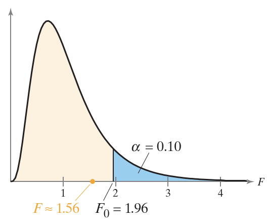

由于 F 不在拒绝域，因此无法拒绝零假设。

**结论：** 在 10% 显著性水平，没有足够证据表明新系统的平均等待时间方差更小。

**例 4** 双样本 F 检验

你想购买一家公司的股票，正在两个股票之间犹豫。由于股票的风险与每日收盘价的标准差有关，因此可以随机选择每只股票的每日收盘价样本，获得以下结果：

| 股票 A    | 股票 B    |
| --------- | --------- |
| $n_2=30$  | $n_1=31$  |
| $s_2=3.5$ | $s_1=5.7$ |

取 $\alpha=0.05$，能够判断哪只股票风险更高？假设股票收盘价服从正态分布。

**解：** 因此 $5.7^2>3.5^2$，所以 $s_1^2=5.7^2$，$s_2^2=3.5^2$。因此 $s_1^2$ 和 $\sigma_1^2$ 代表股票 B 的样本方差和总体方差。

因为需要判断，这两只股票中哪一只风险更高，因此提出假设为：

$H_0$: $\sigma_1^2=\sigma_2^2$, $H_a$：$\sigma_1^2\ne \sigma_2^2$

这是一个双边检验，$\frac{1}{2}\alpha=0.025$。

自由度 $\text{d.f.}_N=n_1-1=30$, $\text{d.f.}_D=n_2-1=29$。查表得临界值 $F_0=2.09$，因此拒绝域为 $F>2.09$。

计算检验统计量：
$$
F=\frac{5.7^2}{3.5^2}\approx 2.65
$$
$F$ 位于拒绝域内，因此拒绝零假设。

**结论：** 在 5% 显著性水平下，有足够证据支持这两只股票中一只风险高于另一只。

## 4. 方差分析

### 单因素方差分析

假设一位医学研究人员正在分析三种止痛药的药效，想确定这三种药物缓解疼痛所需的平均时间是否有差异。为了确定是否存在这种差异，可以结合 F 分布与**方差分析**（analysis of variance）。因为研究的是一个独立变量，所以该过程称为**单因素方差分析**（one-way analysis of variance）。

> [!TIP]
>
> 单因素方差分析时一种假设检验技术，用于比较三个或更多总体的平均值，方差分析缩写为 **ANOVA**。

单因素方差分析的第一步，也是陈述零假设和备择假设：

- $H_0$：$\mu_1=\mu_2=\cdots=\mu_k$ (所有总体均值相等)
- $H_a$：至少一个平均值与其他平均值不同

在单因素 ANOVA 中拒绝零假设，可以得出至少一个均值与其它均值不同的结论。不过，如果不进行更多统计检验，就无法确定到底哪个均值不同。

在进行单因素 ANOVA 之前，需要检查是否满足以下条件：

1. k 个样本, $k\ge 3$，必须从正态或近似正态的总体随机选择；
2. 样本之间彼此独立；
3. 每个总体的方差必须相同；

单因素 ANOVA 的**检验统计量**是样本间方差样本内方差的比例：
$$
\text{test statistic}=\frac{\text{样本间方差}}{\text{样本内方差}}
$$

样本间方差衡量不同样本之间的差异，该方差也称为 mean square between，记为 $MS_B$。

样本内方差衡量同一个样本数据内的差异，通常由抽样误差造成，该方差也称为 mean square within，记为 $MS_W$。

满足 3 个条件的抽样分布近似为 F 分布。检验统计量：
$$
F=\frac{MS_B}{MS_W}
$$

自由度为：$\text{d.f.}_N=k-1$, $\text{d.f.}_D=N-k$。

其中，$k$ 为样本数量（多少类别），$N$ 为所有样本大小之和。

如果均值之间的差异很小或没有差异，则 $MS_B$ 将接近或等于 $MS_W$，检验统计量将近似为 1。

F 值接近 1 表示无法拒绝零假设。但是，如果其中一个平均值与其它平均值有显著差异，则 $MS_B$ 会大于 $MS_W$，检验统计量将大于 1.F 值显著大于 1 表示应该拒绝零假设。因此，**所有单因素 ANOVA 都是右尾检验**，即如果检验统计量大于临界值，则拒绝 $H_0$。

**计算单因素 ANOVA 的检验统计量**

1. 计算每个样本的平均值和方差

$$
\overline{x}_i=\frac{\sum x}{n}
$$

$$
s_i^2=\frac{\sum (x-\overline{x}_i)^2}{n-1}
$$

2. 计算所有样本中所有数据的平均值（总平均值）

$$
\overline{\overline{x}}=\frac{\sum x}{N}
$$

3. 计算样本间残差平方和

$$
SS_B=\sum n_i(\overline{x}_i-\overline{\overline{x}})^2
$$

4. 计算样本内残差平方和

$$
SS_W=\sum (n_i-1)s_i^2
$$

5. 计算样本间方差

$$
MS_B=\frac{SS_B}{\text{d.f.}_N}=\frac{\sum n_i(\overline{x}_i-\overline{\overline{x}})^2}{k-1}
$$

6. 计算样本内方差

$$
MS_W=\frac{SS_W}{\text{d.f.}_D}=\frac{\sum (n_i-1)s_i^2}{N-k}
$$

7. 计算检验统计量

$$
F=\frac{MS_B}{MS_W}
$$

其中，$SS_B$ 表示样本间的残差和：

$$
\begin{aligned}
SS_B&=n_1(\overline{x}_1-\overline{\overline{x}})^2+n_2(\overline{x}_2-\overline{\overline{x}})^2+\cdots+n_k(\overline{x}_k-\overline{\overline{x}})^2 \\
&=\sum n_i(\overline{x}_i-\overline{\overline{x}})^2
\end{aligned}
$$

$SS_W$ 表示样本内的残差和：

$$
\begin{aligned}
SS_W&=(n_1-1)s_1^2+(n_2-1)s_2^2+\cdots+(n_k-1)s_k^2\\
&=\sum(n_i-1)s_i^2
\end{aligned}
$$

**单因素 ANOVA 检验流程**

1. 验证样本是否随机、独立，总体是否服从正态分布，以及总体方差是否相等
2. 根据需求，声明零假设和备择假设
3. 指定显著性水平 $\alpha$
4. 确定分子和分母的自由度

$$
\text{d.f.}_N=k-1
$$

$$
\text{d.f.}_D=N-k
$$

5. 确定临界值
6. 确定拒绝域
7. 计算检验统计量

$$
F=\frac{MS_B}{MS_W}
$$

8. 根据检验统计量和拒绝域，确定拒绝还是无法拒绝零假设。

**ANOVA 汇总表**

|        | 残差和 | 自由度              | Mean squares                      | F                   |
| ------ | ------ | ------------------- | --------------------------------- | ------------------- |
| 样本间 | $SS_B$ | $\text{d.f.}_N=k-1$ | $MS_B=\frac{SS_B}{\text{d.f.}_N}$ | $\frac{MS_B}{MS_W}$ |
| 样本内 | $SS_W$ | $\text{d.f.}_D=N-k$ | $MS_W=\frac{SS_W}{\text{d.f.}_D}$ |                     |

**例 1** 单因素 ANOVA 检验

一位医学研究人员想要确定三种止痛药缓解头痛所需平均时间是否存在差异。研究人员随机选择了几个头痛患者，并给他们服用三种药物中的一种。每个头痛患者记录药物开始起效所需时间（分钟）。结果如下表所示。当 $\alpha=0.01$ 时，能够得出至少一个平均时间与其它时间不同的结论？假设每个药物缓解时间的总体呈正态分布，并且总体方差相等。

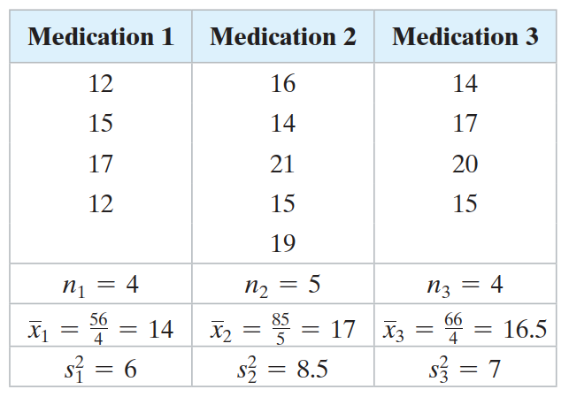

**解：** 零假设和备择假设如下：

- $H_0$：$\mu_1=\mu_2=\mu_3$
- $H_a$：至少其中一个均值与其它不同

因为有 $k=3$ 个样本，因此 $\text{d.f.}_N=k-1=2$。样本量加和 $N=n_1+n_2+n_3=13$，因此：
$$
\text{d.f.}_D=N-k=13-3=10
$$
根据 $\text{d.f.}_N=2$, $\text{d.f.}_D=10$, $\alpha=0.01$，得到临界值 $F_0=7.56$。因此拒绝域为 $F>7.56$。

为了计算检验统计量，需要计算 $\overline{\overline{x}}$, $MS_B$ 和 $MS_W$：
$$
\overline{\overline{x}}=\frac{\sum x}{N}=\frac{56+85+66}{13}\approx 15.92
$$

$$
\begin{aligned}
MS_B&=\frac{SS_B}{\text{d.f.}_N}=\frac{\sum n_i(\overline{x}_i-\overline{\overline{x}})^2}{k-1}\\
&\approx \frac{4(14-15.92)^2+5(17-15.92)^2+4(16.5-15.92)^2}{3-1}\\
&=10.9616
\end{aligned}
$$

$$
\begin{aligned}
MS_W&=\frac{SS_W}{\text{d.f.}_D}=\frac{\sum (n_i-1)s_i^2}{N-k}\\
&=\frac{(4-1)6+(5-1)8.5+(4-1)7}{13-3}\\
&=7.3
\end{aligned}
$$

计算检验统计量：
$$
F=\frac{MS_B}{MS_W}\approx 1.5
$$

拒绝域和检验统计量 F 的位置如下：

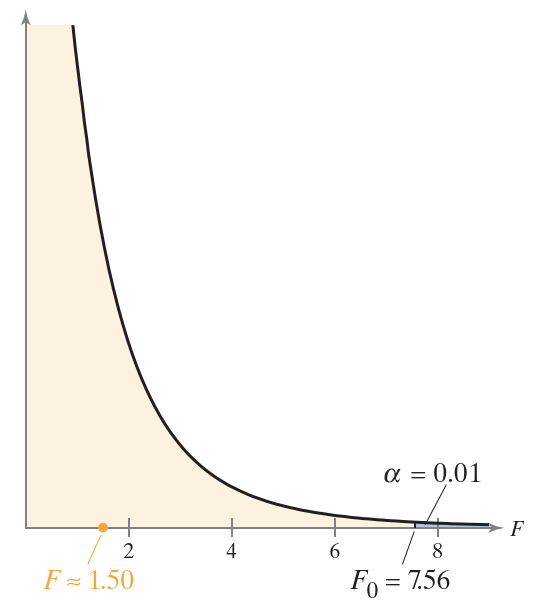

由于 F 不在拒绝，因此无法拒绝零假设。

**结论：** 在 1% 显著性水平，没有足够证据说明三种止痛药缓解头痛所需平均时间存在差异。

ANOVA 汇总表如下：

|        | 残差和  | 自由度 | Mean squares | F    |
| ------ | ------- | ------ | ------------ | ---- |
| 样本间 | 21.9232 | 2      | 10.9616      | 1.50 |
| 样本内 | 73      | 10     | 7.3          |      |

**例 2** 单因素 ANOVA 检验

一位研究人员认为，在城市驾驶中，紧凑型、中型和大型汽车的燃油经济性是相同的。下表显示从每个类别中随机选择的几辆汽车在城市驾驶时的 油耗。假设总体呈正态分布，样本独立，总体方差相等。当 $\alpha=0.05$ 时，能够拒绝“这三类车在城市驾驶中的平均油耗相同”的说法吗？

|紧凑型|中型|大型|
|---|---|---|
|12 |21 |18|
|23 |23 |17|
|17 |19 |14|
|20 |14 |17|
|25 |14 |20|
|18 |21 |17|
|24 |26 |17|
|27 |18 |13|
|29 |25|
|17 |16|
|31 |27|
|24 |22|
|24 |21|
|25|
|21|

声明假设：

- $H_0$：$\mu_1=\mu_2=\mu_3$
- $H_a$：至少其中一个均值与其它不同

计算：

```java
double[] sample1 = new double[]{12, 23, 17, 20, 25, 18, 24, 27, 29, 17, 31, 24, 24};
double[] sample2 = new double[]{21, 23, 19, 14, 14, 21, 26, 18, 25, 16, 27, 22, 21, 25, 21};
double[] sample3 = new double[]{18, 17, 14, 17, 20, 17, 17, 13};

List<double[]> classes = new ArrayList<>(3);
classes.add(sample1);
classes.add(sample2);
classes.add(sample3);

double pValue = InferenceTestUtils.oneWayAnovaPValue(classes);
assertEquals(0.018236, pValue, 1E-6);
```

因为 p-value 小于 $\alpha$，因此拒绝零假设。

**结论：** 在 5% 显著性水平有足够证据来拒绝城市驾驶平均油耗相同的说法。

### 双因素方差分析

如果需要测试两个独立变量对一个因变量的影响，可以使用**双因素方差分析检验**（two-way analysis of variance test）。

例如，假设一名医学研究人员想要检验性别和药物类型对止痛药缓解疼痛所需平均时间的影响，就可以使用双因素方差分析。分组设计：

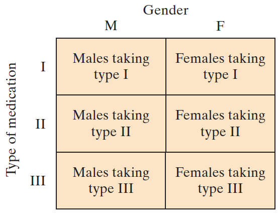

双因素方向分析有 3 个零假设，每个主效应一个，交叉效应一个。

- **主效应**（main effect）是一个独立变量对因变量的影响
- **交互效应**（interaction effect）是两个独立变量共同对因变量的影响

止痛药实验的假设包括：

- 主效应假设
  - $H_0$：性别对止痛药缓解疼痛所需的平均时间没有影响
  - $H_a$：性别对止痛药缓解疼痛所需的平均时间有影响
  - $H_0$：药物类型对止痛药缓解疼痛所需的平均时间没有影响
  - $H_a$：药物类型对止痛药缓解疼痛所需的平均时间有影响
- 交互效应假设
  - $H_0$：性别和药物类型对止痛药缓解疼痛所需的平均时间没有相互作用；
  - $H_a$：性别和药物类型之间存在相互作用，影响止痛药缓解疼痛所需的平均时间

要检验这些假设，可以使用双因素方差分析。

双因素方差分析的条件与单因素方向分析相同，但附加所有样本大小必须相同。使用 F 分布，双因素方差分析为每个假设计算一个 F 检验统计量，因此，有拒绝 0 个、1 个、2 个或所有零假设 4 种可能。

双因素方差分析手动计算复杂，建议使用软件。