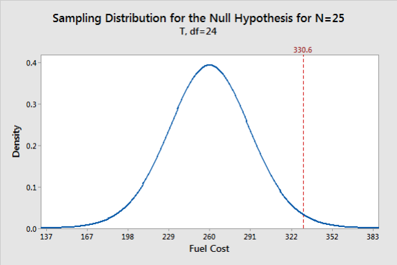
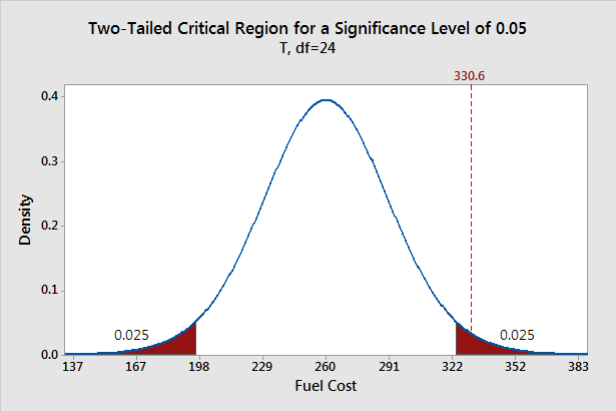
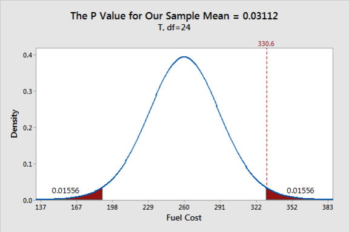
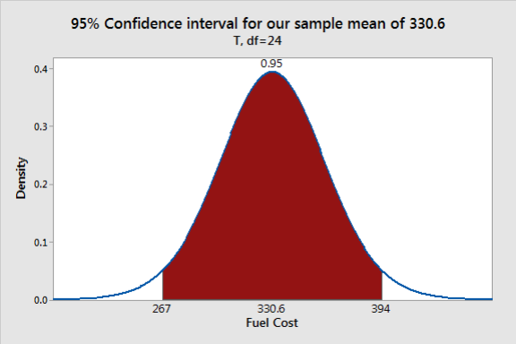

# 假设检验总结

## 基本概念

假设检验（hypothesis test）:假设检验评估关于总体的两个互斥的陈述，并确定数据支持哪个陈述，是一个统计流程。

假设检验根据样本数据推断总体参数。

### 描述和推断统计

**描述统计学**（descriptive statistics）描述样本，即使用 summary statistics 和 graphs 来描述样本数据。

**推断统计学**（inferential statistics）从样本样本推断样本所属总体的性质。因为，需要确保样本能够准确反映总体。因此，首先需要：

1. 定义研究的总体
2. 从总体抽取代表性样本
3. 考虑抽样误差进行分析

**随机抽样**最适合代表总体。随机抽样获得统计量（如平均值）不会过高或过低。使用随机样本，可以从样本推广到更广泛的总体。

虽然样本更实用且成本低，但也存在弊端。使用相对较小的样本获得的统计量不太可能刚好等于总体属性，例如，样本平均值不太可能刚好等于总体平均值。样本统计量和总体值的差异就是**抽样误差** (sampling error)。

从样本估计总体可以节省大量成本，但也有前提条件，即收集的样本数据能够代表总体。毕竟，如果样本与总体不相似，将无法从样本得到关于总体的正确结论。

随机抽样是获取无偏（unbiased）、有代表性（representative）样本的最常见。

### 总体参数和样本统计量

**总体参数**（population parameter）是描述总体特征的值，如总体平均值。由于很少能够测量整体总体，因此通常不知道总体参数的真实值。例如，中国成年女性的平均身高，肯定有一个具体值，只是我们不知道。

总体平均值和标准差是两个常见参数。在统计学中，常用希腊字母表示总体参数，如 $\mu$ 表示均值，$\sigma$ 表示标准差。

**统计量**（statistic）是样本的特征。例如，样本的平均值和标准差就是样本统计量。推断统计学就是用样本统计量得出有关总体的结论。但是，有得到有效的结论，必须使用具有代表性的样本。总体参数的**无偏估计**（unbiased estimate）在平均水平是正确的。使用随机抽样和其它代表性抽样方法可获得无偏估计。

| 总体参数 (parameter) | 样本统计量 (statistic)           |
| -------------------- | -------------------------------- |
| μ                    | 样本均值（sample mean）          |
| σ                    | 样本标准差（standard deviation） |

### 随机抽样误差

即使是代表性样本，样本平均值等统计量也不太可能与总体参数完全相等。即样本与总体相似，但永远无法相同。

样本统计量与总体参数的差异称为**抽样误差**（sampling error）。如果使用样本推断总体，统计方法需要估计抽样误差。

由于总体参数未知，所以我们永远无法确切知道抽样误差。但是，使用假设检验可以估计误差并将其计入检验结果。

### 参数分析和非参分析

**参数统计**是统计学的一个分支，假设样本数据来着由一组参数确定的概率分布的总体。参数分析是最常见的统计方法，是大多统计学教材的主要内容。

**非参数检验（nonparametric test）** 不假设数据服从特定分布。非参数分析的使用频率远低于参数分析。

### 什么是假设检验

**假设检验（hypothesis test）** 是一种统计分析方法，它使用样本数据来评估关于总体属性的两个互斥假设。这两个互斥假设通常称为**零假设**（null hypothesis）和**备择假设**（alternative hypothesis）。假设检验评估样本统计量，并考虑抽样误差以确定样本数据支持哪个假设。

### 零假设

在假设检验中，**零假设**（null hypothesis）是两个互斥假设之一。通常，零假设表示没有效果（即效果为 0），记为 $H_0$。

在所有假设检验中，假设检验都用于测试某种效果，如新疫苗是否有效。研究人员希望发现差异，但是实验组之间可能没有差异。在统计学中，这种**没有差异**的情况称为**零假设**。因此，如果拒绝零假设，表示样本支持备择假设，即在总体水平存在效果（效果不为 0）。

可以将零假设视为默认假设，要求样本中有足够强的证据才能拒绝它。

### 备择假设

备择假设（alternative hypothesis）是关于总体属性的另一个假设。备择假设通常表示总体参数不等于零假设对应的值。换言之，存在 non-zero effect。如果样本包含足够证据，可以拒绝零假设并支持备择假设。记为 $H_1$ 或 $H_a$。

### 效应

**效应（effect）** 指总体值与零假设值之间的差异。effect 也称为总体效应或总体差异。例如，治疗组和对照组健康结果之间的平均差异就是 effect。

我们通常不知道实际 effect 的带下，但是可以使用假设检验来确定 effect 是否存在并估计其大小。

### 显著性水平

**显著性水平（significance level）** 定义样本证据有多强才能得出总体中存在 effect 的结论。

显著性水平（α）是在假设检验之前设定的证据标准，指定样本证据与零假设矛盾到什么程度，才能拒绝零假设。该标准定义为拒绝真实零假设的概率。即，在没有 effect 是说有 effect 的概率。较低的显著性水平表示需要更充分的证据才能拒绝零假设。

例如，显著性水平 0.05 表示没有 effect 时判定有 effect 的概率为 5%。

结合 p-value 和显著性水平确定样本数据支持哪个假设。

样本数据为某种 effect 提供了证据，显著性水平衡量样本证据需要达到什么程度才能确定结果具有统计显著性。所以显著性水平定义了证据的阈值。

**法庭上的证据标准**

刑事案件和民事案件差别很大，但两者都需要最低限度的证据来说明法官和陪审团证明被告的指控。刑事案件中检察官必须 “beyond a reasonable doubt” 证明被告有罪，而民事安检原告必须提供 "preponderance of the evidence"。这两个术语反应了刑事和民事案件不同的证据标准。

对民事案件，大多数学者将  "preponderance of the evidence" 定义为至少有 51% 的证据支持原告的主张。但刑事案件更严重，所需证据更多，必须排除合理怀疑，多数学者将证据标准定义为 90%, 95% 甚至 99% 确信被告人有罪。

在统计学中，显著性水平就是证据标准。研究人员要证明某个总体中存在 effect，样本就必须提供足够证据。

在法庭上，需要证据标准，避免让无辜的人被定罪。在假设检验中，需要显著性水平，避免将不存在的 effect 声明为存在。

**显著性水平作为证据标准**

在统计学中，显著性水平以概率的形式定义证据的强度。α 表示当零假设正确时，检验产生统计显著性的概率。可以将其视为假阳性概率，即检验结果表示有 effect，但实际上没有。

显然，当零假设正确，我们希望假设检验产生的统计显著结果的概率尽可能低。例如，如果 α 为 0.05，则当零假设正确，分析有 5% 的概率产生显著结果。

正如证据标准因案件类型而异，我们可以根据假阳性的后果来设置不同的显著性水平。通过改变 α，可以增加或减少得出总体存在 effect 结论所需的证据。

**修改显著性水平**

α=0.05 是最常用的显著性水平。

α 与所需证据量成反比。例如，将显著性水平从 0.05 提高到 0.1 会降低证据标准。相反，将其从 0.05 降低到 0.01 会提高标准。

**提高显著性水平**

假设你正在测试派对气球的强度。通过测试结果来确定购买哪个品牌的气球。此外假阳性会导致你购买强度不够的气球，假阳性的缺点非常低，因此，可以考虑将显著性水平从 0.05 提高到 0.1 来减少所需的证据。由于减少了所需证据，使得检验对检测差异更灵敏，但也将可能的假阳性从 5% 增加到了 10%。

**降低显著性水平**

假设你在测试热气球的强度（是否达到指定强度）。这里的假阳性非常危险，因此你需要非常确信一家制造商制造的材料是否比另一家的更结实。此时，应该将 α 降为 0.01 来增加所需证据量。由于次更高增加了所需证据量，使用检验对检测差异灵敏度降低，但将假阳性可能值从 5% 降低到 1%。

所以，显著性水平是灵敏度和假阳性之间的权衡。

显著性水平表示所需的证据量，而 p-value 表示样本中证据的强度。当 p-value 小于或等于显著性水平，表示证据强度达到或超过拒绝原假设并得出存在 effect 结论的证据标准。

### p-value

p-value 是获得样本中观察到的 effect 的概率，如果零假设正确，p-value 会更大。p-value 越低，反对零假设的证据越强。

- 如果 p-value 小于或等于显著性水平，则拒绝零假设，结果具有统计显著性。表示数据支持备择假设，即总体中存在 effect。
- 当 p-value 大于显著性水平，表示样本数据没有提供足够的证据来证明存在 effect。

以下是这些决策的统计术语：

- 当 p-value 小于或等于显著性水平，拒绝零假设
- 当 p-value 大于显著性水平，无法拒绝零假设

### 统计显著性

当 p-value 小于显著性水平，结果具有**统计显著性（statistical significance）**。这种情况表示样本证据强度（p-value）超出定义的证据标准（显著性水平），样本提供了足够证据得出总体存在 effect 的结论。

### 置信区间

推断统计学的一个主要目标是估计总体参数。这些参数是总体的一个未知值，如总体平均值和标准差。这些参数值未知，而且几乎总是未知的。抽样误差会导致估计值有一定不确定性。

置信区间（confidence interval）结合不确定性和抽样误差创建实际总体值可能的范围。

### 假设检验原理

下面通过均值检验解释假设检验过程。

**例**：一位研究人员研究家庭燃气支出，想确定每月费用与去年相比发生了变化，去年平均每月 260 元。研究人员随机抽取 25 个家庭作为样本，并分析他们今年每月费用。数据如下：

| 样本数 | 平均值 | SE Mean | StDev |
| ------ | ------ | ------- | ----- |
| 25     | 330.6  | 30.8    | 154.2 |

**描述统计学无法回答该问题**

随机样本的样本平均值 330.6 大于去年的平均值 260，为什么还有进行假设检验？

因为我们得到是样本数据，而不是总体数据。使用样本数据就要考虑抽样误差。抽样误差是样本统计量与总体参数之间的差距。对该示例，样本统计量为样本均值 330.6，总体参数指总体平均值 μ。总体参数通常未知。

得到的样本平均值为 330.6，但是，由于抽样误差，总体平均值也有可能是 260。因此，我们需要使用假设检验来确定从平均值为 260 的总体中随机抽样，获取平均值为 330.6 的概率。

**抽样分布**

如果我们可以获取大量随机样本，并计算每个样本的平均值，就可以观察样本平均值的分布图。这种分布称为**抽样分布（sampling distribution）**。通过抽样分布可以确定获得指定样本统计量的可能性，对执行假设检验非常重要。

每次研究收集的一个样本，只是所有可能抽取的随机样本中的一个。现在想知道今年的平均燃气支出（330.6）是否与去年不同（260）。为了回答该问题，假设总体平均燃气费用仍为 260，绘制抽样分布图。假设检验总是使用零假设为真时的抽样分布。

**在抽样分布中绘制样本均值**

下图显示总体平均值为 260 时的抽样分布：

最可能的样本均值接近 260.但是，考虑到随机抽样误差，观察到样本均值在 167 到 352 之间也不奇怪。

抽样分布是一种概率分布图，分布曲线下的总面积为 1。假设检验利用概率分布计算数值范围的概率以确定统计显著性。抽样分布表明，如果总体均值为 260，我们获得 330.6 的样本的可能性相对较小。那么，样本平均值是否如此不可能，以至于我们拒绝总体平均值为 260 的说法？

在统计学中，我们称之为拒绝零假设。如果拒绝上例中的零假设，表示样本平均值（330.6和 260 之间的差异在统计上是显著的，即样本数据支持总体平均值不等于 260 的假设。

假设检验通过显著性水平和 p-value 来量化该判断：

- 零假设：总体平均值等于 260
- 备择假设：总体平均值不等于 260

**绘制显著性水平对应的临界区域**

显著性性水平是提前设置的证据标准。较低的显著性水平需要更强的样本证据才能拒绝零假设。

在概率分布图熵，显著性水平定义样本值必须与零假设对应值相差多远，才能拒绝零假设。对 0.05 的显著性水平，标识距离零假设均值最远的 5%，如下图所示：

图中的两个阴影面积与零假设的中心等距。每个阴影的概率为 0.025。这些阴影区域被称为**双尾假设检验**的临界区域。

临界区域定义了零假设为真时，样本统计量不大可能出现的区域。如果零假设正确，总体平均值为 260，则来自该总体的随机样本(n=25)的平均值只有 5% 的可能性落在临界区域内。

上例中样本的平均值在 0.05 显著性水平具有统计显著性，因为它落在临界区域内。

**什么是 p-valule**

p-value 是假设零假设正确，获得与样本一样极端 effect 的概率。首先，计算样本的 effect，该 effect 指样本值与零假设值之间的距离：330.6-260=70.6。然后标识距离抽样分布中心 70.6 两侧的面积。对应观察到与样本平均值一样极端的样本平均值的概率。如下图：

两个阴影区域的面积加和为 0.03113。如果零假设为真（260）， 你抽取了许多随机样本，则大于有 3.1% 的速记样本的平均值会落在该阴影区域，即有 3.1% 的机会观察到至少 70.6 的 effect，这就是 p-value。

如果 p-value 小于或等于显著性水平，则拒绝零假设。0.03113 小于 0.05，因此拒绝零假设。故在 0.05 显著性水平，样本 effect 具有统计显著性。样本数据支持备择假设，即总体平均值不等于 260。

> [!NOTE]
>
> 当使用样本数据对总体做出结论，假设检验至关重要，因为这些检验考虑了样本误差。对比显著性水平和 p-value 确定何时拒绝零假设可以提高得出正确结论的可能性。

### 置信区间原理

置信区间是根据样本计算得到的，它提供了可能包含总体参数的范围。置信区间的使用与 p-value 非常类似。

从同一总体抽取的不同随机样本可能会产生不同的区间。如果抽取许多随机样本，并计算每个样本的置信区间，则该区间包含总体参数的百分比就是**置信水平**（confidence level）。

例如，95% 的置信水平，表示如果从同一总体中抽取 20 个随机样本，预期 19 个置信区间包含总体参数值。

**估计值精度**

**置信区间**（confidence interval）包含样本的点估计值和误差范围。**点估计**（point estimate）是总体参数最可能的值，等于样本统计量。**误差范围**（margin of error）表示估计总体参数时允许的误差。样本数据的变异性越大，估计值越不精确，这会导致误差范围越大。置信区间可以帮助我们估计点估计值相对总体参数的不确定性。

首先，置信区间可以帮助我们比较不同估计值的精密度。假设两项研究的平均值相同，均为 10.但是，使用 95% 置信区间，一个区间为 [5,15]，一个为 [9,11]，后者置信区间更窄，表明它的估计值更精确。

显著性水平和置信区间的抽样分布有两个关键区间。显著性水平以零假设值为中心，取远离分布的 5% 面积；置信区间相反，取以样本平均值为中心的 95% 面积。

上图样本均值的阴影范围 [267,392] 覆盖该抽样分布的 95%。该范围就是样本数据的 95% 置信区间。即我们有 95% 信心燃气成本的总体均值介于 267 到 392 之间。

该图以样本均值为中心，如果总体均值等于样本均值，则来自该总体的随机样本（N=25）将有 95% 的机会落在该范围。

我们并不知道样本均值是否接近总体均值，只知道样本均值是总体均值的无偏估计。无偏估计不会过高或过低估计总体均值，在平均水平是正确的。
$$
\text{置信水平}=1-\text{显著性水平}
$$

## t-test 的使用和假设

## 参考

- Hypothesis Testing: An Intuitive Guide for Making Data Driven Decisions