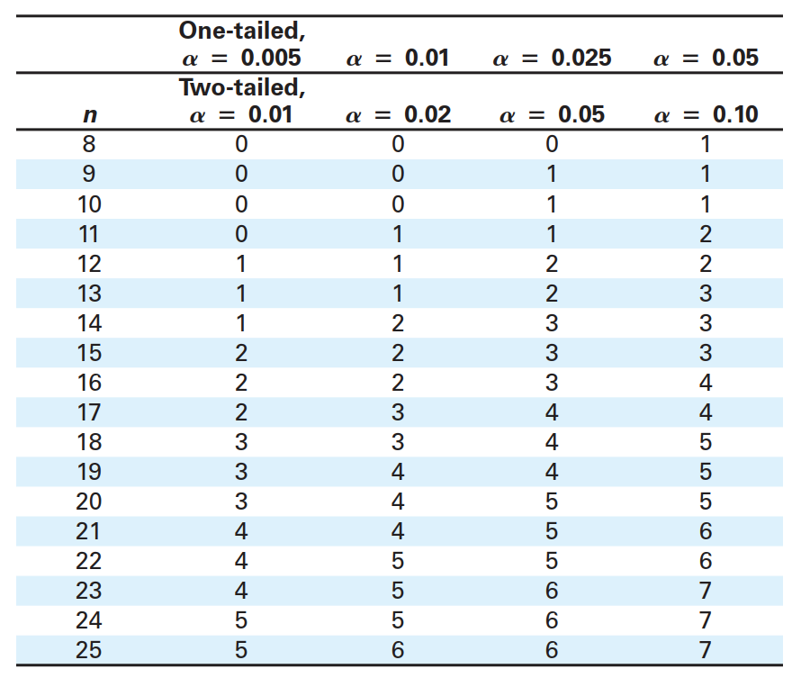

# 非参数检验

- [非参数检验](#非参数检验)
  - [概述](#概述)
  - [Sign Test](#sign-test)
    - [总体中位数的 Sign 检验](#总体中位数的-sign-检验)

2024-12-10
@author Jiawei Mao
***

## 概述

到目前为止，许多研究过的假设检验都对总体分布提出了一个或多个要求。例如，一些检验要求总体必须服从正态分布，有些要求总体方差相等。当这些要求无法满足时怎么办？针对这类情况，统计学家开发了不受分布影响的假设检验，统称为**非参数检验**（nonparametric test）。

> [!NOTE]
>
> 非参数检验是一种假设检验，它不需要总体分布形状或总体参数值满足任何特定条件。

非参数检验通常比对应的参数检验更容易执行。然而，它们通常比参数检验效率低，使用非参数检验拒绝零假设需要更有力的证据。因此，只要有可能，应该尽可能使用参数检验。

## Sign Test

### 总体中位数的 Sign 检验

**符号检验**（sign test）是最简单的非参数检验之一，用于检验总体中位数与假设值 $k$ 的相关性。使用符号检验的唯一必要条件是样本随机。

总体中位数的符号检验可以是左尾、右尾或双尾。每种检验类型的零假设和备择假设如下。

- 左尾检验

$H_0$：$\text{median}\ge k$, $H_a$: $\text{median}<k$

- 右尾检验

$H_0$：$\text{median} \le k$, $H_a$：$\text{median} > k$

- 双尾检验

$H_0$：$\text{median}=k$，$H_a$：$\text{median}\ne k$

使用符号检验，首先将样本的每个数据与假设的中位数 $k$ 进行比较，如果小于 $k$，分配 `-` 号，如果大于 $k$，分配 `+`，如果等于 $k$，分配 0。然后比较 `+` 和 `-` 的数量（忽略 0）。当 + 的数量和 - 的数量相差很大时，中位数可能与假设值不同，应该拒绝零假设。

下表列出了指定显著性水平和样本量下符号检验的临界值。使用符号检验时，**样本量** $n$ 指 `+` 和 `-` 符号的总数。当样本量大于 25 时，可以使用标准正态分布来查找临界值。

**符号假设的临界值**

当检验统计量 $x$ 小于或等于标准的值，拒绝零假设。



> 表中 $n$ 表示 `+` 和 `-` 符号总数。检验值为 `+` 和 `-` 符号的较小数。

**符号检验的检验统计量**

当 $n\le 25$，符号检验的检验统计量为 `+` 和 `-` 数量较小的数值。

当 $n >25$，符号检验的检验统计量为：
$$
z=\frac{(x+0.5)-0.5n}{\frac{\sqrt{n}}{2}}
$$

其中，$x$ 是 `+` 和 `-` 数目较小的值，`n` 为样本量，即 `+` 和 `-` 数目加和。

因为 $x$ 被定义为 `+` 和 `-` 较小的数量，所以拒绝域始终位于左尾。因此，总体中位数的符号检验**始终是左尾检验或双尾检验**。当检验双尾时，仅使用左尾临界值。

> [!NOTE]
>
> 如果将 $x$ 定义为 `+` 和 `-` 的较大数目时，拒绝域始终位于右尾。

**总体中位数的符号检验流程**

1. 确定样本随机
2. 声明假设
3. 指定显著性水平
4. 通过 `+` 和 `-` 计数获得样本量 $n$
5. 确定临界值
6. 计算检验统计量
7. 根据检验统计量和拒绝域，决定是拒绝零假设还是无法拒绝

**例 1** 使用符号检验

一家公司的网站管理员声称，该公司网站每天访客中位数不超过 1500 人。一名员工对这一说法的准确性表示怀疑，下面列出了随机选择的 20 天的每天访客人数。当 $\alpha=0.05$ 时，该员工可以拒绝管理员的说法吗？

```
1469 1462 1634 1602 1500 
1463 1476 1570 1544 1452 
1487 1523 1525 1548 1511 
1579 1620 1568 1492 1649
```

**解：** 零假设和备择假设：

$H_0$：$\text{median}\le 1500$，$H_a$：$\text{median}>1500$。

将每个数据与假设的中位数 1500 进行比较，统计符号：

```
- - + + 0 
- - + + - 
- + + + + 
+ + + - +
```

可以看到，有 7 个 `-` 和 12 个 `+`，因此，$n=12+7=19$。由于 $n\ge 25$，

