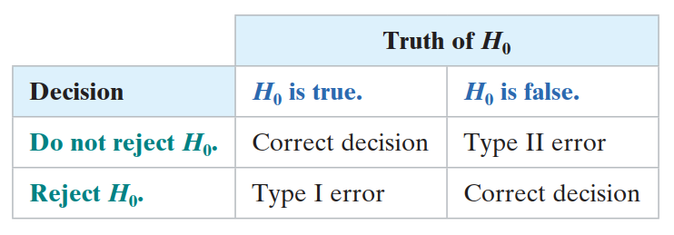
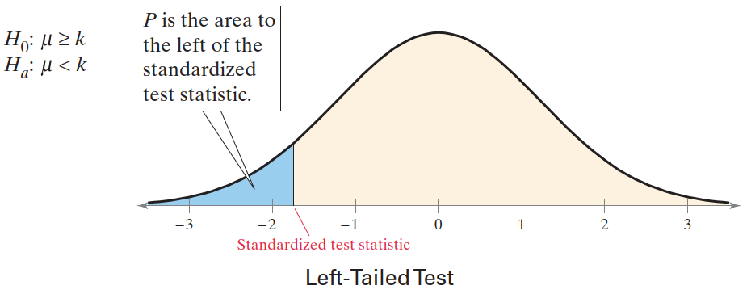
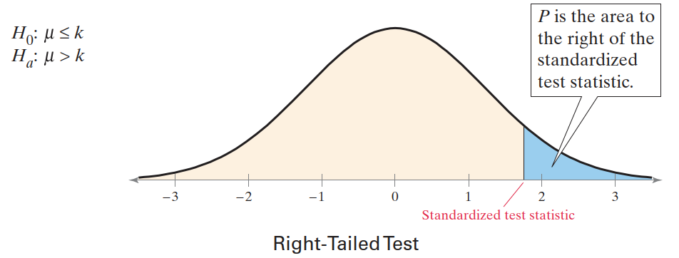
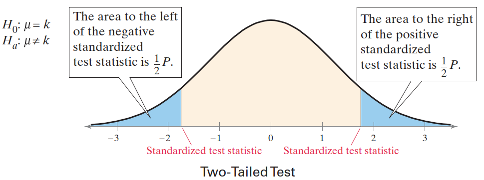
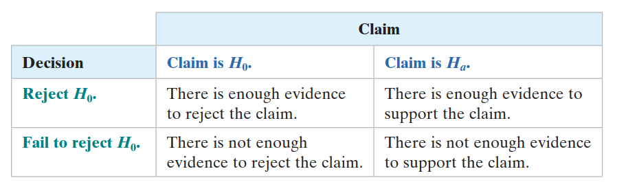
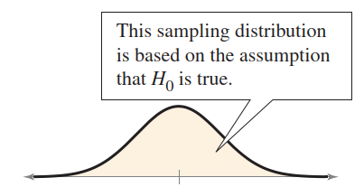
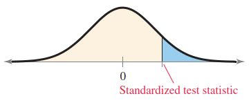

# 假设检验

- [假设检验](#假设检验)
  - [1. 基本概念](#1-基本概念)
    - [原假设和备择假设](#原假设和备择假设)
    - [相关概念](#相关概念)
    - [错误类型](#错误类型)
    - [统计检验和 p-value](#统计检验和-p-value)
    - [作出决定](#作出决定)
  - [2. 使用 p-Value 进行假设检验的步骤](#2-使用-p-value-进行假设检验的步骤)
    - [假设检验策略](#假设检验策略)
  - [3. 功效函数](#3-功效函数)

2024-04-30 ⭐
@author Jiawei Mao
***

## 1. 基本概念

### 原假设和备择假设

1. **原假设**（null hypothesis） **H0** 通常是包含等号的假设，例如 $\le$, =, or $\ge$；

2. **备择假设**（alternative hypothesis）**Ha** 是原假设的对立面。

  原假设为 false 时，备择假设必然为 true。Ha 命题通常包含不等式，如 $>$, $≠$, or $<$

例如：

$$
\begin{cases}
    H_0: \mu\le k\\
    H_a: \mu > k
\end{cases}
$$

$$
\begin{cases}
    H_0: \mu \ge k\\
    H_a: \mu < k
\end{cases}
$$

$$
\begin{cases}
    H_0: \mu = k\\
    H_a: \mu \ne k
\end{cases}
$$

### 相关概念

在检验一个假设时所使用的统计量称为**检验统计量**。

使原假设得到接受的那些样本（$X_1,\cdots,X_n$）所在的区域 $A$，称为该检验的**接受域**；而使原假设被否定的那些样本所在的区域 $R$，则称为该检验的**拒绝域**。拒绝域又称为否定域，临界域。$A$ 与 $R$ 互补，知其一即知其二。定一个检验，等价于指定其接受域或拒绝域。

不论是原假设还是备择假设，若其中只包含一个参数值，就称为**简单假设**，否则就称为**复合假设**。

### 错误类型

因为检验是基于一个样本而不是总体，所以总有可能做出错误的决定。

**定义**

- **I 类错误**（type I error）：原假设为 true，但是拒绝了原假设；
- **II 类错误**（type II error）：原假设为 false，但是接受了原假设。

如下表所示：

在假设检验中，**显著性水平**（level of significance）是允许犯 I 类错误的最大概率，通常用 $\alpha$ 表示。II 类错误的概率用字母 $\beta$ 表示。

将显著性水平设置为一个很小的值，表示希望假阳性的概率很小。三种常用的显著性水平：$\alpha=0.10$, $\alpha=0.05$, $\alpha=0.01$。

> 降低 $\alpha$，很可能增加 $\beta$。

在假设检验中，通常先保证 I 类错误的概率不超过指定 $\alpha$，再在这个限制下，使 II 类错误的概率尽可能小。

**定义：** 设 $\Phi$ 是原假设 $H_0$ 的一个检验，$\beta_{\Phi}(\theta_1,\cdots,\theta_k)$ 为其功效函数，如果：

$$
\beta_{\Phi}(\theta_1,\cdots,\theta_k)\le \alpha
$$

则称 $\Phi$ 为 $H_0$ 的执行水平为 $\alpha$ 的检验。

### 统计检验和 p-value

声明原假设和备择假设，指定显著性水平，假设检验的下一步是随机抽样，获取样本统计量，如 $\overline{x}$, $\hat{p}$ 或 $s^2$。这些样本统计量称为**检验统计量（test statistic）**。

假设原假设为真，然后将检验统计量转换为标准化检验统计量，如 $z$, $t$ 或 $\chi^2$。

常见单样本统计检验：

|总体参数|Test statistic|Standardized test statistic|
|---|---|---|
|$\mu$|$\overline{x}$|$z$ ($\sigma$ 已知) $t$ ($\sigma$ 未知)|
|$p$|$\hat{p}$|$z$|
|$\sigma^2$|$s^2$|$\chi^2$|

决定是否拒绝原假设的一种方法是：确定获得标准化检验统计量的概率是否小于显著性水平。

有三种类型的假设检验：

- left-tailed
- right-tailed
- two-tailed

1. 如果备择假设 $H_a$ 包含 $<$，则假设检验是**左边检验**

2. 如果备择假设 $H_a$ 包含 $>$，则假设检验是**右边假设**

3. 如果备择假设 $H_a$ 包含 $\ne$，则假设检验是**双边检验**

对双边检验，两边面积各为 $\frac{1}{2}p$

p-Value 越小，则拒绝 $H_0$ 的证据越充分。需要注意，即使 p-Value 非常非常小也不能证明 $H_0$ 是错误的，只能证明它可能是错误。

### 作出决定

假设检验的最后一步，作出决定，并解释为什么。对任何假设检验，只有两种结果：（1）拒绝原假设；（2）未能拒绝原假设。

**基于 p-Value 的决策**

通过比较 p-Value 和 $\alpha$ 进行判断：

1. 如果 $P\le \alpha$，则拒绝 $H_0$
2. 如果 $P>\alpha$，则未能拒绝 $H_0$

没有拒绝原假设并不代表接受原假设为 true。它仅仅表示没有足够的证据来拒绝原假设。

## 2. 使用 p-Value 进行假设检验的步骤

> **NOTE**
> 在进行假设检验时，应该在收集数据之前声明零假设和备择假设。

**假设检验步骤**

1. 用数学或语言方式声明假设。确定零假设和备择假设。

$$
H_0: ?
$$

$$
H_a: ?
$$

2. 指定显著性水平

$$
\alpha=?
$$

3. 确定标准化抽样分布，并绘图

4. 计算检验统计量和相应的标准化检验统计量。把它添加到上图中

5. 计算 p-Value
6. 作出决策

- 如果 p-Value 小于等于显著性水平，拒绝 $H_0$；
- 否则，未能拒绝 $H_0$

7. 作出声明，根据原假设解释决策结果。

### 假设检验策略

假设检验使用的策略取决于你是想支持还是拒绝一个声明。

假设检验是试图证明能够拒绝 $H_0$，所以：

- 如果你想**支持**某个说法，应该将其声明为**备择假设**
- 如果你想**拒绝**某个说法，应该将其声明为**零假设**

## 3. 功效函数

同一个原假设可以有许多检验方法，**功效函数** 用于区分不同检验方法的优劣。

**例如：** 假设元件寿命服从[指数分布](../distribution/exponential.md)，通过抽样数据判断“元件平均寿命不小于 5000 小时”。取如下检验：

$$
\begin{cases}
    H_0:\mu \ge 5000\\
    H_a:\mu < 5000
\end{cases} \tag{1}
$$

原假设 $H_0$ 被接受与否取决于样本 $X_1,\cdots,X_n$，而样本是随机的。因此原假设被否定的概率为：

$$
\beta_{H_a}(\lambda)=P_{\lambda}(\overline{X}<C)
$$

其中 $\lambda$ 为总体参数。因为 $2\lambda(X_1+\cdots+X_n)～\chi^2(2n)$，分布函数记为 $K_{2n}$，则有：

$$
\begin{aligned}
\beta_{H_a}(\lambda)
&=P_{\lambda}(X_1+\cdots+X_n<nC)\\
&=P_{\lambda}(2\lambda(X_1+\cdots+X_n)<2\lambda nC)\\
&=K_{2n}(2\lambda nC)
\end{aligned} \tag{2}
$$

该值与 $\lambda$ 相关，随 $\lambda$ 上升而增加。因为 $\lambda$ 越大，离开原假设 $1/\lambda \ge 5000$ 越远，一个合理的检验方法就需要用更大的概率去否定它。

函数（2）就是检验（1）的功效函数。由此，提供一般定义：

**定义** 设总体分布包含若干个未知参数 $\theta_1,\cdots,\theta_k$。$H_0$ 是关于这些参数的一个原假设，设有样本 $X_1,\cdots,X_n$，而 $\Phi$ 是基于这些样本对 $H_0$ 所做的一个检验。则称检验 $\Phi$ 的功效函数为：

$$
\beta_{\Phi}(\theta_1,\cdots,\theta_k)=P_{\theta_1,\cdots,\theta_k}
$$

即 $H_0$ 被否定的概率。

当某一特定参数值 $(\theta_1^0,\cdots,\theta_k^0)$ 使 $H_0$ 成立，我们希望 $\beta_{\Phi}(\theta_1,\cdots,\theta_k)$ 尽可能小；反之，则希望 $\beta_{\Phi}(\theta_1,\cdots,\theta_k)$ 尽可能大。

同一个原假设的两个检验 $\Phi_1$ 和 $\Phi_2$，哪一个更符合这个要求，哪一个就更好。
