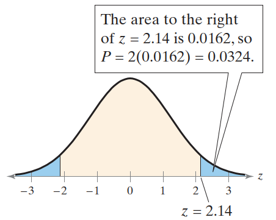
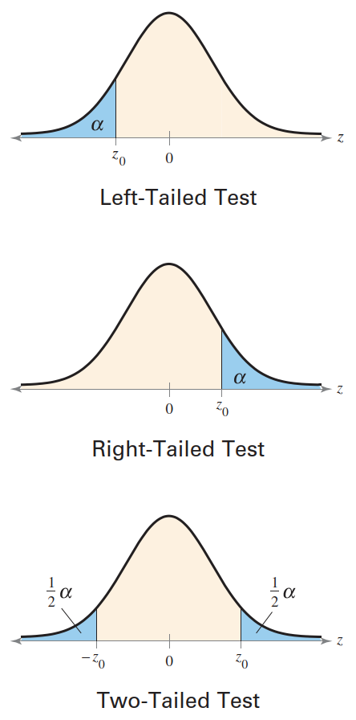

# 均值检验（σ 已知）

- [均值检验（σ 已知）](#均值检验σ-已知)
  - [1.使用 p-Value 作决策](#1使用-p-value-作决策)
    - [基于 p-Value 的决策](#基于-p-value-的决策)
    - [找到假设检验的 p-Value](#找到假设检验的-p-value)
  - [2. 使用 p-Value 进行 z-Test](#2-使用-p-value-进行-z-test)
    - [使用 p-Value 进行 z-test 的步骤（σ 已知）](#使用-p-value-进行-z-test-的步骤σ-已知)
  - [3. 拒绝域和临界值](#3-拒绝域和临界值)
    - [计算标准正态分布中的临界值](#计算标准正态分布中的临界值)
    - [使用拒绝域进行 z-Test](#使用拒绝域进行-z-test)
    - [使用拒绝域进行 Z-Test 的操作指南](#使用拒绝域进行-z-test-的操作指南)

2024-04-30 ⭐
@author Jiawei Mao
***
## 1.使用 p-Value 作决策

当样本量不小于 30，那么 $\overline{x}$ 的抽样分布为正态分布。

### 基于 p-Value 的决策

通过比较 p-Value 和 $\alpha$ 进行判断：

1. 如果 $P\le \alpha$，则拒绝 $H_0$
2. 如果 $P>\alpha$，则未能拒绝 $H_0$

**例 1：** 解释 p-Value

如果假设检验的 $P=0.0237$。当显著性水平为（1）$\alpha=0.05$ 和（2）$\alpha=0.01$，决策是？

解：
1. 因为 $0.0237 < 0.05$，所以拒绝零假设；
2. 因为 $0.0237 > 0.01$，所以无法拒绝零假设。

> p-Value 越小，拒绝 $H_0$ 的证据越充分。
> p-Value 是根据样本统计量拒绝零假设的最低显著性水平。在例 1 中，任何大于或等于 0.0237 的显著性水平，都能够拒绝 $H_0$。

### 找到假设检验的 p-Value

在确定假设检验的标准化检验统计量和对应的区域后。执行以下操作计算 p-Value：

a. 左边检验，P=左尾面积
b. 右边检验，P=右尾面积
c. 双边检验，P=两尾面积加和

**例 2：** 计算左边检验的 p-Value

标准化检验统计量 $z=-2.23$，显著性水平 $\alpha=0.01$，是否拒绝 $H_0$。

```java
NormalDistribution distribution = new NormalDistribution();
double v = distribution.cumulativeProbability(-2.23);
System.out.println(v);
```

```
0.012873721438602019
```

p-Value 为 0.0129，大于 0.01，所以无法拒绝 $H_0$。

**例 3：** 计算双边检验的 p-Value

标准化检验统计量 $z=2.14$，显著性水平 $\alpha=0.05$，是否拒绝 $H_0$。下图是标准正态曲线：



蓝色区域左侧 $z=-2.14$，右侧 $z=2.14$，对双边检验，p-Value 为两个蓝色区域面积加和。

```java
NormalDistribution distribution = new NormalDistribution();
double v = distribution.cumulativeProbability(-2.14);
System.out.println(v);
```

```
0.016177383372166065
```

所以，p-Value = 0.0162*2=0.0324。

因为 p-Value < 0.05，所以拒绝 $H_0$。

## 2. 使用 p-Value 进行 z-Test

下面就是这篇的主题，**标准差 $\sigma$ 已知时**，如何对均值 $\mu$ 进行假设检验。

标准差 $\sigma$ 已知，可以用 **z-test** 检验均值。

要使用 z-test，首先要计算检验统计量 $\overline{x}$ 的标准化值。均值的标准化检验统计量的形式为：

$$
z=\frac{样本均值-假设均值}{标准差}
$$

**均值 $\mu$ 的 z-test**

z-test 用于总体均值的统计检验。检验统计量（test statistic）为样本均值 $\overline{x}$，标准化检验统计量为：

$$
z=\frac{\overline{x}-\mu}{\sigma/\sqrt{n}}
$$

前提条件：

1. 样本随机
2. 总体为正态分布，或样本数 $n\ge 30$

其中，$\sigma/\sqrt{n}$ 是均值的标准差 $\sigma_{\overline{x}}$。

### 使用 p-Value 进行 z-test 的步骤（σ 已知）

1. 验证前提条件：$\sigma$ 已知，样本随机，总体为正态分布或 $n\ge 30$；
2. 用数学或语句声明假设，确定零假设和备择假设：声明 $H_0$ 和 $H_a$；
3. 执行显著性水平 $\alpha$；
4. 计算标准化统计量：$z=\frac{\overline{x}-\mu}{\sigma/\sqrt{n}}$；
5. 计算 $z$ 对应的面积
6. 计算 p-Value
    a. 对左边检验，p-Value 的左尾面积
    b. 对右边检验，p-Value 的右尾面积
    c. 对双边检验，p-Value 的两边面积加和。
7. 做出决策，拒绝还是无法拒绝零假设：如果 $p\le \alpha$，即拒绝 $H_0$，否则无法拒绝 $H_0$；
8. 根据原假设给出结论。

> 对所有假设检验，绘制抽样分布图都很有帮助。

**例 4：** 在汽车比赛中，pit-stop 是赛车更新新轮胎、加油、修理的地方。维修人员的效率会影响比赛的结果。一个维修人员称，它们的平均进展时间（更换 4 个轮胎和加油）不到 13 秒。随机抽样 32 次，样本均值为 12.9 秒。假设总体标准差为 0.19 秒。那么，在 $\alpha = 0.01$ 时，是否有足够证据支持上述声明。
**解：** $\sigma$ 已知（$\sigma=0.19$），样本随机，样本数 $n=32\ge 30$，可以用 z-test。
声明是：“平均进站时间少于 13 秒”。因此，零假设和备择假设为：

$$
H_0: \mu \ge 13\\
H_a: \mu < 13
$$

显著性水平 $\alpha=0.01$。标准化统计量：

$$
\begin{aligned}
    z&=\frac{\overline{x}-\mu}{\sigma/\sqrt{n}}\\
    &=\frac{12.9-13}{0.19/\sqrt{32}}\\
    &\approx -2.98
\end{aligned}
$$

$z=-2.98$ 对应的面积为 0.0014，因为这是左边检验，因此 p-Value 为 0.0014。由于 p-Value 小于 $\alpha=0.01$，因此拒绝零假设。
结论：在 0.01 显著性水平下，有足够证据支持平均进站时间少于 13 秒的说法。

## 3. 拒绝域和临界值

除了采用 p-Value，还可以通过判断标准化检验统计里是否落在抽样分布的拒绝域来决定是否拒绝零假设。

**定义：** 抽样分布的**拒绝域（rejection region）** 或 **临界域（critical region）** 指不接受零假设的值范围。如果标准化检验统计量落在这个区域，就拒绝零假设。**临界值** $z_0$ 将拒绝域和非拒绝域分开。

### 计算标准正态分布中的临界值

1. 指定显著性水平 $\alpha$
2. 确定检验类型：左边、右边还是双边；
3. 计算临界值 $z_0$：
    a. 左边检验，面积 $\alpha$ 对应的 z-score
    b. 右边检验，面积 $1-\alpha$ 对应的 z-score
    c. 双边检验，$\frac{1}{2}\alpha$ 和 $1-\frac{1}{2}\alpha$ 对应的 z-score
4. 描绘标准正态分布，在每个临界值处画一条垂直线，并对拒绝域进行着色。如下图



### 使用拒绝域进行 z-Test

使用拒绝域进行假设检验，首先计算标准化假设检验量 $z$。如果标准化检验统计量满足：

1. 在拒绝域内，则拒绝 $H_0$；
2. 不在拒绝域内，则无法拒绝 $H_0$。

> 再次强度，没有拒绝零假设不代表零假设为真，仅仅表示没有足够证据来拒绝零假设。

### 使用拒绝域进行 Z-Test 的操作指南

1. 确认 $\sigma$ 已知，样本随机，总体为正态分布或样本数 $n\ge 30$；
2. 使用数学和语言方式声明零假设和备择假设：声明 $H_0$ 和 $H_a$；
3. 指定显著性水平 $\alpha$；
4. 计算临界值；
5. 确定拒绝域；
6. 计算标准化检验统计量：$z=\frac{\overline{x}-\mu}{\sigma/\sqrt{n}}$；
7. 作出决策：拒绝或无法拒绝 $H_0$：如果 $z$ 在拒绝域，就拒绝 $H_0$，否则无法拒绝 $H_0$。
8. 给出结论。
