# 单样本假设检验

- [单样本假设检验](#单样本假设检验)
  - [1. 假设检验概述](#1-假设检验概述)
    - [假设检验](#假设检验)
    - [零假设和备择假设](#零假设和备择假设)
    - [错误类型和显著性水平](#错误类型和显著性水平)
    - [统计检验和 p-value](#统计检验和-p-value)
    - [作出决策并解释](#作出决策并解释)
    - [使用 p-Value 进行假设检验的步骤](#使用-p-value-进行假设检验的步骤)
    - [假设检验策略](#假设检验策略)
  - [2. 均值检验（σ已知）](#2-均值检验σ已知)
    - [使用 p-Value 作决策](#使用-p-value-作决策)
    - [使用 p-Value 进行 z-Test](#使用-p-value-进行-z-test)
    - [拒绝域和临界值](#拒绝域和临界值)
    - [使用拒绝域进行 z-Test](#使用拒绝域进行-z-test)
  - [3. 均值检验（σ 未知）](#3-均值检验σ-未知)
    - [t 分布中的临界值](#t-分布中的临界值)
    - [均值 μ 的 t-Test](#均值-μ-的-t-test)
    - [t-test 流程：p-Value](#t-test-流程p-value)
  - [4. 比例检验](#4-比例检验)
  - [5. 方差和标准差的假设检验](#5-方差和标准差的假设检验)
    - [卡方检验的临界值](#卡方检验的临界值)
    - [卡方检验](#卡方检验)

2024-11-14⭐
@author Jiawei Mao
***

## 1. 假设检验概述

### 假设检验

**假设检验（hypothesis test）** 是一个使用样本统计量来检验有关总体参数声明的过程。

例如，假设一家制造商宣传其新款混动车的平均油耗为每加仑 50 英里。但是你怀疑该数据，那么如何证明广告是错误的？显然，你无法测试所有车，但仍然可以通过随机抽样并测量样本中每辆车的油耗来对平均油耗做出合理的判断。如果样本平均值与广告平均值相差很大，就可以判定广告是错误的。

为了测试这类混动车的平均油耗是否为 $\mu=50$ 英里/加仑，你随机抽取 $n=30$ 辆车并测量每辆车的油耗。你获得的样本平均值为 $\overline{x}=47$ 英里/加仑，样本标准差为 $s=5.5$ 英里/加仑。这是否表明制造商的广告是虚假的？

为了做出判断，首先你假设广告是正确的，即假设 $\mu=50$。然后检查从 $\mu=50$, $\sigma=5.5$ 的总体中抽取样本均值 $n=30$ 的抽样分布。根据[中心极限定理](../distribution/normal.md#中心极限定理)，该抽样分布为正态分布，且平均值为 50，标准差为：

$$
\sigma_{\overline{x}}=\frac{\sigma}{\sqrt{n}}=\frac{5.5}{\sqrt{30}}\approx 1
$$

如下图所示，可以发现样本均值 $\overline{x}=47$ 的概率极低，与声称的平均值相差约 3 个标准差 （$z\approx -2.99$）。因此，如果广告是真的，那么获得 47 或更低的样本平均值的概率约为 0.001，这是一个 unusual-event。所以，假设该公司的广告是正确的，导致得到一个不大可能的结果，因此，要么是样本非常 unusual，要么广告可能是假的。合乎逻辑的结论是广告可能是假的。

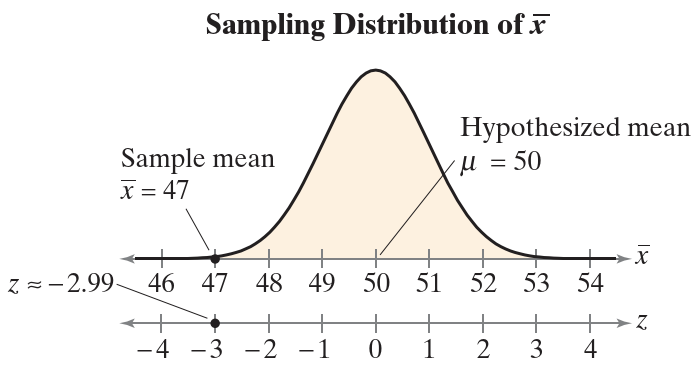

### 零假设和备择假设

关于总体参数的陈述称为**统计假设**（statistical hypothesis）。要检验总体参数，首先要陈述一对假设：一个代表目标，一个为其互补。当一个假设为 false，另一个必须为 true。两个假设：null hypothesis 或 alternative hypothesis 都可能代表原目标。

1. **零假设**（null hypothesis, $H_0$）通常是包含等式陈述的统计假设，如 $\le, =, \ge$
2.  **备择假设**（alternative hypothesis, $H_a$）为零假设的补集，在 $H_0$ 为 false 时它必然为 true，备择假设通常包含不等式陈述，如 $>, \ne, <$。

声明零假设和备择假设，就是将关于总体参数的声明从口头陈述转换为数学形式。然后写出它的互补形式。例如，如果声明值为 $k$ 而总体参数为 $\mu$，那么零假设和备择假设的可能组合形式包括：

$$
\begin{cases}
    H_0: \mu\le k\\
    H_a: \mu > k
\end{cases}
$$

$$
\begin{cases}
    H_0: \mu \ge k\\
    H_a: \mu < k
\end{cases}
$$

$$
\begin{cases}
    H_0: \mu = k\\
    H_a: \mu \ne k
\end{cases}
$$

不管使用哪种形式，总是假设 $\mu=k$，然后基于该假设检查抽样分布。在抽样分布中，确定样本统计量是否 unusual。

下表显示了关于参数 $\mu$ 的可能陈述以及相应的零假设与备择假设。对其它总体参数，如 $p$, $\sigma$ 或 $\sigma^2$ 可以做出类似陈述。

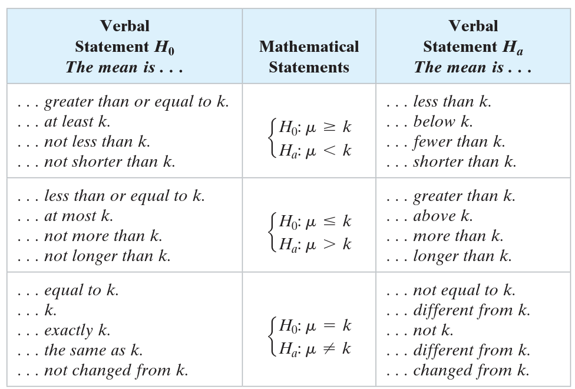

**例 1：** 陈述零假设和备择假设

为每个声明写一个数学陈述。声明零假设和备择假设，并确定哪个代表目标声明。

1. 某学校宣传至少参加一项课外活动的学生比例为 61%

$$
\begin{cases}
    H_0: p = 0.61\\
    H_a: p \ne 0.61
\end{cases}
$$

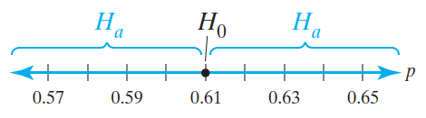

零假设为目标声明。

2. 某汽车经销商宣称其换油的平均时间小于 15 分钟

$$
\begin{cases}
    H_0: \mu \ge 15\\
    H_a: \mu < 15
\end{cases}
$$

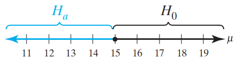

备择假设为目标声明。

3. 以公司宣称其熔炉的平均寿命超过 18 年

$$
\begin{cases}
    H_0: \mu \le 18\\
    H_a: \mu > 18
\end{cases}
$$

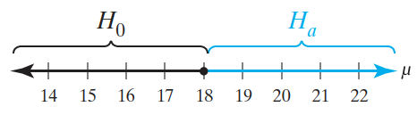

备择假设为目标声明。

### 错误类型和显著性水平

不管哪种假设代表目标声明，假设检验总是通过假设零假设中的相等条件为 true 开始。因此，进行假设检验会做出一下两个决定之一：

1. 拒绝零假设
2. 无法拒绝零假设（fail to reject null hypothesis）

因为假设检验是基于样本而不是总体做出的决策，所以有可能做出错误的决策。

例如，声明一个硬币是均匀的。为了检验该声明，设 $p$ 代表正面的比例，那么硬币是否均匀可以写成：

$$
\begin{cases}
    H_0: p =0.5\\
    H_a: p \ne 0.5
\end{cases}
$$

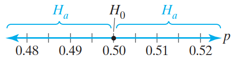

> [!WARNING]
>
> 要绝对确定 $H_0$ 的真假，唯一的方法是查看整个总体。
>
> 由于假设检验的结论（拒绝 $H_0$ 或无法拒绝 $H_0$）是基于样本，因此要接受决策出错的可能。

错误类型：

- **I 类错误**（type I error）：零假设为 true，拒绝了零假设；
- **II 类错误**（type II error）：零假设为 false，接受了零假设。

下表为假设检验的四种可能结果：


**例 2：** 识别 Type I 和 Type II 错误

美国农业部对碎牛肉沙门氏菌污染的限制是 7.5%。一位肉类检验员报告称，一家公司生产的碎牛肉超过农业部的限制。你进行假设检验，以确定肉类检验员的说法是否属实。什么时候会发生 I 类错误和 II 类错误？哪种错误更严重？

**解：** 将碎牛肉中受污染的比例记为 $p$。检验员的说法是受污染的超过 7.5%，因此假设可以写为

$$
\begin{cases}
    H_0: p \le 0.075\\
    H_a: p > 0.075
\end{cases}
$$

Type I 错误指零假设为 true，但拒绝了零假设：碎牛肉受污染比例不高于 7.5%，但检验员说高于 7.5%。

Type II 错误指零假设为 false (备择假设为 true)，但接受了零假设：碎牛肉受污染比例高于 7.5%，但检验员说不高于 7.5%。

显然，从安全角度考虑，Type II 错误的危害更大。

当抽样分布中的样本统计量异常时，拒绝零假设。由于样本之间存在差异，因此当零假设为 true，也有可能拒绝零假设。

在假设检验中，**显著性水平**（level of significance）是允许犯 Type I 错误的最大概率，记为 $\alpha$。范 II 类错误的概率记为 $\beta$。

将显著性水平设置为一个很小的值，表示希望犯 Type I 错误概率很小。三种常用的显著性水平：$\alpha=0.10$, $\alpha=0.05$, $\alpha=0.01$。

> [!NOTE]
>
> 降低 $\alpha$，很可能增加 $\beta$。

在假设检验中，通常先保证 I 类错误的概率不超过指定 $\alpha$，再在这个限制下，使 II 类错误的概率尽可能小。

### 统计检验和 p-value

声明零假设、备择假设和指定显著性水平，假设检验的下一步是随机抽样，计算样本统计量，如 $\overline{x}$, $\hat{p}$ 或 $s^2$。这些样本统计量称为**检验统计量（test statistic）**。假设零假设为 true，然后将检验统计量转换为标准化检验统计量（standardized test statistic），如 $z$, $t$ 或 $\chi^2$。

下面假设几种单样本统计检验。下表为常见单样本统计检验的总体参数、检验统计量和标准化检验统计量：

|总体参数|检验统计量|标准化检验统计量|
|---|---|---|
|$\mu$|$\overline{x}$|$z$ ($\sigma$ 已知)<br />$t$ ($\sigma$ 未知)|
|$p$|$\hat{p}$|$z$|
|$\sigma^2$|$s^2$|$\chi^2$|

决定是否拒绝零假设的一种方法是：确定获得标准化检验统计量的概率是否小于显著性水平。

如果零假设为 true，则假设检验的 P-value (probability value) 就是获得样本统计量或更极端值的概率。假设检验的 p-value 取决于检验性质。假设检验有三种类型：

- left-tailed
- right-tailed
- two-tailed

检验类型取决于有利于拒绝 $H_0$ 的抽样分布的位置，即备择假设对应区域。

1. 如果备择假设 $H_a$ 包含 $<$，则假设检验是**左尾检验**


2. 如果备择假设 $H_a$ 包含 $>$，则假设检验是**右尾假设**


3. 如果备择假设 $H_a$ 包含 $\ne$，则假设检验是**双尾检验**

对双尾检验，两边面积各为 $\frac{1}{2}p$


p-Value 越小，则拒绝 $H_0$ 的证据越充分。需要注意，即使 p-Value 非常非常小也不能证明 $H_0$ 是错误的，只能证明它可能是错误。

**例 3：** 确定假设检验的性质

对每个声明，用文字或符号声明 $H_0$ 和 $H_a$。然后确定是左尾检验、右尾检验还是双尾检验。画出正态抽样分布，标出 p-value 区域。

1. 某学校宣称其参加至少一项课外活动的学生比例为 61%。

$$
\begin{cases}
    H_0: p = 0.61\\
    H_a: p \ne 0.61
\end{cases}
$$

因为 $H_a$ 包含 $\ne$，所以是双尾检验。

### 作出决策并解释

假设检验的最后一步：作出决策并解释。

对任何假设检验，只有两种可能结果：

（1）拒绝原假设；

（2）无法拒绝原假设。

**基于 p-value 的决策**

通过比较 p-value 和 $\alpha$ 进行判断：

1. 如果 $P\le \alpha$，则拒绝 $H_0$
2. 如果 $P>\alpha$，则无法拒绝 $H_0$

无法拒绝零假设不代表零假设为 true，仅仅表示没有足够证据拒绝零假设。如下表：


### 使用 p-Value 进行假设检验的步骤

> [!NOTE]
>
> 在进行假设检验时，应该在收集数据之前声明零假设和备择假设。

**假设检验步骤**

1. 用数学或语言方式声明假设。确定零假设和备择假设。

$$
H_0: ?
$$

$$
H_a: ?
$$

2. 指定显著性水平

$$
\alpha=?
$$

3. 确定标准化抽样分布，并绘图


4. 计算检验统计量和相应的标准化检验统计量。把它添加到上图中


5. 计算 p-value
6. 作出决策

- 如果 p-Value 小于等于显著性水平，拒绝 $H_0$；
- 否则，无法拒绝 $H_0$

7. 声明，根据零假设解释决策结果。

> 上面步骤 4 显示的右尾检验，对左尾检验和双尾检验，基本步骤相同。

### 假设检验策略

假设检验使用的策略取决于你是想支持还是拒绝某个声明。

假设检验是试图证明能够拒绝 $H_0$，所以：

- 如果你想**支持**某个说法，应该将其声明为**备择假设**
- 如果你想**拒绝**某个说法，应该将其声明为**零假设**

**例：** 写出假设

一个医学研究团队正在调查一种新外科治疗的优点。其中一项声明是，患者接受新治疗后的平均恢复时间少于 96 小时。

1. 如果要支持声明，如何写零假设和备择假设，如何解释拒绝零假设的决策？
2. 如果要拒绝该声明，如何写零假设和备择假设，如何解释拒绝零假设的决策？

**解：**

1. 支持的声明，要写成备择假设，即$H_a$: $\mu < 96$ 小时。其补集为 $H_0$: $\mu \ge 96$ 为零假设。

如果拒绝 $H_0$，意味着支持平均恢复时间小于 96 小时的说法。

2. 要拒绝该声明，所以将其声明为零假设，即 $H_0$: $\mu \le 96$ 小时，对应备择假设为 $H_a$: $\mu > 96$ 小时。如果拒绝 $H_0$，表示拒绝平均恢复时间少于 96 小时的声明。

## 2. 均值检验（σ已知）

### 使用 p-Value 作决策

当样本量 $n\ge 30$，样本均值 $\overline{x}$ 的抽样分布为正态分布。若使用 p-value 做决策，假设零假设为 true，假设检验的 p-value 是获得如样本统计量一样或更极端值的概率。

**基于 p-value 的假设检验的决策规则**

比较 p-Value 和 $\alpha$：

1. 如果 $P\le \alpha$，则拒绝 $H_0$
2. 如果 $P>\alpha$，则无法拒绝 $H_0$

**例 1：** 解释 p-Value

如果假设检验的 p-value 为 $P=0.0237$。当显著性水平为（1）$\alpha=0.05$ 和（2）$\alpha=0.01$，决策是？

**解：**

1. 因为 $0.0237 < 0.05$，所以拒绝零假设；
2. 因为 $0.0237 > 0.01$，所以无法拒绝零假设。

p-value 越小，拒绝 $H_0$ 的证据越充分。p-Value 是根据样本统计量拒绝零假设的最低显著性水平。在例 1 中，任何大于或等于 0.0237 的显著性水平，都能够拒绝 $H_0$。

**计算假设检验的 p-value**

在确定假设检验的标准化检验统计量和对应的区域后。执行以下操作计算 p-Value：

a. 左尾检验，P=左尾面积
b. 右尾检验，P=右尾面积
c. 双尾检验，P=两尾面积加和

**例 2：** 计算左边检验的 p-Value

标准化检验统计量 $z=-2.23$，当显著性水平 $\alpha=0.01$，是否拒绝 $H_0$。

```java
NormalDistribution distribution = new NormalDistribution();
double v = distribution.cumulativeProbability(-2.23);
System.out.println(v);
```

```
0.012873721438602019
```

p-Value 为 0.0129，大于 0.01，所以无法拒绝 $H_0$。

**例 3：** 计算双尾检验的 p-value

标准化检验统计量 $z=2.14$，显著性水平 $\alpha=0.05$，是否拒绝 $H_0$。下图是标准正态曲线：


蓝色区域左侧 $z=-2.14$，右侧 $z=2.14$，对双尾检验，p-value 为两个蓝色区域面积加和。

```java
NormalDistribution distribution = new NormalDistribution();
double v = distribution.cumulativeProbability(-2.14);
System.out.println(v);
```

```
0.016177383372166065
```

所以，p-Value = 0.0162*2=0.0324。

因为 p-Value < 0.05，所以拒绝 $H_0$。

### 使用 p-Value 进行 z-Test

下面就是这篇的主题，**标准差 $\sigma$ 已知时**，对均值 $\mu$ 进行假设检验。标准差 $\sigma$ 已知，可以用 **z-test** 检验均值。要使用 z-test，首先要计算检验统计量 $\overline{x}$ 的标准化值。均值的标准化检验统计量的形式为：

$$
z=\frac{样本均值-假设均值}{标准差}
$$

**均值 $\mu$ 的 z-test**

均值的 z-test 用于总体均值的统计检验。检验统计量（test statistic）为样本均值 $\overline{x}$，标准化检验统计量为：

$$
z=\frac{\overline{x}-\mu}{\sigma/\sqrt{n}}
$$

前提条件：

1. 样本随机
2. 总体为正态分布，或样本数 $n\ge 30$

其中，$\sigma/\sqrt{n}$ 是抽样分布样本均值的标准差 $\sigma_{\overline{x}}$。

**使用 p-Value 进行 z-test 的步骤（σ 已知）**

1. 验证前提条件：$\sigma$ 已知，样本随机，总体为正态分布或 $n\ge 30$；
2. 声明假设，确定零假设和备择假设 $H_0$ 和 $H_a$；
3. 指定显著性水平 $\alpha$；
4. 计算标准化统计量：$z=\frac{\overline{x}-\mu}{\sigma/\sqrt{n}}$；
5. 计算 $z$ 对应的面积
6. 计算 p-Value
    a. 对左尾检验，p-Value 为左边面积
    b. 对右尾检验，p-Value 为右边面积
    c. 对双尾检验，p-Value 为两边面积加和。
7. 做出决策，拒绝还是无法拒绝零假设：如果 $p\le \alpha$，则拒绝 $H_0$，否则无法拒绝 $H_0$；
8. 根据目标声明给出结论。

> 对所有假设检验，绘制抽样分布图都很有帮助。

**例 4：** 使用 p-value 进行假设检验

在赛车比赛中，pit-stop 是赛车更换轮胎、加油、修理的地方。维修人员的效率会影响比赛的结果。一个维修人员称他们的平均进站时间（更换 4 个轮胎和加油）不到 13 秒。随机抽样 32 次，样本均值为 12.9 秒。假设总体标准差为 0.19 秒。那么，在 $\alpha = 0.01$ 时，是否有足够证据支持上述声明。
**解：** $\sigma$ 已知（$\sigma=0.19$），样本随机，样本数 $n=32\ge 30$，可以用 z-test。
声明是：“平均进站时间少于 13 秒”。因此，零假设和备择假设为：
$$
H_0: \mu \ge 13\\
H_a: \mu < 13
$$

显著性水平 $\alpha=0.01$。标准化统计量：

$$
\begin{aligned}
    z&=\frac{\overline{x}-\mu}{\sigma/\sqrt{n}}\\
    &=\frac{12.9-13}{0.19/\sqrt{32}}\\
    &\approx -2.98
\end{aligned}
$$

$z=-2.98$ 对应的面积为 0.0014，这是左尾检验，因此 p-Value 为 0.0014。由于 p-value 小于 $\alpha=0.01$​，因此拒绝零假设。
**结论：** 在 0.01 显著性水平下，有足够证据支持平均进站时间少于 13 秒的说法。

### 拒绝域和临界值

除了采用 p-value，还可以通过判断标准化检验统计里是否落在抽样分布的拒绝域来决定是否拒绝零假设。

**定义：** 抽样分布的**拒绝域（rejection region）** 或 **临界域（critical region）** 指不接受零假设的值范围。如果**标准化检验统计量**落在这个区域，就拒绝零假设。**临界值** $z_0$ 将拒绝域和非拒绝域分开。

**计算标准正态分布中的临界值的步骤**

1. 指定显著性水平 $\alpha$
2. 确定检验类型：左尾、右尾还是双尾；
3. 计算临界值 $z_0$：
    a. 左边检验，面积 $\alpha$ 对应的 z-score
    b. 右边检验，面积 $1-\alpha$ 对应的 z-score
    c. 双边检验，$\frac{1}{2}\alpha$ 和 $1-\frac{1}{2}\alpha$ 对应的 z-score
4. 描绘标准正态分布，在每个临界值处画一条垂直线，标出拒绝域。如下图


**例：** 计算左尾检验的临界值

$\alpha=0.01$ 计算左尾检验的临界值和拒绝域。

```java
NormalDistribution distribution = new NormalDistribution();
System.out.println(distribution.inverseCumulativeProbability(0.01));
// -2.326347874040841
```

所以临界值为 $z_0=-2.33$，$z_0$ 左侧为拒绝域。

**例：** 计算双尾检验的临界值

$\alpha=0.05$ 计算双尾检验的临界值和拒绝域。

如下图所示：

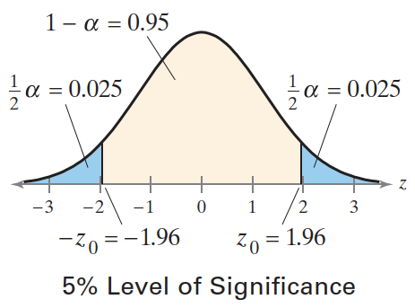

左边面积为 0.025，对应的 $-z_0$ 值为：

```java
NormalDistribution distribution = new NormalDistribution();
System.out.println(distribution.inverseCumulativeProbability(0.025));
// -1.959963984540054
```

所以临界值为：$-z_0=-1.96$, $z_0=1.96$。

-1.96 左侧和 1.96 右侧为拒绝域。

### 使用拒绝域进行 z-Test

使用拒绝域进行假设检验，首先计算标准化假设检验量 $z$。如果标准化检验统计量满足：

1. 在拒绝域内，则拒绝 $H_0$；
2. 不在拒绝域内，则无法拒绝 $H_0$。

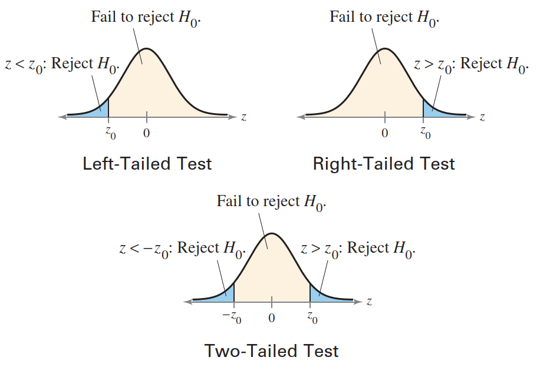

> [!WARNING]
>
> 再次强度，没有拒绝零假设不代表零假设为真，仅仅表示没有足够证据来拒绝零假设。

**使用拒绝域进行 Z-Test 的操作流程**

1. 确认 $\sigma$ 已知，样本随机，总体为正态分布或样本数 $n\ge 30$；
2. 使用数学和语言方式声明零假设和备择假设：声明 $H_0$ 和 $H_a$；
3. 指定显著性水平 $\alpha$；
4. 计算临界值；
5. 确定拒绝域；
6. 计算标准化检验统计量：$z=\frac{\overline{x}-\mu}{\sigma/\sqrt{n}}$；
7. 作出决策：拒绝或无法拒绝 $H_0$：如果 $z$ 在拒绝域，就拒绝 $H_0$，否则无法拒绝 $H_0$。
8. 给出结论。

**例：** 使用拒绝域进行假设检验

一家建筑公司的员工声称他们工程师的平均工资低于其竞争对手的工资，后者为 88200 美元。该公司随机抽取 20 名机械工程师的平均工资为 85900 美元。假设总体标准差为 9500，总体为正态分布。取 $\alpha=0.05$，检验员工的说法。

$\sigma=9500$，样本随机，总体为正态分布；

$$
H_0: \mu >= 88200\\
H_a: \mu < 88200
$$
为左尾检验。显著性水平 $\alpha=0.05$，对应的临界值：$z_0=-1.635$，拒绝域为 $z<-1.645$。

标准化检验统计量为：
$$
z=\frac{\overline{x}-\mu}{\sigma/\sqrt{n}}=\frac{85900-88200}{9500/\sqrt{20}}\approx -1.08
$$

$z$ 没有在拒绝域，因此无法拒绝零假设。

**结论：** 在 5% 显著性水平下，没有足够证据支持员工关于平均工资低于 88200 美元的说法。

要理解该结论，虽然样本平均值 85900 小于 88200，但也无法支持（5% 显著性水平下）所有工程师的工资平均值低于 88200 美元的说法。检验统计量 $\overline{x}=85900$ 和假设均值 $\mu=88200$ 之间的差异可能是抽样误差造成的。

**例：** 使用拒绝域进行假设检验

一位研究人员声称美国已婚家庭抚养一个孩子（2 岁以下）每年平均费用为 14050 美元。在一个美国已婚家庭的随机样本中，抚养一个孩子（2岁以下）的平均年费为 13795 美元，该样本包含 500 名儿童。假设总体标准差为 2875 美元。令 $\alpha=0.10$，是否有足够证据来拒绝该说明。

**解：** $\sigma=2875$，样本随机，且 $n=500>30$；两个假设：

$$
H_0: \mu = 14050\\
H_a: \mu \ne 14050
$$

为双尾检验。$\alpha=0.10$，单尾概率为 0.05，对应临界值为 -$z_0=-1.645$ 和 $z_0=1.645$。拒绝域为 $z<-1.645$, $z> 1.645$。标准化检验统计量：

$$
z=\frac{\overline{x}-\mu}{\sigma/\sqrt{n}}=\frac{13795-14050}{2875/\sqrt{500}}\approx -1.98
$$

$z$ 落在左边拒绝域内，因此拒绝零假设。

**结论：** 在 10% 的显著性水平下有足够证据来反驳：美国已婚家庭抚养一个2岁以下孩子的平均年成本为 14050 美元的说法。

## 3. 均值检验（σ 未知）


### t 分布中的临界值

上面介绍了在已知总体标准差的情况下对总体均值的假设检验。然而在现实生活中，总体标准差大多是未知的，因此 Z-test 应用有限。

当**总体为正态分布**或**样本量不小于 30** 时，仍然可以检验总体均值 $\mu$，只是换成 t-test。

**计算 t 分布中的临界值**

1. 指定显著性水平 $\alpha$；
2. 确定自由度 $\text{d.f.} = n-1$；
3. 查表，根据自由度确定临界值。

如下图所示：

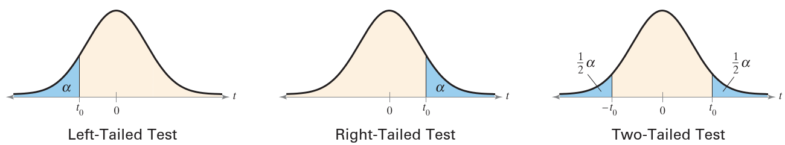

**例 1：** 查找左尾检验的临界值

假设 $\alpha=0.05$，$n=21$，计算左尾检验临界值 $t_0$。

**解：** 自由度为
$$
\text{d.f.}=n-1=21-1=20
$$

```java
TDistribution distribution = new TDistribution(20);
double v = distribution.inverseCumulativeProbability(0.05);
assertEquals(v, -1.725, 1e-3);
```

如下图：

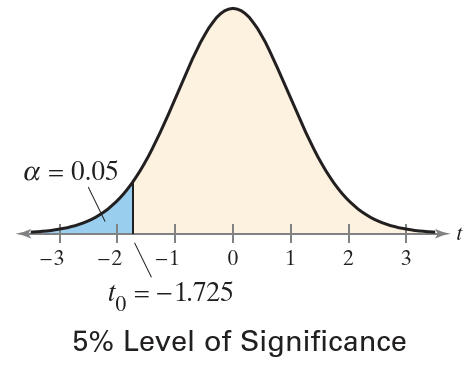

**例 2：** 查找右尾检验的临界值

假设 $\alpha=0.01$，$n=17$，计算右边检验的临界值 $t_0$。

```java
double criticalValue = TTestUtils.getRightCriticalValue(16, 0.01);
assertEquals(criticalValue, 2.583, 1e-3);
```

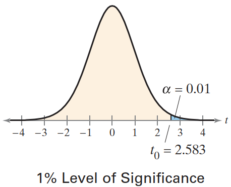

**例 3：** 双尾检验的临界值。

假设 $\alpha=0.10$，$n=26$。

```java
DoubleDoublePair criticalValue = TTestUtils.getCriticalValue(25, 0.1);
assertEquals(criticalValue.leftDouble(), -1.708, 1e-3);
assertEquals(criticalValue.rightDouble(), 1.708, 1e-3);
```

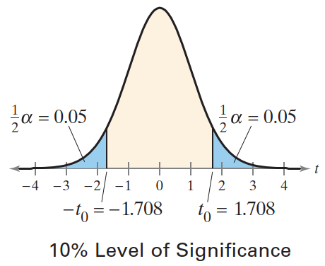

### 均值 μ 的 t-Test

$\sigma$ 未知时对均值 $\mu$ 的检验，可以使用 t 抽样分布。标准化检验统计量的形式为：

$$
t=\frac{样本均值-假设均值}{标准差}
$$

由于 $\sigma$ 未知，所以用**样本标准差** $s$ 替代 $\sigma$ 计算标准化检验统计量。

均值 $\mu$ 的 t 检验即对总体均值的统计检验。检验统计量为样本均值 $\overline{x}$。标准化检验统计量为：
$$
t=\frac{\overline{x}-\mu}{s/\sqrt{n}}
$$
需满足的前提条件：

1. 样本随机
2. 总体为正态分布，或样本量 $n\ge 30$

自由度 $\text{d.f.}=n-1$。

**总体均值的 t-test 流程(σ 未知)：拒绝域**

1. 验证前提条件：$\sigma$ 未知，样本随机，总体为正态分布或 $n\ge 30$；
2. 声明假设：$H_0$ 和 $H_a$；
3. 指定显著性水平 $\alpha$；
4. 确定自由度：$\text{d.f.}=n-1$；
5. 计算临界值；
6. 确定拒绝域；
7. 计算标准化检验统计量：$t=\frac{\overline{x}-\mu}{s/\sqrt{n}}$；
8. 下结论：拒绝或无法拒绝零假设；
9. 解释结论。

**例 4** 使用拒绝域策略执行 t-test

一位二手车商称过去 12 个月售出的二手车平均价格至少为 21000 美元。你怀疑这个说法，随机选择过去 12 个月售出的 14 辆二手车，平均价格为 19189 美元，标准差为 2950 美元。那么，是否有足够证据表明在 $\alpha=0.05$ 时拒绝二手车商的说法？假设总体为正态分布。

1. $\sigma$ 未知，样本随机，总体为正态分布，可以用 t-test；
2. 要拒绝的假设：$H_0\ge 21000$，备择假设 $H_a<21000$；
3. 显著性水平 $\alpha=0.05$；
4. 自由度：$\text{d.f.}=n-1=13$;
5. 显然，这是左尾检验，计算临界值：

```java
double criticalValue = TTestUtils.getLeftCriticalValue(13, 0.05);
System.out.println(criticalValue); // -1.7709333959890659
```

6. 所以，拒绝域为 $t<-1.771$；
7. 计算检验统计量

```jade
double statistic = TTestUtils.getStatistic(19189, 21000, 2950 * 2950, 14);
assertEquals(statistic, -2.297, 1e-3);
```

8. 下结论

由于 t 落在拒绝域内，因此拒绝零假设。

9. 解释

在 5% 显著性水平下，有足够证据来拒绝 $H_0$，即拒绝过去 12 个月售出的二手车的平均价格至少为 21000 美元的说法。

> [!WARNING]
>
> 用假设检验得出的结论可能犯错，拒绝 $H_0$ 可能犯 I 类错误。

### t-test 流程：p-Value

对单个均值的 t-test，也可以用 p-value。

**例 5** 基于 p-value 的 t-test

一个车站管理处称，人们平均等待时间不到 14 分钟。随机抽取 10 个人，平均等待时间为 13 分钟，标准差为 3.5 分钟。在 $\alpha=0.10$ 时，检验该车站管理处的说法。假设总体为正态分布。

1. 验证前提条件：$\sigma$  未知，样本随机，总体为正态分布，因此可以用 t-test；
2. 假设：$H_0$：$\mu \ge 14$ 分钟, $H_a$: $\mu < 14$ 分钟；
3. 显著性水平 $\alpha=0.10$；
4. 自由度：$df=9$；
5. 根据假设可判断右边检验，计算 p-value

```java
double pValue = TTestUtils.getOneSampleOneTailedPValue(13, 14, 3.5 * 3.5, 10);
System.out.println(pValue); // 0.19489940273037554
```

6. 下结论：因为 p-value 大于 $\alpha$，所以无法拒绝零假设；
7. 解释

在 10% 置信水平下，没有足够证据支持管理处平均时间少于 14 分钟的说法。

## 4. 比例检验

下面介绍针对总体比例 $p$ 的假设检验。

当政治家想知道支持某项法案的选民比例，或者质量保证工程师检验有缺陷零部件的比例，都可以使用比例假设检验。

在生物学研究中，许多数据是用比例表示的。当总体或样本中的个体分为两种属性，如药剂处理后害虫的死与活，种子的发芽与不发芽，动物的雌和雄等，类似这样的性状组成的总体通常服从**二项分布**。

设二项分布中具有“目标性状”的个体的比例为 $p$，另一种的比例为 $q$，则 $p+q=1$。如果 $np\ge 5$ 并且 $nq \ge 5$，那么 $\hat{p}$ 的**抽样分布近似为正态分布**，均值 $\mu_{\hat{p}}=p$，标准差为：
$$
\sigma_{\hat{p}}=\sqrt{pq/n}
$$

**比例 $p$ 的 z-test**

当二项分布满足 $np \ge 5$ 且 $nq \ge 5$，就可以用 z-test 检验总体比例。

**检验统计量**为样本比例 $\hat{p}$，**标准化检验统计量**为：
$$
z=\frac{\hat{p}-\mu_{\hat{p}}}{\sigma_{\hat{p}}}=\frac{\hat{p}-p}{\sqrt{pq/n}}
$$
**用 z-test 检验总体比例 p 的操作流程**

1. 确定 $\hat{p}$ 的抽样分布是否可以用正态分布近似：$np \ge 5$, $nq\ge 5$；
2. 声明假设 $H_0$ 和 $H_a$；
3. 指定显著性水平 $\alpha$；
4. 计算临界值；
5. 确定拒绝域；
6. 计算标准化检验统计量；

$$
z=\frac{\hat{p}-p}{\sqrt{pq/n}}
$$

7. 下结论；
8. 解释。

> [!TIP]
>
> 这个操作流程使用拒绝域，使用 p-values 也可以。使用方法与均值 z-test 类似。

**例 1** 单个比例的假设检验

一个研究人员称，只有不到 45% 的美国成年人因为复杂密码难记而使用不太安全的密码。随机抽样调查 100 名成年人，41% 的人说因为复杂密码难记而使用不安全的密码。取 $\alpha=0.01$，是否有足够证据支持该研究者的说法。

1. $np=100*0.45=45$, $nq=100*0.55=55$，均大于 5，可以使用 z-test；
2. 报告是“不到 45%”，因此声明假设 $H_0$: $p\ge 0.45$，$H_a$：$p<0.45$；
3. 显著性水平 $\alpha=0.01$；
4. 计算临界值，显然，这是左尾假设，临界值：

```java
double v = ZTestUtils.getLeftCriticalValue(0.01);
assertEquals(v, -2.33, 0.01);
```

5. 确定拒绝域：$z < -2.33$；
6. 计算标准化检验统计量

```java
double z = ZTestUtils.getStatistic(0.41, 0.45, 100);
assertEquals(z, -0.80, 0.01);
```

7. 结论：z 没有在拒绝域内，因此无法拒绝零假设；
8. 解释：在 1% 显著性水平下，没有足够证据支持以下说法：只有不到 45% 的美国成年人因为复杂密码难记而使用不安全的密码。

也可以采用 p-value 方法。和单总体均值检验一样，只是 z 统计量的计算方法不同。

> [!NOTE]
>
> 如果样本比例没有给出，可以用 $\hat{p}=\frac{x}{n}$ 来计算，其中 x 是成功样本数，n 为样本个数。

**例 2** 单总体比例检验

一位研究人员称，51% 的美国成年人错误地认为抗生素对病毒有效。随机抽取 2202 名成年人，1161 人表示抗生素对病毒有效。在 $\alpha=0.10$ 时，是否有足够证据支持该研究人员的说法？

1. $np=2202*0.51\approx 1123$，$nq=2202*0.49\approx 1079$，因此可以用 z-test；
2. $H_0$：$p=0.51$, $H_a$：$p\ne 0.51$；
3. $\alpha=0.10$；
4. 计算临界值，根据假设知为双边检验：

```R
System.out.println(ZTestUtils.getCriticalValue(0.10)); 
// <-1.644853626951473,1.6448536269514724>
```

5. 计算标准化检验统计量

样本 ratio $\hat{p}=\frac{1161}{2202}\approx 0.527$

```r
System.out.println(ZTestUtils.getStatistic(1161 / 2202., 0.51, 2202));
// 1.6190608635924506
```

6. 结论：z 没有落在拒绝域，所以无法拒绝 null 假设；
7. 解释：在 10% 的显著性水平下，没有足够证据拒绝说法：51% 的美国成年人错误地认为抗生素有效。

## 5. 方差和标准差的假设检验


### 卡方检验的临界值

在现实生活的，产生一致的结果非常重要。例如，厂家生产的高尔夫球的尺寸和重量都要一致，对变化的容忍度很低，即要求方差很小。

对正态分布总体，可以用自由度为 $n-1$ 的**卡方分布**（chi-square distribution）来检验方差和标准差。在开始检验之前，首先要知道如何找到临界值。

**计算卡方检验的临界值**

1. 指定显著性水平 $\alpha$;
2. 确定自由度 $\text{d.f.}=n-1$；
   - 对右尾检验，使用 d.f. 和 $1-\alpha$ 对应的值
   - 对左尾检验，使用 d.f. 和 $\alpha$ 对应的值
   - 对双尾检验，使用 d.f. 和 $\frac{1}{2}\alpha$ 和 $1-\frac{1}{2}\alpha$
3. 查表确定临界值 

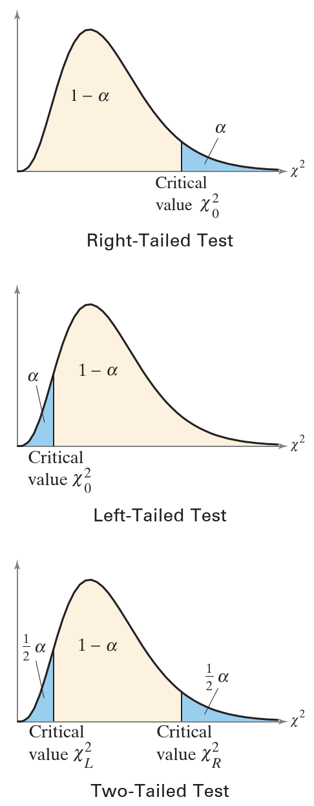

**例 1** 右尾检验临界值

设 $n=26$, $\alpha=0.10$。

```java
double criticalValue = ChiSquareTestUtils.getRightCriticalValue(26, 0.10);
assertEquals(criticalValue, 34.382, 1e-3);
```

图示：


**例 2** 左尾检验临界值

设 $n=11$, $\alpha=0.01$。

```java
double criticalValue = ChiSquareTestUtils.getLeftCriticalValue(11, 0.01);
assertEquals(criticalValue, 2.558, 1e-3);
```

图示：


**例 3** 双尾检验临界值

由于卡方分布不是对称的，所以在双边检验中，两个临界值的绝对值不同。比如单独计算每个临界值。

设 $n=9$, $\alpha=0.05$。

对双边检验，两个面积各为 0.025。

```java
DoubleDoublePair criticalValue = ChiSquareTestUtils.getCriticalValues(9, 0.05);
assertEquals(criticalValue.leftDouble(), 2.180, 1e-3);
assertEquals(criticalValue.rightDouble(), 17.535, 1e-3);
```

图示：


### 卡方检验

正态总体的方差或标准差的检验，用卡方检验。

方差（variance）或标准差（standard deviation）的卡方检验不如总体均值或比例检验那么稳健。因此，在对方差或标准差进行卡方检验时，**总体必须是正态分布的**。对非正态总体，检验结果可能导致错误结论。

方差 $\sigma^2$ 或标准差 $\sigma$ 的卡方检验（chi-square test）：**卡方检验只能用于总体为正态分布**。

**统计检验量**为 $s^2$ ，**标准化检验统计量**为：
$$
\chi^2=\frac{(n-1)s^2}{\sigma^2}
$$
标准化检验统计量服从自由度为 $n-1$ 的卡方分布。

**卡方检验步骤：** 临界值策略（p-value 策略类似）

1. 确定样本随机，总体为正态分布；
2. 声明假设；
3. 指定显著性水平 $\alpha$；
4. 确定自由度 $df=n-1$；
5. 计算临界值；
6. 确定拒绝域；
7. 计算标准化检验统计量；

$$
\chi^2=\frac{(n-1)s^2}{\sigma^2}
$$

8. 作出结论；
9.  解释。

**例 4** 总体方差的假设检验

一家乳制品公司声称，他们的全脂牛奶脂肪含量的方差不超过 0.25。你怀疑这数字不对，于是随机抽取 41 盒牛奶，样本方差为 0.27。在 $\alpha=0.05$ 时，是否有足够证据驳回该公司的说法？假设总体是正态分布。

1. 样本随机，总体为正态分布，可以用 Chi-Square test；
2. 假设：$H_0$：$\sigma^2\le 0.25$，$H_a$：$\sigma^2 > 0.25$；
3. $\alpha=0.05$；
4. 自由度 $df=41-1=40$；
5. 计算临界值（右边检验）：

```java
System.out.println(ChiSquareTestUtils.getRightCriticalValue(41, 0.05));
// 55.75847927888691
```

6. 确定拒绝域：$\chi^2> 55.758$；
7. 计算检验统计量

```java
double x2 = ChiSquareTestUtils.getStatistic(41, 0.27, 0.25);
assertEquals(x2, 43.2, 0.01);
```

8. 下结论：因为 $\chi^2$ 不在拒绝域，所以无法拒绝零假设。图示：


9. 解释：在 5% 的置信水平下，没有足够证据来拒绝该公司关于全脂牛奶中脂肪含量的方差不超过 0.25 的说法。

**例 5** 标准差的假设检验

某公司声称，接通电话到正确转接到办公室所需时间的标准差小于 1.4 分钟。随机抽样 25 个来电，标准差为 1.1 分钟。在 $\alpha=0.10$ 时，是否有足够证据支持该公司的说法？假设总体为正态分布。

1. 样本随机，总体为正态分布，可以用卡方检验；
2. 假设：$H_0$：$\sigma\ge 1.4$，$H_a$：$\sigma < 1.4$；
3. $\alpha=0.10$；
4. $df=24$；
5. 临界值（左边检验）

```java
System.out.println(ChiSquareTestUtils.getLeftCriticalValue(25, 0.10));
// 15.658684052426953
```

6. 拒绝域：$\chi^2 < 15.659$；
7. 标准化检验统计量

```java
System.out.println(ChiSquareTestUtils.getStatistic(25, 1.1 * 1.1, 1.4 * 1.4));
// 14.81632653061225
```

图示：


8. 下结论：$\chi^2$ 在拒绝域，因此拒绝零假设；
9. 解释：在 10% 执行水平下，有足够证据支持该公司的说法，即来电转移到正确办公司所需时间的标准差小于 1.4 分钟。

**例 6** 总体方差的**双边检验**

某体育用品制造商称某钓鱼线的强度方差为 15.9。随机抽取 15 个钓鱼线，方差为 21.8。在 $\alpha=0.05$ 时，是否有足够证据来拒绝制造商的声明？假设总体为正态分布。

1. 样本随机，总体为正态分布，可以用卡方检验；
2. 假设：$H_0$：$\sigma^2=15.9$，$H_a$：$\sigma^2\ne 15.9$；
3. $\alpha=0.05$；
4. $df=14$；
5. 临界值（双边检验）：

```java
System.out.println(ChiSquareTestUtils.getStatistic(25, 1.1 * 1.1, 1.4 * 1.4));
// <5.628726103023956,26.118948045037424>
```

6. 拒绝域：$\chi^2<5.629$ 或 $\chi^2 > 26.119$；
7. 标准化检验统计量

```java
System.out.println(ChiSquareTestUtils.getStatistic(15, 21.8, 15.9));
// 19.19496855345912
```

图示：


8. 结论：$\chi^2$ 不在拒绝域，因为无法拒绝 $H_0$；
9. 解释：在 5% 显著性水平下，没有足够证据来拒绝鱼线强度方差为 15.9 的说法。