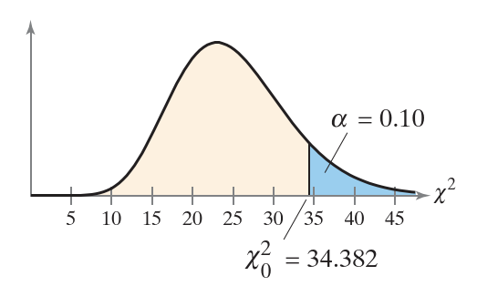
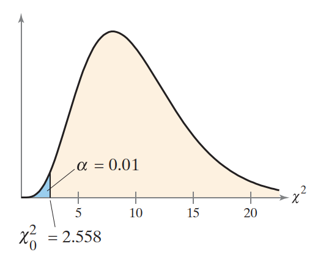
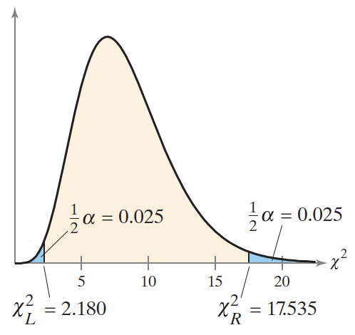
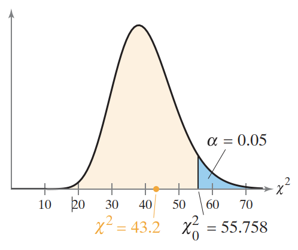
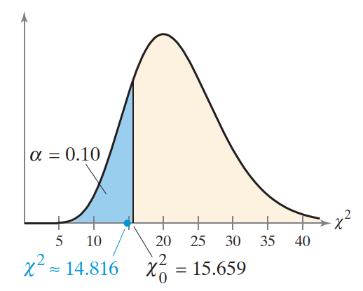
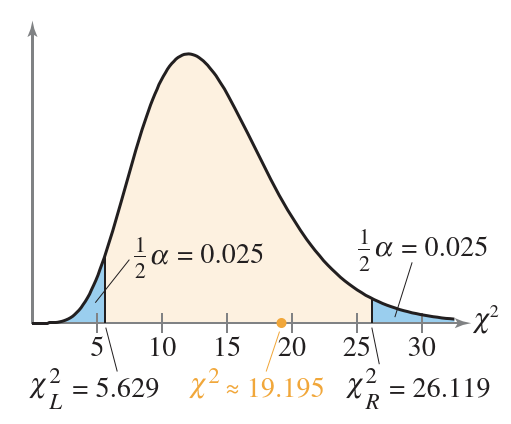

# 单样本方差和标准差检验

- [单样本方差和标准差检验](#单样本方差和标准差检验)
  - [卡方检验-计算临界值](#卡方检验-计算临界值)
  - [卡方检验](#卡方检验)

2024-06-07
@author Jiawei Mao
***

## 卡方检验-计算临界值

在现实生活的，产生一致的的结果很重要。例如，高尔夫厂家生产的高尔夫球的尺寸和重量都要相同。对变化的容忍度很低，即要求方差很小。

对正态分布总体，可以用自由度为 $n-1$ 的卡方分布来检验方差和标准差。

**计算卡方检验的临界值**

1. 指定显著性水平 $\alpha$;
2. 确定自由度 $df=n-1$；
3. 查表确定临界值

**例 1** 右边检验临界值

设 $n=26$, $\alpha=0.10$。

```java
double criticalValue = ChiSquareTestUtils.getRightCriticalValue(26, 0.10);
assertEquals(criticalValue, 34.382, 1e-3);
```

图示：



**例 2** 左边检验临界值

设 $n=11$, $\alpha=0.01$。

```java
double criticalValue = ChiSquareTestUtils.getLeftCriticalValue(11, 0.01);
assertEquals(criticalValue, 2.558, 1e-3);
```

图示：



**例 3** 双边检验临界值

由于卡方分布不是对称的，所以在双边检验中，两个临界值的绝对值不同。比如单独计算每个临界值。

设 $n=9$, $\alpha=0.05$。

对双边检验，两个面积各为 0.025。

```java
DoubleDoublePair criticalValue = ChiSquareTestUtils.getCriticalValues(9, 0.05);
assertEquals(criticalValue.leftDouble(), 2.180, 1e-3);
assertEquals(criticalValue.rightDouble(), 17.535, 1e-3);
```

图示：



## 卡方检验

正态总体的方差或标准差的检验，用卡方检验。

方差或标准差的卡方检验哺乳总体均值或比例的检验那么稳健。因此，在对方差或标准差进行卡方检验时，总体必须是正态分布的。对非正态总体，检验结果可能导致错误结论。

方差 $\sigma^2$ 或标准差 $\sigma$ 的卡方检验（chi-square test）：**卡方检验只能用于总体为正态分布**。

统计检验量为 $s^2$ ，标准化检验统计量为：
$$
\chi^2=\frac{(n-1)s^2}{\sigma^2}
$$
服从自由度为 $n-1$ 的卡方分布。

**卡方检验步骤：** 临界值策略

1. 确定样本随机，总体为正态分布；
2. 声明假设；
3. 指定显著性水平；
4. 确定自由度 $df=n-1$；
5. 计算临界值；
6. 确定拒绝域；
7. 计算标准化检验统计量；
8. 作出结论；
9. 解释。

**例 4** 总体方差的假设检验

一家乳制品公司声称，他们的全脂牛奶脂肪含量的方差不超过 0.25。你怀疑这数字不对，于是随机抽取 41 盒牛奶，样本方差为 0.27。在 $\alpha=0.05$ 时，是否有足够证据驳回该公司的说法？假设总体是正态分布。

1. 样本随机，总体为正态分布，可以用 Chi-Square test；
2. 假设：$H_0$：$\sigma^2\le 0.25$，$H_a$：$\sigma^2 > 0.25$；
3. $\alpha=0.05$；
4. 自由度 $df=41-1=40$；
5. 计算临界值（右边检验）：

```java
System.out.println(ChiSquareTestUtils.getRightCriticalValue(41, 0.05));
// 55.75847927888691
```

6. 确定拒绝域：$\chi^2> 55.758$；
7. 计算检验统计量

```java
double x2 = ChiSquareTestUtils.getStatistic(41, 0.27, 0.25);
assertEquals(x2, 43.2, 0.01);
```

8. 下结论：因为 $\chi^2$ 不在拒绝域，所以无法拒绝 null 假设。图示：



9. 解释：在 5% 的执行水平下，没有足够证据来拒绝该公司关于全脂牛奶中脂肪含量的方差不超过 0.25 的说法。

**例 5** 标准差的假设检验

某公司生成，接通电话到正确办公室所需时间的标准差小于 1.4 分钟。随机抽样 25 个来电，标准差为 1.1 分钟。在 $\alpha=0.10$ 时，是否有足够证据支持该公司的说法？假设总体为正态分布。

1. 样本随机，总体为正态分布，可以用卡方检验；
2. 假设：$H_0$：$\sigma\ge 1.4$，$H_a$：$\sigma < 1.4$；
3. $\alpha=0.10$；
4. $df=24$；
5. 临界值（左边检验）

```java
System.out.println(ChiSquareTestUtils.getLeftCriticalValue(25, 0.10));
// 15.658684052426953
```

6. 拒绝域：$\chi^2 < 15.659$；
7. 标准化检验统计量

```java
System.out.println(ChiSquareTestUtils.getStatistic(25, 1.1 * 1.1, 1.4 * 1.4));
// 14.81632653061225
```

图示：



8. 下结论：$\chi^2$ 在拒绝域，因此拒绝 null 假设；
9. 解释：在 10% 执行水平下，有足够证据支持该公司的说法，即来电转移到正确办公司所需时间的标准差小于 1.4 分钟。

**例 6** 总体方差的**双边检验**

某体育用品制造商称某钓鱼线的强度方差为 15.9。随机抽取 15 个钓鱼线，方差为 21.8。在 $\alpha=0.05$ 时，是否有足够证据来拒绝制造商的声明？假设总体为正态分布。

1. 样本随机，总体为正态分布，可以用卡方检验；
2. 假设：$H_0$：$\sigma^2=15.9$，$H_a$：$\sigma^2\ne 15.9$；
3. $\alpha=0.05$；
4. $df=14$；
5. 临界值（双边检验）：

```java
System.out.println(ChiSquareTestUtils.getStatistic(25, 1.1 * 1.1, 1.4 * 1.4));
// <5.628726103023956,26.118948045037424>
```

6. 拒绝域：$\chi^2<5.629$ 或 $\chi^2 > 26.119$；
7. 标准化检验统计量

```java
System.out.println(ChiSquareTestUtils.getStatistic(15, 21.8, 15.9));
// 19.19496855345912
```

图示：



8. 结论：$\chi^2$ 不在拒绝域，因为无法拒绝 $H_0$；
9. 解释：在 5% 显著性水平下，没有足够证据来拒绝鱼线强度方差为 15.9 的说法。