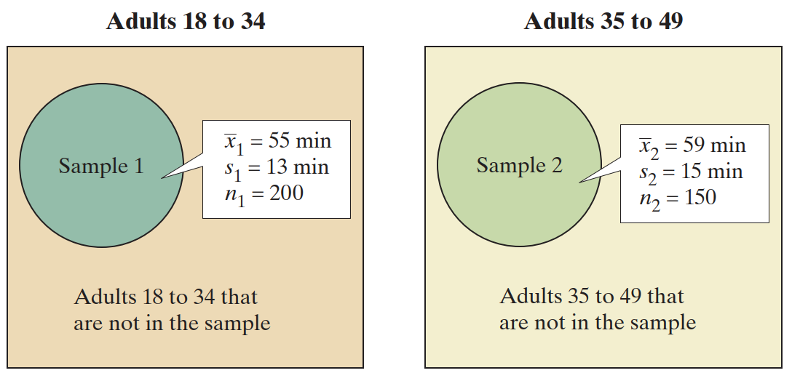
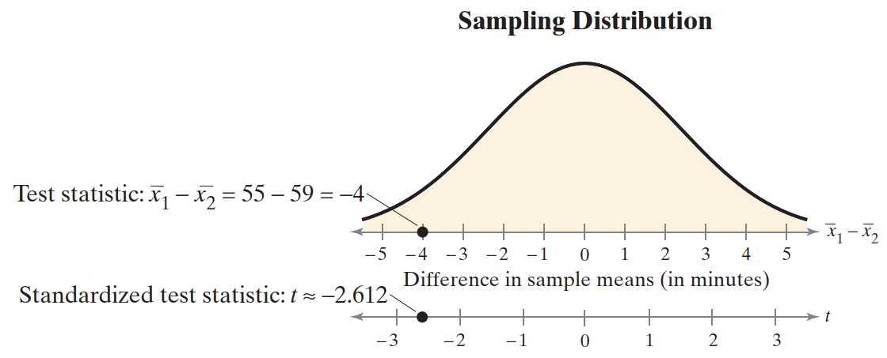
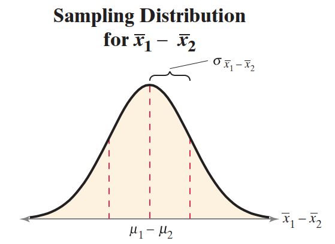
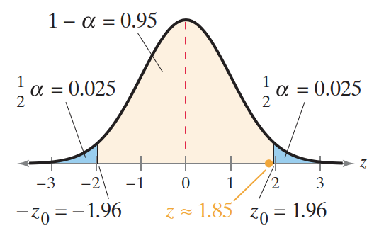
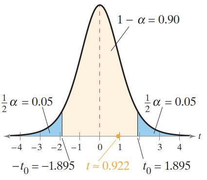
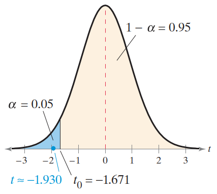
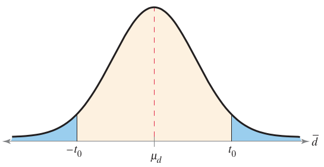
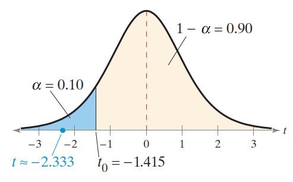

# 双样本假设检验

- [双样本假设检验](#双样本假设检验)
  - [1. 均值差异检验（独立样本，σ1 和 σ2 已知）](#1-均值差异检验独立样本σ1-和-σ2-已知)
    - [独立样本和配对样本](#独立样本和配对样本)
    - [双样本假设检验概述](#双样本假设检验概述)
    - [均值差异的双样本 z-Test](#均值差异的双样本-z-test)
  - [2. 均值差异检验（独立样本，σ1 和 σ2 未知）](#2-均值差异检验独立样本σ1-和-σ2-未知)
    - [均值差异的双样本 t-Test](#均值差异的双样本-t-test)
  - [3. 均值差异检验（配对样本）](#3-均值差异检验配对样本)
    - [均值差异的 t 检验](#均值差异的-t-检验)
  - [4. 比例差异检验](#4-比例差异检验)
    - [比例差异的双样本 z-test](#比例差异的双样本-z-test)
  - [参考](#参考)

2024-11-26⭐
@author Jiawei Mao
***

## 1. 均值差异检验（独立样本，σ1 和 σ2 已知）

双样本假设检验，通过比较两个总体的参数来检验假设。

### 独立样本和配对样本

独立（Independent）和相关（dependent）

- 当从一个总体选择的样本与从第二个总体选择的样本无关时，则称两个样本**独立**（independent）（下图）。
- 当两个样本的成员一一对应，则称两个样本**相关**（dependent）。相关样本也称为**配对样本**（paired samples）或**匹配样本**（matched samples）。

> [!NOTE]
>
> 配对样本这个名称更容易理解，后面全部用配对样本这个名词来代表相关样本。


> [!TIP]
>
> 相关样本通常涉及同一个对象前后结果，如一个人节食前后的体重，或特定特征匹配的个体，如同卵双胞胎。

**例 1** 独立样本和配对样本

- 样本 1: 70 位患者的甘油三酯水平
- 样本 2: 同一批 70 位患者使用降甘油三酯药 6 个月后的甘油三酯水平

这是典型的 dependent 样本。同一患者的两个甘油三酯水平是相关的。

**例 2**

- 样本 1: 38 名成年男性在注意力缺陷/多动障碍的心理测试中的得分
- 样本 2: 50 名成年女性在注意力缺陷/多动障碍的心理测试中的得分

样本成员之间无法形成配对关系，样本大小不同，为独立样本。

### 双样本假设检验概述

下面介绍如何使用独立样本比较两个不同总体的平均值。

例如，一个广告商正在指定一个营销计划，需要确定 18-34 岁成年人和 35-49 岁成年人每天花在社交媒体上的时间是否有差异。能明确是否有差异的唯一方法是对这两个年龄段的所有人进行普查，计算他们每天花在社交媒体上的平均时间，看是否有差异。当然，进行这样的调研不现实，但是，通过抽样可以在一定置信水平上确定这种差异是否存在。

为了确定是否存在差异，广告商首先鉴定两个总体的平均时间没有差异，即：
$$
\mu_1-\mu_2=0
$$
然后，从每个总体随机抽样，使用检验统计量进行双样本假设检验。
$$
\overline{x}_1-\overline{x}_2=0
$$
广告商得到的结果如下：



下图显示从 $\mu_1-\mu_2=0$ 的两个总体多次抽样，$\overline{x}_1-\overline{x}_2$ 的**抽样分布**、检验统计量和标准化检验统计量：



从图中可以看出，假设平均值的实际差值为 0，不太可能获得均值相差 4 分钟的样本。样本均值差比假设的差值相差 2.5 个标准差。使用显著性水平 $\alpha=0.10$ 进行双样本假设检验，广告商可以得出结论，18-34 岁的成年人和 35-49 岁的成年人每天花在社交媒体上的时间是不同的。

> [!CAUTION]
>
> 使用独立样本进行双样本假设检验，检验的是两个**总体参数的差值**，而非参数本身的值。

**独立样本的双样本假设检验**：

1. 零假设 $H_0$：通常表示两个总体的参数没有差异，null 假设总是包含符号 $\le, =, \ge$；
2. 备择假设 $H_a$：$H_0$ 为 false 时 $H_a$ 为 true，即和 $H_0$ 对立，备择假设包含符号 $>$, $\ne$ 或 $<$。

要写出独立样本的双样本假设检验的零假设和备择假设，通常是将关于总体参数的声明从口头陈述转化为数学陈述。例如，对两个总体参数 $\mu_1$ 和 $\mu_2$，可能的零假设和备择假设有：

$$
\begin{cases}
    H_0: \mu_1 = \mu_2\\
    H_a: \mu_1 \ne \mu_2
\end{cases}
$$

$$
\begin{cases}
    H_0: \mu_1\le \mu_2\\
    H_a: \mu_1 > \mu_2
\end{cases}
$$

$$
\begin{cases}
    H_0: \mu_1 \ge \mu_2\\
    H_a: \mu_1 < \mu_2
\end{cases}
$$

不敢使用哪种假设，总是假设总体均值没有差异 $\mu_1=\mu_2$。

### 均值差异的双样本 z-Test

下面介绍独立样本的两个总体均值差异的 z 检验。**使用的前提条件**：

1. 总体标准差已知：$\sigma_1$ 和 $\sigma_2$
2. 样本随机
3. 样本独立
4. 总体为正态分布或样本量都不低于 30：$n_1\ge30$, $n_2\ge 30$.

当满足这些条件，**样本均值之差** $\overline{x}_1-\overline{x}_2$ 的**抽样分布服从正态分布**，如下图所示：

- 样本均值抽样分布的均值的差值等于两个总体均值的差值

$$
\mu_{\overline{x}_1-\overline{x}_2}=\mu_{\overline{x}_1}-\mu_{\overline{x}_2}=\mu_1-\mu_2
$$

- 抽样分布的方差为 $\overline{x}_1$ 和 $\overline{x}_2$ 两个均值抽样分布方差的加和，标准差取平方根

$$
\sigma_{\overline{x}_1-\overline{x}_2}=\sqrt{\sigma_{\overline{x}_1}^2+\sigma_{\overline{x}_2}^2}=\sqrt{\frac{\sigma_1^2}{n_1}+\frac{\sigma_2^2}{n_2}}
$$



满足以上条件， $\overline{x}_1-\overline{x}_2$ 的抽样分布为正态分布，就可以用 z-test 检验两个总体均值 $\mu_1$ 和 $\mu_2$ 的差值。检验统计量为 $\overline{x}_1-\overline{x}_2$，标准化检验统计量为：
$$
z=\frac{样本差值-假设差值}{标准差}
$$
公式：
$$
z=\frac{(\overline{x}_1-\overline{x}_2)-(\mu_1-\mu_2)}{\sigma_{\overline{x}_1-\overline{x}_2}}
$$
其中：
$$
\sigma_{\overline{x}_1-\overline{x}_2}=\sqrt{\frac{\sigma_1^2}{n_1}+\frac{\sigma_2^2}{n_2}}
$$

即：

$$
z=\frac{(\overline{x}_1-\overline{x}_2)-(\mu_1-\mu_2)}{\sqrt{\frac{\sigma_1^2}{n_1}+\frac{\sigma_2^2}{n_2}}}
$$

**用双样本 z-Test 检验总体均值差异的操作流程：** (独立样本，$\sigma_1$ 和 $\sigma_2$ 已知)

1. 确定 $\sigma_1$ 和 $\sigma_2$ 已知，样本随机且独立，总体为正态分布或 $n_1\ge 30$ 且 $n_2\ge 30$；
2. 声明假设：$H_0$ 和 $H_a$
3. 指定显著性水平 $\alpha$;
4. 计算临界值；
5. 确定拒绝域；
6. 计算标准化检验统计量；

$$
z=\frac{(\overline{x}_1-\overline{x}_2)-(\mu_1-\mu_2)}{\sigma_{\overline{x}_1-\overline{x}_2}}
$$

7. 下结论：如果 $z$ 在拒绝域，则拒绝 $H_0$，否则无法拒绝 $H_0$
8. 解释。

> [!TIP]
>
> 也可以使用 p-value 执行均值差异的假设检验，跳过步骤 4 和 5，计算得到标准化检验统计量后，根据正态分布计算 p-value，然后根据 p-value 和 $\alpha$ 的大小关系拒绝或无法拒绝 $H_0$。

**例 2**. 均值差异的双样本 z-Test

一个信用卡机构声称，加州和佛罗里达州的信用卡平均债务存在差异。对每个州 250 人的随机调查结果如下：

| 加州                       | 佛罗里达州                 |
| -------------------------- | -------------------------- |
| $\overline{x}_1=3060$ 美元 | $\overline{x}_2=2910$ 美元 |
| $n_1=250$                  | $n_2=250$                  |

两个样本独立。设加州的 $\sigma_1=960$，佛罗里达州的 $\sigma_2=845$。该结果是否支持信用卡机构的声明？取 $\alpha=0.05$。

**解：**

1. $\sigma_1=960$, $\sigma_2=845$；样本独立且随机，$n_1=250\ge 30$, $n_2=250\ge 30$，因此可以用 z-test
2. 声明假设：$H_0$：$\mu_1=\mu_2$， $H_a$：$\mu_1\ne\mu_2$；
3. $\alpha=0.05$；
4. 双边检验，显著性水平 $\alpha=0.05$，计算临界值：

```java
DoubleDoublePair criticalValues = ZTestUtils.getCriticalValues(0.05);
System.out.println(criticalValues);
// <-1.959963984540054,1.959963984540054>
```

因此拒绝域为 z<-1.96 和 z>1.96。

5. 计算标准化检验统计量

$$
z=\frac{(\overline{x}_1-\overline{x}_2)-(\mu_1-\mu_2)}{\sigma_{\overline{x}_1-\overline{x}_2}}=\frac{(3060-2910)-0}{\sqrt{\frac{960^2}{250}}+\frac{845^2}{250}}\approx 1.85
$$

代码实现：

```java
double z = ZTestUtils.getStatistic(3060, 2910, 250, 250, 960 * 960, 845 * 845);
assertEquals(z, 1.85, 0.01);
```

下图显示了拒绝域位置和标准化检验统计量 z。由于 z 不在拒绝域内，因此无法拒绝零假设



6. 下结论：z 没有在拒绝域，因此无法拒绝 null 假设。
7. 解释：在 5% 的显著性水平下，没有足够证据支持该信用卡机构的说法，即不支持加州和佛罗里达州人的平均信用卡债务存在差异的说法。

这里也可以采用 p-value 方法，z=1.85 右侧面积为 1-0.9678，p-value 为该面积的两倍：
$$
P=2(1-0.9678)=2\times 0.0322=0.0644
$$
因为 p-value > 0.05，因此无法拒绝 H0.

**例 3：** 代码实现双样本  z-test

一家旅行社称，在得克萨斯州度假的餐饮和住宿平均每日费用低于弗吉尼亚州。下面是对每个州的度假者进行随机调查的结果。两个样本独立。假设得克萨斯州的 $\sigma_1=20$, 弗吉尼亚州的 $\sigma_2=25$，且两个总体为正态分布。当 $\alpha=0.01$，是否有足够证据支持该说法？

| Texas                  | Virginia               |
| ---------------------- | ---------------------- |
| $\overline{x}_1=\$245$ | $\overline{x}_2=\$251$ |
| $n_1=25$               | $n_2=20$               |

1. $\sigma_1$ 和 $\sigma_2$ 已知，样本随机且独立，总体为正态分布，可以用 z-test
2. 声明假设

$H_0$: $\mu_1\ge \mu_2$

$H_a$: $\mu_1 < \mu_2$

3. 显著性水平 $\alpha=0.01$
4. 计算标准化检验统计量

$$
z=\frac{(\overline{x}_1-\overline{x}_2)-(\mu_1-\mu_2)}{\sqrt{\frac{\sigma_1^2}{n_1}+\frac{\sigma_2^2}{n_2}}}
$$

```java
double sigma1 = 20;
double sigma2 = 25;
double x1 = 245;
int n1 = 25;
double x2 = 251;
int n2 = 20;
double a = 0.01;
double z = ZTestUtils.getStatistic(x1, x2, n1, n2, sigma1 * sigma1, sigma2 * sigma2);
System.out.println(z);
// -0.8728715609439694
```

5. 对左尾检验，计算该 z 值对应的 p-value

```java
System.out.println(ZTestUtils.getOneTailedPValue(z));
// 0.19136654444261292
```

所以 p-value = 0.19 大于显著性水平 $\alpha=0.01$，因此在 1% 显著性水平下，没有足够证据支持旅行社的声明。

## 2. 均值差异检验（独立样本，σ1 和 σ2 未知）

### 均值差异的双样本 t-Test

均值差异的双样本 z-test 要求两个总体的标准差已知。然而在现实中，两个总体标准差通常是未知的，此时可以采用 t-test。

均值差异的双样本 t-Test 应用前提：

1. 总体标准差未知：$\sigma_1$ 和 $\sigma_2$ 未知
2. 样本随机；
3. 样本独立；
4. 总体为正态分布或样本量均不小于 30；

满足以上条件，**样本均值差** $\overline{x}_1-\overline{x}_2$ 的**抽样分布**服从均值为 $\mu_1-\mu_2$ 的 **t 分布**。因此，可以使用双样本 t-test 来检验总体均值 $\mu_1$ 和 $\mu_2$ 的差异。抽样分布的自由度和标准差取决于总体方差 $\sigma_1^2$ 和 $\sigma_2^2$ 是否相等。

**检验统计量**为 $\overline{x}_1-\overline{x}_2$，**标准化检验统计量**为：
$$
t=\frac{(\overline{x}_1-\overline{x}_2)-(\mu_1-\mu_2)}{s_{\overline{x}_1-\overline{x}_2}}
$$
如果两个**总体方差相等**：可以将两个样本的信息结合起来计算标准差 $\hat{\sigma}$ 的汇总估计
$$
\hat{\sigma}=\sqrt{\frac{(n_1-1)s_1^2+(n_2-1)s_2^2}{n_1+n_2-2}}
$$
$\overline{x}_1-\overline{x}_2$ 抽样分布的标准差为：
$$
s_{\overline{x}_1-\overline{x}_2}=\hat{\sigma}\cdot \sqrt{\frac{1}{n_1}+\frac{1}{n_2}}
$$
自由度为：$\text{d.f.}=n_1+n_2-2$。

如果两个**总体方差不等**，此时标准差为：
$$
s_{\overline{x}_1-\overline{x}_2}=\sqrt{\frac{s_1^2}{n_1}+\frac{s_2^2}{n_2}}
$$
自由度 $\text{d.f.}$ 为 $n_1-1$ 和 $n_2-1$ 中的较小值。

**均值差异的独立双样本检验总结**：


**均值差异的双独立样本 t-test 操作流程：**

1. 确定条件：$\sigma_1$ 和 $\sigma_2$ 未知，样本随机且独立，总体为正态分布或 $n_1\ge30$ 且 $n_2\ge30$，这样才能用 t-test
2. 声明假设: $H_0$ 和 $H_a$
3. 指定显著性水平 $\alpha$
4. 确定自由度: $\text{d.f.}=n_1+n_2-2$ 或 $\text{d.f.}=min(n_1-1, n_2-1)$
5. 计算临界值
6. 确定拒绝域
7. 计算标准化检验统计量

$$
t=\frac{(\overline{x}_1-\overline{x}_2)-(\mu_1-\mu_2)}{s_{\overline{x}_1-\overline{x}_2}}
$$

8. 下结论；
9.  解释。

**例 1**. 下表是同一所学校的两名教师所教学生随机抽样数学测试结果。能够得出这两位老师的学生的平均考试成绩有差异的结论么？使用 $\alpha=0.10$​。假设总体为正态分布，总体方差不等。

| 教师 1               | 教师 2               |
| -------------------- | -------------------- |
| $\overline{x}_1=473$ | $\overline{x}_2=459$ |
| $s_1=39.7$           | $s_2=24.5$           |
| $n_1=8$              | $n_2=18$             |

1. 已知 $\sigma_1$ 和 $\sigma_2$ 未知，样本随机且独立，总体为正态分布，所以可以用 t-test；
2. 声明假设

$H_0$：$\mu_1=\mu_2$

$H_a$: $\mu_1\ne \mu_2$

3. 指定显著性水平：$\alpha=0.10$
4. 确定自由度

总体方差不等，所以 $\text{d.f.}=min(n_1-1,n_2-1)=7$

5. 计算临界值

```java
DoubleDoublePair criticalValue = TTestUtils.getTwoTailedCriticalValue(7, 0.10);
System.out.println(criticalValue);
// <-1.8945786051080835,1.8945786051080835>
```

6. 确定拒绝域

根据临界值，拒绝域为 z<-1.895 和 z>1.895.

7. 计算标准化检验统计量

```java
double t = TTestUtils.getStatistic(473, 459, 39.7 * 39.7, 24.5 * 24.5, 8, 18);
System.out.println(t);
// 0.9224141168865682
```

如下图所示：



标准化检验统计量 t 不在拒绝域，因为无法拒绝零假设。

**结论：** 在 10% 显著性水平，没有足够证据支持两位老师的学生的平均数学考试成绩不同的说法。

在软件中，通常采用如下公式计算 t-test 中的自由度：
$$
\text{d.f.}=\frac{(s_1^2/n_1+s_2^2/n_2)^2}{\frac{(s_1^2/n_1)^2}{n_1-1}+\frac{(s_2^2/n_2)^2}{n_2-1}}
$$

**例 2** 均值差异的双样本 t-test

一家制造商声称其轿车的平均驾驶成本低于其主要竞争对手。从该制造商随机选择 30 辆轿车，从其竞争对手随机选择 32 辆轿车，测试结果如下：

| 制造商                            | 对手                              |
| --------------------------------- | --------------------------------- |
| $\overline{x}_1=\$0.48/\text{mi}$ | $\overline{x}_1=\$0.51/\text{mi}$ |
| $s_1=\$0.05/\text{mi}$            | $s_1=\$0.07/\text{mi}$            |
| $n_1=30$                          | $n_1=32$                          |

当 $\alpha=0.05$，假设总体方差相等，是否支持制造商的说法？

1. $\sigma_1$ 和 $\sigma_2$ 未知，样本随机且独立，$n_1\ge 30$, $n_2\ge 30$，可以用 t-test
2. 声明假设

$H_0$: $\mu_1\ge \mu_2$

$H_a$: $\mu_1<\mu_2$

显然，这是左尾检验。

3. 显著性水平：$\alpha=0.05$
4. 自由度

$$
\text{d.f.}=n_1+n_2-2=60
$$

5. 计算临界值

```java
double criticalValue = TTestUtils.getLeftTailedCriticalValue(60, 0.05);
System.out.println(criticalValue);
// -1.6706488649053048
```

6. 确定拒绝域

根据临界值，得到拒绝域为：$t<-1.671$

7. 计算标准化检验统计量

```jade
double statisticEqual = TTestUtils.getStatisticEqual(0.48, 0.51,
        0.05 * 0.05, 0.07 * 0.07, 30, 32);
System.out.println(statisticEqual);
// -1.9303018432724748
```

8. 结论

如下图所示：



t 在拒绝域内，因此拒绝 $H_0$。在 5% 的显著性水平下，有足够的证据支持制造商的说法，即其轿车的没盈利平均驾驶成本低于其竞争对手。

## 3. 均值差异检验（配对样本）

### 均值差异的 t 检验

前面对独立样本进行双样本假设检验，采用检验统计量 $\overline{x}_1-\overline{x}_2$。对配对样本，则要采用不同的技术，首先计算每对数据的差值 $d$：
$$
d=\text{pair.1}-\text{pair.2}
$$

检验统计量为 d 的平均值 $\overline{d}$:
$$
\overline{d}=\frac{\sum d}{n}
$$

在进行 t-test 前，要求满足如下前提条件：

1. 样本随机
2. 样本配对
3. 总体为正态分布或配对数据量 $n$ 不低于 30，即 $n\ge 30$

满足这些条件后，$\overline{d}$ 的抽样分布，即配对数据两个值差值的平均值，可以由自由度为 n-1 的 t 分布近似。如下图：



配对 t-test 相关参数：

- n，数据对数目
- $d$，每对数据的差值
- $\mu_d$，总体中配对数据差值的假设均值
- $\overline{d}$，配对样本中数据差值的均值

$$
\overline{d}=\frac{\sum d}{n}
$$

- $s_d$，配对数据差值的标准差

$$
s_d=\sqrt{\frac{\sum(d-\overline{d})^2}{n-1}}
$$

当用 t 分布近似 $\overline{d}$ 的抽样分布，可以使用 t-test 检验配对数据总体差异的平均值。

**检验统计量**：
$$
\overline{d}=\frac{\sum d}{n}
$$
**标准化检验统计量**：
$$
t=\frac{\overline{d}-\mu_d}{s_d/\sqrt{n}}
$$
自由度：
$$
\text{d.f.}=n-1
$$
**配对样本均值差异的 t-test 操作流程**

1. 验证：样本随机、样本配对，总体为正态分布或 $n\ge 30$
2. 声明假设：$H_0$ 和 $H_a$
3. 指定显著性水平：$\alpha$
4. 确定自由度：$\text{d.f.}=n-1$
5. 确定临界值
6. 确定拒绝域
7. 计算 $\overline{d}$ 和 $s_d$

$$
\overline{d}=\frac{\sum d}{n}
$$

$$
s_d=\sqrt{\frac{\sum(d-\overline{d})^2}{n-1}}
$$

8. 计算标准化检验统计量

$$
t=\frac{\overline{d}-\mu_d}{s_d/\sqrt{n}}
$$

9. 确实是拒绝还是无法拒绝零假设：如果 t 在拒绝域，则拒绝 $H_0$，否则无法拒绝 $H_0$
10. 基于原假设下结论

**例 1** 配对样本均值差异的 t-test

一家鞋厂声称，运动员使用他们的鞋可以提高垂直跳跃高度。研究人员测量了 8 名随机选择的运动员的垂直跳跃高度，在运动员使用该鞋 8 个月后，再次测量他们的垂直跳跃高度。下表显示了每位运动员的垂直跳跃高度（英寸）。当 $\alpha=0.10$，是否有足够证据支持制造商的说法？假设垂直跳跃高度呈正态分布。

| 运动员             | 1    | 2    | 3    | 4    | 5    | 6    | 7    | 8    |
| ------------------ | ---- | ---- | ---- | ---- | ---- | ---- | ---- | ---- |
| 垂直跳跃高度（前） | 24   | 22   | 25   | 28   | 35   | 32   | 30   | 27   |
| 垂直跳跃高度（后） | 26   | 25   | 25   | 29   | 33   | 34   | 35   | 30   |

1. 样本随机，配对样本，总体为 正态分布，可以用 t-test
2. 声明假设

如果设 d=前-后，那么可以声明为：

$H_0$: $\mu_d\ge0$

$H_a$: $\mu_d<0$

这是一个左尾检验。

3. 显著性水平：$\alpha=0.10$
4. 确定自由度：$\text{d.f.}=n-1=7$
5. 计算临界值

```java
System.out.println(TTestUtils.getLeftTailedCriticalValue(7, 0.10));
// -1.4149239276452403
```

6. 确定拒绝域

根据临界值，拒绝域为：$t<-1.415$。

7. 计算标准化检验统计量

```java
public static double getPairedT(double[] x1, double[] x2) {
    double[] d = new double[x1.length];
    for (int i = 0; i < x1.length; i++) {
        d[i] = x1[i] - x2[i];
    }
    double mean = StatUtils.mean(d);
    double variance = StatUtils.variance(d);
    return mean / FastMath.sqrt(variance / d.length);
}

double[] s1 = new double[]{24, 22, 25, 28, 35, 32, 30, 27};
double[] s2 = new double[]{26, 25, 25, 29, 33, 34, 35, 30};

double pairedT = TTestUtils.getPairedT(s1, s2);
System.out.println(pairedT);
// -2.3333333333333335
```

如下图：



8. t 落在拒绝域内，因此拒绝 $H_0$
9. 结论：有足够的证据表明在 10% 显著性水平下支持鞋子制造商的说法，即运动员使用该制造商的训练鞋可以增加垂直跳跃高度。

> [!WARNING]
>
> 垂直跳跃高度的提高可能是其他原因导致，许多广告滥用统计结果，暗示未经测试证实的因果关系。

**例 2** 均值差异的 t-test

某州立法者的竞选团队想要确定该立法者的绩效评级（0-100）从去年到今年是否有变化。下表是 16 名随机选择的选民去年和今年对该立法者的绩效评级。当 $\alpha=0.01$，是否有足够证据得出该立法者的绩效评级发生变化？假设绩效评级为正态分布。

| 选民         | 1    | 2    | 3    | 4    | 5    | 6    | 7    | 8    | 9    | 10   | 11   | 12   | 13   | 14   | 15   | 16   |
| ------------ | ---- | ---- | ---- | ---- | ---- | ---- | ---- | ---- | ---- | ---- | ---- | ---- | ---- | ---- | ---- | ---- |
| 评级（去年） | 60   | 54   | 78   | 84   | 91   | 25   | 50   | 65   | 68   | 81   | 75   | 45   | 62   | 79   | 58   | 63   |
| 评级（今年） | 56   | 48   | 70   | 60   | 85   | 40   | 40   | 55   | 80   | 75   | 78   | 50   | 50   | 85   | 53   | 60   |

1. 验证条件：样本随机，配对 样本，总体为正态分布，可以用 t-test
2. 声明假设

$H_0$: $\mu_d=0$

$H_a$: $\mu_d\ne 0$

3. 显著性水平 $\alpha=0.01$
4. 自由度：$\text{d.f.}=n-1=15$
5. 临界值

```java
DoubleDoublePair criticalValue1 = TTestUtils.getTwoTailedCriticalValue(15, 0.01);
// <-2.946712883532811,2.946712883532811>
```

6. 拒绝域：$t<-2.947$ 或 $t>2.947$
7. 计算 t 值

```java
double[] x1 = new double[]{60, 54, 78, 84, 91, 25, 50, 65, 
                           68, 81, 75, 45, 62, 79, 58, 63};
double[] x2 = new double[]{56, 48, 70, 60, 85, 40, 40, 55, 
                           80, 75, 78, 50, 50, 85, 53, 60};

double pairedT1 = TTestUtils.getPairedT(x1, x2);
System.out.println(pairedT1);
// 1.3688496182416288
```

8. t 值不在拒绝域，因此无法拒绝 $H_0$

因此，在 1% 显著性水平下，没有足够证据表明该立法者的绩效评级有变化。

## 4. 比例差异检验

### 比例差异的双样本 z-test

下面介绍使用 z-test 检验两个总体比例 $p_1$ 和 $p_2$ 的差异。对两个总体参数 $p_1$ 和 $p_2$，可能的零假设和备择假设有：

$$
\begin{cases}
    H_0: p_1 = p_2\\
    H_a: p_1 \ne p_2
\end{cases}
$$

$$
\begin{cases}
    H_0: p_1\le p_2\\
    H_a: p_1 > p_2
\end{cases}
$$

$$
\begin{cases}
    H_0: p_1 \ge p_2\\
    H_a: p_1 < p_2
\end{cases}
$$

不管使用哪一种，都通过假设总体比例 $p_1=p_2$ 来执行检验操作。

**使用 z-test 执行双样本比例检验的前提：**

1. 样本随机
2. 样本独立
3. 样本足够大，从而可以使用正态抽样分布。即 $n_1p_1\ge 5$, $n_1q_1\ge 5$, $n_2p_2\ge 5$, $n_2q_2\ge 5$,

满足这些条件，**样本比例的差值** $\hat{p}_1-\hat{p}_2$ 的**抽样分布**就可以用**正态分布近似**，均值为：
$$
\mu_{\hat{p}_1-\hat{p}_2}=p_1-p_2
$$
标准差为：
$$
\sigma_{\hat{p}_1-\hat{p}_2}=\sqrt{\frac{p_1q_1}{n_1}+\frac{p_2q_2}{n_2}}
$$
这里，需要知道总体比例才能计算标准差。由于一般假设 $p_1=p_2$，所以可以计算 $p_1$ 和 $p_2$ 的加权估计值：
$$
\overline{p}=\frac{x_1+x_2}{n_1+n_2}
$$
其中，$x_1=n_1\hat{p}_1$, $x_2=n_2\hat{p}_2$。使用加权估计值 $\overline{p}$，$\hat{p}_1-\hat{p}_2$ 抽样分布的标准差为：
$$
\sigma_{\hat{p}_1-\hat{p}_2}=\sqrt{\overline{p}\overline{q}(\frac{1}{n_1}+\frac{1}{n_2})}
$$
其中，$\overline{q}=1-\overline{p}$。

还需要知道总体比例，以验证样本是否足够大，从而能用正态分布近似。但是，在确定 z-test 是否可用于二项试验的比例差异时，应该使用 $\overline{p}$ 代替 p1 和 p2，使用 $\overline{q}$ 替代 q1 和 q2.

**检验统计量**为  $\hat{p}_1-\hat{p}_2$ ，**标准化检验统计量**为：
$$
z=\frac{(\hat{p}_1-\hat{p}_2)-(p_1-p_2)}{\sqrt{\overline{p}\overline{q}(\frac{1}{n_1}+\frac{1}{n_2})}}
$$
其中，$\overline{p}=\frac{x_1+x_2}{n_1+n_2}=\frac{n_1\hat{p}_1+n_2\hat{p}_2}{n_1+n_2}$，$\overline{q}=1-\overline{p}$。

**比例差异的双样本 z-test 流程**

1. 验证样本随机且独立
2. 计算 p1 和 p2 的加权估计值，验证 $n_1\overline{p}$, $n_1\overline{q}$, $n_2\overline{p}$, $n_2\overline{q}$ 不小于 5
3. 声明假设
4. 指定显著性水平 $\alpha$
5. 计算临界值
6. 确定拒绝域
7. 计算标准化检验统计量

$$
z=\frac{(\hat{p}_1-\hat{p}_2)-(p_1-p_2)}{\sqrt{\overline{p}\overline{q}(\frac{1}{n_1}+\frac{1}{n_2})}}
$$

8. 根据 z 是否在拒绝域，确定拒绝还是接受 $H_0$，得出结论。

> [!NOTE]
>
> 也可以使用 p-value 方法执行比例差异的假设检验。跳过上面的步骤 5 和 6，根据标准化检验统计量计算 p-value，然后与显著性水平对比。如果 p-value 小于或等于 α，则拒绝 $H_0$，否则无法拒绝 $H_0$。

**例 1** 比例差异的双样本 z-test

随机选择 200 名轿车和250名皮卡车乘客，91.0% 的轿车乘客和 83.2% 的皮卡车乘客系安全带。当 $\alpha=0.10$，能够拒绝“轿车和皮卡车乘客系安全带的比例相同”的说法？

1. 样本独立且随机
2. 计算 p1 和 p2 的加权估计值

$$
\overline{p}=\frac{n_1\hat{p}_1+n_2\hat{p}_2}{n_1+n_2}=\frac{200*0.91+250*0.832}{200+250}\approx 0.8667
$$

因此，$\overline{q}=1-\overline{p}=0.1333$。

$n_1\overline{p}=200*0.8667$, $n_1\overline{q}=200*0.1333$, $n_2\overline{p}=250*0.8667$, $n_2\overline{q}=250*0.1333$，显然都大于 5. 

3. 声明假设

$$
\begin{cases}
    H_0: p_1 = p_2\\
    H_a: p_1 \ne p_2
\end{cases}
$$

4. 显著性水平：$\alpha=0.10$
5. 计算临界值

```java
System.out.println(ZTestUtils.getCriticalValues(0.10));
// <-1.644853626951473,1.6448536269514724>
```

6. 确定拒绝域

根据临界值确定拒绝域为：$z<-1.645$ 和 $z>1.645$。

7. 计算标准化检验统计量

```java
double z = ZTestUtils.z(0.91, 0.832, 200, 250);
System.out.println(z);
// 2.418677324489567
```

8. 结论

z 落在拒绝域，因此拒绝 $H_0$。

在 10% 的显著性水平，有足够的证据来反驳 “乘轿车和皮卡车中系安全带的乘客比例相同” 的说法。

**例 2** 比例差异的双样本 z-test

一个医学研究小组测试一种降胆固醇药物的效果。随机选择的 4700 名服用该要去的受试者中，有 301 人死于心脏病；随机选择的 4300 名安慰剂的受试者中，有 357 人死于心脏病。在 $\alpha=0.01$ 时，你是否支持以下说法：服用该药物的人因心脏病的死亡率低于服用安慰剂的人？

1. 样本独立且随机
2. $\hat{p}_1=\frac{301}{4700}=0.064$, $\hat{p}_2=\frac{357}{4300}=0.083$，$n_1=4700$, $n_2=4300$

```java
System.out.println(ZTestUtils.matchZTest(301 / 4700., 357 / 4300., 4700, 4300));
// true
```

可以用 z-test。

3. 声明假设

$$
\begin{cases}
    H_0: p_1 \ge p_2\\
    H_a: p_1 < p_2
\end{cases}
$$

4. 计算 z

```java
System.out.println(ZTestUtils.z(301 / 4700., 357 / 4300., 4700, 4300));
// -3.4551639270546044
```

5. 显著性水平 $\alpha=0.10$，对左尾检验，计算临界值

```java
System.out.println(ZTestUtils.getLeftCriticalValue(0.01));
// -2.326347874040841
```

6. 结论

z 落在拒绝域，因此拒绝 $H_0$。在 1% 置信水平下，有足够证据支持说法：“服用药物的人因心脏病导致死亡率低于服用安慰剂的人”。


## 参考

- OpenIntro Statistics, 4ed, David Diez & Mine Cetinkaya-Rundel & Christopher Barr
- Elementary Statistics: Picturing the World, 7ed, Larson Ron & Farber Betsy
