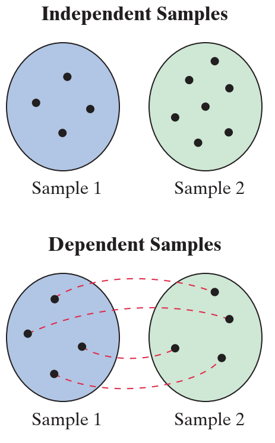

# 两个独立样本均值差异检验（σ1 和 σ2 已知）

- [两个独立样本均值差异检验（σ1 和 σ2 已知）](#两个独立样本均值差异检验σ1-和-σ2-已知)
  - [独立和相关样本](#独立和相关样本)
  - [双样本假设检验](#双样本假设检验)
  - [均值差的双样本 z-Test](#均值差的双样本-z-test)

2024-06-07
@author Jiawei Mao
***

## 独立和相关样本

独立（Independent）和相关（dependent）

当从一个总体中选择的样本与从第二个总体选择的样本无关时，两个样本是**独立的**（independent）；当两个样本的成员一一对应时，两个样本就不独立（dependent）。dependent 样本又称为**配对样本**（paired samples）或匹配样本（matched samples）。如下图所示：



**例 1**. 独立样本和配对样本

样本 1: 70名患者的甘油三酯水平

样本2：使用甘油三酯降低药物 6 个月后，同样的 70 名患者的甘油三酯水平。

显然，这是配对样本。

样本 1：38 名成年男性的注意力缺陷/多动障碍的心理筛选测试得分

样本 2：50 名成年女性的注意力缺陷/多动障碍的心理筛选测试得分

显然，这是独立样本。

## 双样本假设检验

下面介绍如何使用独立样本比较两个不同总体的均值。

例如，一个广告商正在指定一个营销计划，想要确定 18-34 岁成年人和 35-49 岁成年人每天花在社交媒体上的时间是否有差异。能明确是否有差异的方法是对这两个年龄段的所有人进行人口普查，计算他们每天花在社交媒体上的平均时间，看是否有差异。然而，进行这样的调研不现实，但是，通过抽样可以在一定置信水平上确定这种差异是否存在。

为了确定是否存在差异，广告商首先鉴定两个总体的平均时间没有差异，即：
$$
\mu_1-\mu_2=0
$$
然后，通过从每个总体中随机抽取样本，使用检验统计量进行双样本假设检验。
$$
\overline{x}_1-\overline{x}_2=0
$$
广告商得到的结果如下：


下图显示从 $\mu_1-\mu_2=0$ 的两个总体多次抽样，$\overline{x}_1-\overline{x}_2$ 的抽样分布：


从图中可以看出，假设实际差值为 0，不太可能获得均值相差 4 分钟的样本。样本均值差比假设的差值相差 2.5 个标准差。使用显著性水平 $\alpha=0.10$ 进行双样本假设检验，广告商可以得出结论，18-34 岁的成年人和 35-49 岁的成年人每天花在社交媒体上的时间是不同的。

> 使用独立样本进行双样本假设检验，检验的是两个总体参数的差值，而非参数本身。

对独立样本的双样本假设检验：

1. null 假设 $H_0$：通常表示两个总体的参数没有差异，null 假设总是包含符号 $\le, =, \ge$；
2. alternative 假设 $H_a$：$H_0$ 为 false 时 $H_a$ 为 true，即和 $H_0$ 对立。

## 均值差的双样本 z-Test

前提条件：

1. 总体标准差已知：$\sigma_1$ 和 $\sigma_2$
2. 样本随机
3. 样本独立
4. 总体为正态分布或样本量都不低于 30：$n_1\ge30$, $n_2\ge 30$.

当满足这些条件，样本均值之差 $\overline{x}_1-\overline{x}_2$ 的抽样分布服从正态分布，如下图所示：

- 抽样分布样本均值的差值等于两个总体均值的差值

$$
\mu_{\overline{x}_1-\overline{x}_2}=\mu_{\overline{x}_1}-\mu_{\overline{x}_2}=\mu_1-\mu_2
$$

- 抽样分布的方差为 $\overline{x}_1$ 和 $\overline{x}_2$ 单个抽样分布方差的加和

$$
\sigma_{\overline{x}_1-\overline{x}_2}=\sqrt{\sigma_{\overline{x}_1}^2+\sigma_{\overline{x}_2}^2}=\sqrt{\frac{\sigma_1^2}{n_1}+\frac{\sigma_2^2}{n_2}}
$$


满足以上条件，就可以用 z-test 检验两个总体均值 $\mu_1$ 和 $\mu_2$ 的差值。标准化检验统计量的形式为：
$$
z=\frac{样本差值-假设差值}{标准差}
$$
公式：
$$
z=\frac{(\overline{x}_1-\overline{x}_2)-(\mu_1-\mu_2)}{\sigma_{\overline{x}_1-\overline{x}_2}}
$$
其中：
$$
\sigma_{\overline{x}_1-\overline{x}_2}=\sqrt{\frac{\sigma_1^2}{n_1}+\frac{\sigma_2^2}{n_2}}
$$
**操作流程：**

1. 确定 $\sigma_1$ 和 $\sigma_2$ 已知，样本随机且独立，总体为正态分布或 $n_1\ge 30$ 且 $n_2\ge 30$；
2. 声明假设；
3. 指定显著性水平 $\alpha$;
4. 计算临界值；
5. 确定拒绝域；
6. 计算标准化检验统计量；
7. 下结论；
8. 解释。

如果用 p-Value，可以跳过步骤 4 和 5。

**例 2**. 双样本均值差 z-Test

一个信用卡机构声称，加州和佛罗里达州的信用卡平均债务存在差异。对每个州 250 人的随机调查结果如下：

| 加州                       | 佛罗里达州                 |
| -------------------------- | -------------------------- |
| $\overline{x}_1=3060$ 美元 | $\overline{x}_2=2910$ 美元 |
| $n_1=250$                  | $n_2=250$                  |

两个样本独立。设加州的 $\sigma_1=960$，佛罗里达州的 $\sigma_2=845$。该结果是否支持信用卡机构的声明？取 $\alpha=0.05$。

1. $\sigma_1=960$, $\sigma_2=845$ ，均已知；
2. 声明假设：$H_0$：$\mu_1=\mu_2$， $H_a$：$\mu_1\ne\mu_2$；
3. $\alpha=0.05$；
4. 双边检验，计算临界值：

```java
DoubleDoublePair criticalValues = ZTestUtils.getCriticalValues(0.05);
System.out.println(criticalValues);
// <-1.959963984540054,1.959963984540054>
```

5. 计算标准化检验统计量

```R
double z = ZTestUtils.getStatistic(3060, 2910, 250, 250, 960 * 960, 845 * 845);
assertEquals(z, 1.85, 0.01);
```


6. 下结论：z 没有在拒绝域，因此无法拒绝 null 假设。
7. 解释：在 5% 的显著性水平下，没有足够证据支持该信用卡机构的说法，即不支持加州和佛罗里达州人的平均信用卡债务存在差异的说法。