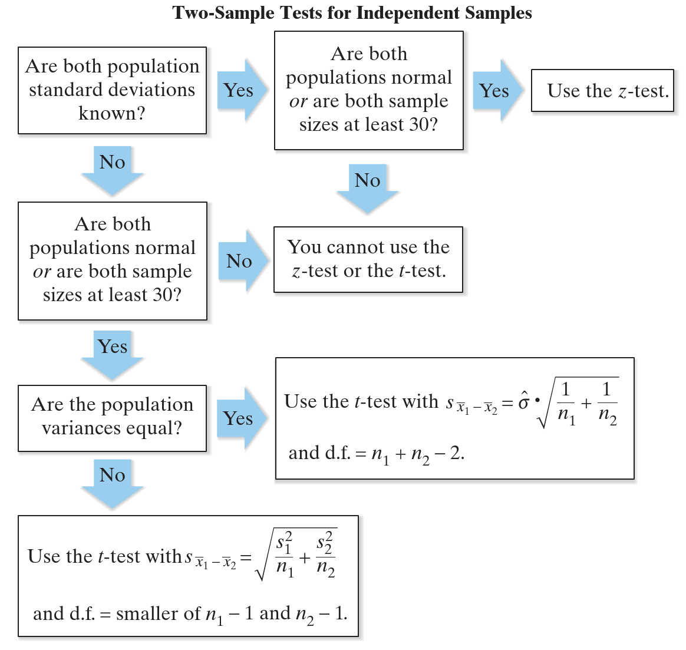

# 双独立样本均值差异检验（σ1 和 σ2 未知）

## 双样本 t-Test

在现实生活中，两个总体标准差都是未知的。

t-Test 可用于如下条件的双独立样本的均值差异检验：

1. 总体标准差未知：$\sigma_1$ 和 $\sigma_2$ 未知
2. 样本随机；
3. 样本独立；
4. 总体为正态分布或样本量均不小于 30；

满足以上条件，样本均值差 $\overline{x}_1-\overline{x}_2$ 就服从均值为 $\mu_1-\mu_2$ 的 t 分布。因此，可以使用双样本 t-test 来检验总体均值 $\mu_1$ 和 $\mu_2$ 的差异。抽样分布的自由度和标准差取决于总体方差 $\sigma_1^2$ 和 $\sigma_2^2$ 是否相等。

标准化检验统计量为：
$$
t=\frac{(\overline{x}_1-\overline{x}_2)-(\mu_1-\mu_2)}{s_{\overline{x}_1-\overline{x}_2}}
$$
如果两个**总体方差相等**：可以将两个样本的信息结合起来计算标准差 $\hat{\sigma}$ 的汇总估计
$$
\hat{\sigma}=\sqrt{\frac{(n_1-1)s_1^2+(n_2-1)s_2^2}{n_1+n_2-2}}
$$
$\overline{x}_1-\overline{x}_2$ 抽样分布的标准差为：
$$
s_{\overline{x}_1-\overline{x}_2}=\hat{\sigma}\cdot \sqrt{\frac{1}{n_1}+\frac{1}{n_2}}
$$
如果两个**总体方差不等**，此时标准差为：
$$
s_{\overline{x}_1-\overline{x}_2}=\sqrt{\frac{s_1^2}{n_1}+\frac{s_2^2}{n_2}}
$$
总结：

**操作流程：**

1. 确定条件：$\sigma_1$ 和 $\sigma_2$ 未知，样本随机且独立，总体为正态分布或 $n_1\ge30$ 且 $n_2\ge30$；
2. 声明假设
3. 指定显著性水平
4. 确定自由度
5. 计算临界值
6. 确定拒绝域
7. 计算标准化检验统计量
8. 下结论；
9. 解释。

**例 1**. 下表是同一所学校的两名教师所教学生随机抽样数学测试的结果。能够得出这两位老师的学生的平均学术考试成绩有差异的结论？使用 $\alpha=0.10$​。假设总体为正态分布，总体方差不等。

| 教师 1               | 教师 2               |
| -------------------- | -------------------- |
| $\overline{x}_1=473$ | $\overline{x}_2=459$ |
| $s_1=39.7$           | $s_2=24.5$           |
| $n_1=8$              | $n_2=18$             |

1. 已知 $\sigma_1$ 和 $\sigma_2$ 未知，样本随机且独立，总体为正态分布，所以可以用 t-test；
2. 

