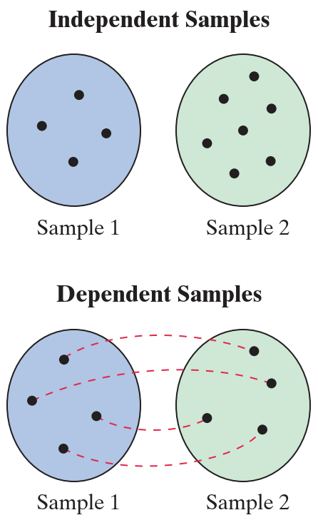

# 双样本假设检验

- [双样本假设检验](#双样本假设检验)
  - [1. 双样本均值差异检验（独立样本，σ1 和 σ2 已知）](#1-双样本均值差异检验独立样本σ1-和-σ2-已知)
    - [Independent 和 Dependent 样本](#independent-和-dependent-样本)
    - [双样本假设检验概述](#双样本假设检验概述)

2024-11-07
@author Jiawei Mao
***

## 1. 双样本均值差异检验（独立样本，σ1 和 σ2 已知）

### Independent 和 Dependent 样本

如果从一个总体中选择的样本与从第二个总体中选择的样本无关，则两个样本**独立**（independent）。如果一个样本的每个成员与另一个样本的成员相对应，则两个样本**相关**（dependent）。dependent 样本也称为**配对样本**（paired samples）或**匹配样本**（matched samples）。

> 相关样本通常涉及同一个人或对象前后结果，如一个人节食前后的体重，或特定特征匹配的个体，如同卵双胞胎。

**示例 1**

- Sample1: 70 位患者的甘油三酯水平
- Sample2: 同一批 70 位患者使用降脂药 6 个月后的甘油三酯水平

这是典型的 dependent 样本。同一患者的两个甘油三酯水平是相关的。

**示例 2**

- Sample1: 38 名成年男性在注意力缺陷测试中的得分
- Sample2: 50 名成年女性在注意力缺陷测试中的得分

样本成员之间无法形成配对关系，样本大小不同，为 independent 样本。

### 双样本假设检验概述

下面首先介绍通过独立样本比较两个不同总体的平均值。