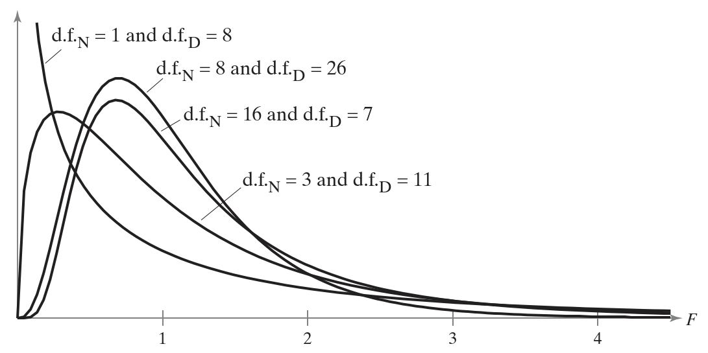
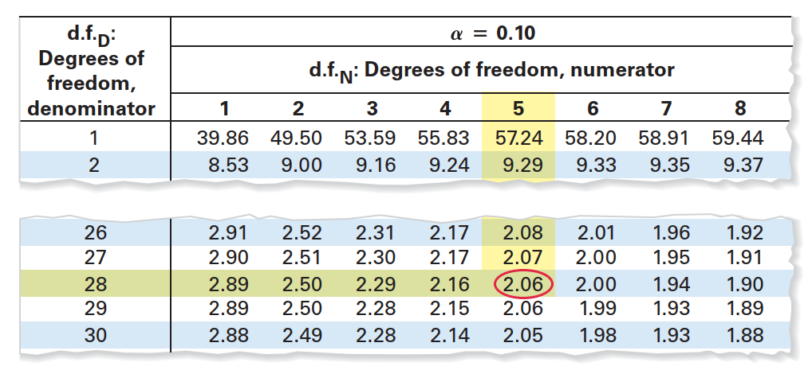
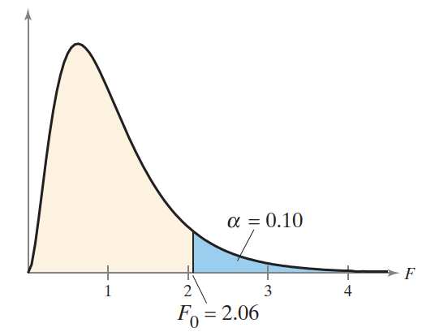
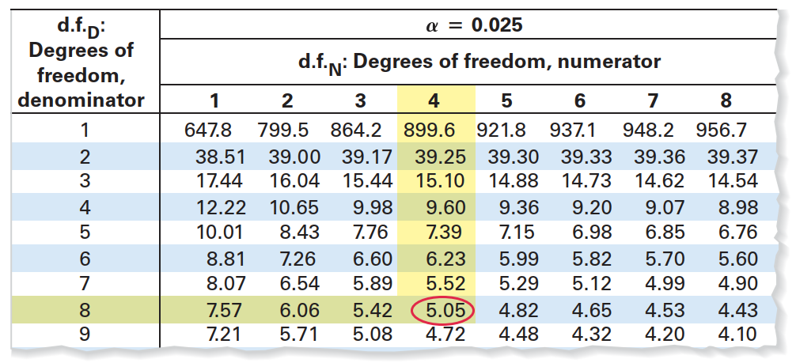
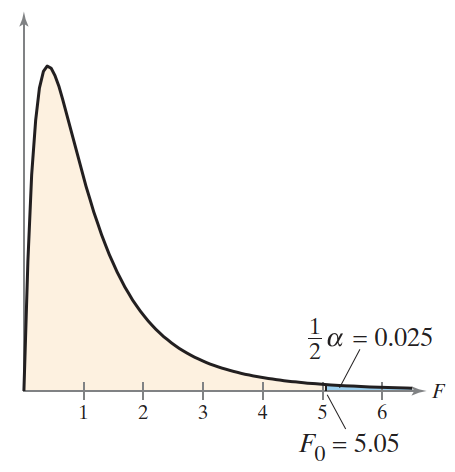

# 比较方差

## 简介

通过 two-sampel F-test 比较两个总体的方差是否相等。

## F 分布

设 $s_1^2$ 和 $s_2^2$ 表示两个不同总体的样本方差。如果两个总体都是正态分布，且总体方差 $\sigma_1^2$ 和 $\sigma_2^2$ 相等，那么：
$$
F=\frac{s_1^2}{s_2^2}
$$
服从 F-分布。

F 分布的性质：

1. F 分布是一个曲线家族，每条曲线由两个自由度决定：分子方差的自由度 $df_N$ 和分母方差的自由度 $df_D$。
2. F 分布不对称（见下图）；
3. F 分布曲线下的总面积为 1；
4. 所有 F 值大于或等于 0；
5. 随所有 F 分布，F 的平均值近似为 1。

> 不同自由度对应的 F 分布

对方差不相等的情况，将较大的方差指为 $s_1^2$。所以在 $F=s_1^2/s_2^2$ 的抽样分布中，分子方差大于或等于分母方差，因此 F 总是大于等于 1。

因此，所有单边检验都是右边检验；所有双边检验，也只需要计算右侧临界值。

## 计算 F 分布的临界值

1. 执行显著性水平（level of significance）$\alpha$；
2. 确定分子的自由度 $df_N$；
3. 确定分母的自由度 $df_D$；
4. 查表确定临界值：
   1. 对单边检验，使用 $\alpha$ F-table
   2. 对双边检验，使用 $\frac{1}{2}\alpha$ F-table

> 因为 F 总是大于或等于 1，因此单边检验就是右边检验，双边检验只需要看右边临界值。

**例 1** 查找右边检验的临界 F 值

设 $\alpha=0.10$，$df_N=5$，$df_D=28$.

单边检验，用 $\alpha=0.10$ F-table，根据自由度查找临界值。

即临界值为 2.06。如图：

**例 2** 查找双边检验 F-test 临界值

设 $\alpha=0.05$，$df_N=4$, $df_D=8$。

查 0.025 F-table，如下：

即，临界值为 5.05。如下图所示：

## 方差的 Two-Sample F-Test

双样本 F-test 用于比较两个总体的方差。

two-sample F-test 用于比较两个总体方差 $\sigma_1^2$ 和 $\sigma_2^2$。

执行该检验，需要满足以下条件：

1. 样本必须是随机的；
2. 样本必须是独立的；
3. 两个总体都服从正态分布。

检验统计量（test statistic）为：
$$
F=\frac{s_1^2}{s_2^2}
$$
其中 $s_1^2$ 和 $s_2^2$ 为样本方差，且 $s_1^2\ge s_2^2$​。

分子的自由度 $df_N=n_1-1$；分母的自由度 $df_D=n_2-1$。

其中 $n_1$ 是方差为 $s_1^2$ 样本的样本量；$n_2$ 是方差为 $s_2^2$ 样本的样本量。

## Two-Sample F-Test

1. 验证样本是随机的，并且总体为正态分布；
2. 声明 null 假设和 alternative 假设；
3. 指定显著性水平；
4. 确定分子和分母的自由度：$df_N=n_1-1$, $df_D=n_2-1$；
5. 确定临界值；
6. 确定拒绝域；
7. 计算检验统计量：$F=\frac{s_1^2}{s_2^2}$；
8. 作出决策：拒绝或无法拒绝 null 假设；
9. 根据声明解释结论。

**例 3** Two-sample F-test

一位餐厅经理正在设计一个系统，旨在减少顾客用餐前等待时间的方差。在旧系统下，随机抽取 10 名客户，方差为 400.在新系统，随机抽取 21 名顾客，方差为 256。在 $\alpha=0.10$ 时，是否有足够证据说服经理改用新系统？假设两个总体都是正态分布。

因为 $400 > 256$，所以 $s_1^2=400$, $s_2^2=256$​。

