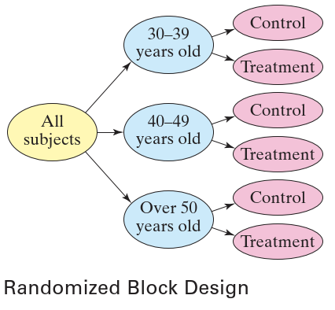
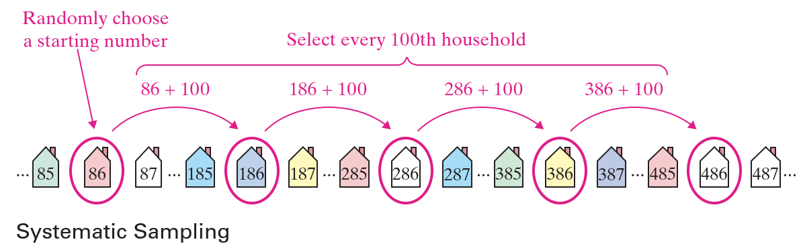

# 统计学导论

- [统计学导论](#统计学导论)
  - [1. 统计学概览](#1-统计学概览)
    - [统计学的定义](#统计学的定义)
    - [数据集](#数据集)
    - [统计分支](#统计分支)
  - [2. 数据分类](#2-数据分类)
    - [数据类型](#数据类型)
    - [测量尺度](#测量尺度)
  - [3. 数据收集和实验设计](#3-数据收集和实验设计)
    - [数据收集](#数据收集)
    - [实验设计](#实验设计)
    - [抽样技术](#抽样技术)

2024-05-06 ⭐
@author Jiawei Mao
***

## 1. 统计学概览

### 统计学的定义

**数据 (data)：** 来自观察、计数、测量或响应的信息。

**统计学（statistics）** 是一门收集、整理、分析和解释数据以做出决策的科学。

### 数据集

在学习统计学时，会涉及两种类型的数据集（dataset）：

- 总体（population）：所有感兴趣的结果、响应、测量或计数的集合。
- 样本（sample）：总体的子集或一部分。

**样本用来获得总体信息**。例如，为了估计美国人口的失业率，美国劳工统计局使用大约 6 万个家庭的样本。

样本应该能够代表总体，以便能够从样本数据得出关于总体的结论。应该采用适当的方法收集样本数据，如*随机抽样*。当收集数据的方法不合适，从样本数据不能得出关于总体的结论。

**例 1：** 识别数据集

在一项调查中，834 美国名员工被问及他们是否认为自己的工作压力大。其中 517 人回答是肯定的。确定总体和样本。

**答：** 总体由美国所有员工的回答组成。样本由参与调查的 834 名员工的回答组成。

数据集是总体还是样本取决于实际情况。例如，在例 1 中，总体是美国所有员工的回答集合。根据调查目的，总体也可以是居住在加州的所有员工，或者医疗保健行业的所有员工的回答集合。

在统计中有两个主要术语：

- **参数（parameter）：** 对总体特征的数值描述；
- **统计量（statistic）：** 对样本特征的数值描述。

> 样本统计量可能因样本而异，而总体参数对于总体是恒定的。

### 统计分支

统计学研究有两个主要分支：

- **描述统计学（descriptive statistics）：** 数据的组织、汇总和显示。
- **推断统计学（inferential statistics）:** 使用样本得出关于总体的结论 。

## 2. 数据分类

### 数据类型

数据分为两类：

- **定性数据（qualitative）：** 属性、标签或非数值项组成；
- **定量数据（quantitative）：** 测量或计数的数字组成。

### 测量尺度

数据的另一个特征是它的**测量尺度（ level of measurement）**。测量尺度决定哪些统计计算是有意义的。测量尺度从低到高分别为：

- 标称（nominal）
- 序数（ordinal）
- 区间（interval）
- 比率（ratio）

**标称（nominal）** 尺度的数据只是定性的。此级别数据使用名称、标签等进行分类。不能进行数据计算。

**序数** 尺度的数据可以是定性或定量的。此级别的数据可以按顺序排序，但是数据条目之间的差异没有意义。

**区间和比率** 则用于表示定量数据：

- 区间尺度的数据可以排序，可以计算数据之间的差值（有意义），0 为区间尺度上的一个刻度；
- 比率尺度的数据类似区间数据，只是添加了一个额外属性（0 位置的比率固定为 0）；

要区分区间数据和比率数据，只需判断 **两倍** 是否有意义。例如，可以说 2 美元是 1 美元的两倍，所以为比率类型；不能说明 2 ℃ 比 1 ℃ 暖和两倍，所以温度数据是区间类型。

下表总结了不同类型数据可应用的操作。

|数据类型|分类|排序|差值|倍数|
|---|---|---|---|---|
|Nominal|Yes|No|No|No|
|Ordinal|Yes|Yes|No|No|
|Interval|Yes|Yes|Yes|No|
|Ratio|Yes|Yes|Yes|Yes|

## 3. 数据收集和实验设计

每一项统计学研究都是收集数据，然后利用数据做出决策。其中收集数据非常重要，当收集数据有问题，最终的决策必然有问题。

**设计统计研究**

1. 确定感兴趣的变量和研究的总体；
2. 制定详细的数据收集计划。如果使用样本，需确保样本能够代表总体；
3. 收集数据；
4. 使用描述统计技术描述数据；
5. 使用推断统计解释数据并对总体做出决策；
6. 识别可能的错误。

统计研究可以分为观察性研究（observational）和实验性研究（experiment）：

- 观察性研究：研究者不影响响应值；
- 实验性研究：研究者在观察反应之前故意应用一种处理。

在实验性研究中，研究者将一种治疗方法应用于总体的一部分，称为治疗组（treatment），并观察反应；另一部分人可以作为对照组（control），不应用热呢还治疗。在许多情况下，对照组的受试者被给予安慰剂。然后比较和研究两组人的反应。

### 数据收集

收集数据的方式有多种，统计研究的目的决定了收集数据的最佳方式。下面对两种数据收集方式进行简要总结。

**模拟（simulation）** 

模拟使用数学或物理模型来再现一种情形或过程的条件。通常需要用到计算机。模拟可以用来研究现实生活中不切实际或危险的情况，通常可以节省时间和金钱。例如，汽车制造商使用假人模拟来研究撞车对人的影响。

**调查（survey）**

调查是对总体一个或多个特征的数据收集。大多数情况下，调查是通过向人们提问来进行。最常见的调查类型包括访谈、网络、电话和邮件等。在设计调查时，最重要的是问题的设计不会导致有偏见的结果。

### 实验设计

为了产生有意义无偏差的结果，应该仔细设计和执行实验。设计良好的实验有**三个关键因素**：控制（control）、随机（randomization）和重复（replication）。

由于实验结果可能受各种因素的影响，因此能够控制这些因素非常重要。其中一个因素是**混淆变量（confounding variable）**。

> **定义**
> 当实验者无法区分不同因素对变量的影响，就出现混淆变量。

例如，咖啡店老板为了吸引更多顾客，将店面改造得更鲜艳。与此同时，附近一家购物中心也隆重开业。如果咖啡店的生意变好了，就不能确定是鲜艳的颜色还是新的购物中心，此时颜色和购物中心的效果被混淆。

另一个影响实验结果的因素是**安慰剂效应**（*placebo effect*）。当受试者没有接受治疗，只是安慰剂组，当受试者响应很好，就是安慰剂效应。为了控制或减少安慰剂效应，可以使用盲试验（blinding）。

> **定义**
> **盲试验**（Blinding）指受试者不知道他接受的治疗还是安慰剂。在**双盲试验**中（double-blind experiment），实验人员和受试者都不知道受试者接受的是治疗还是安慰剂。所有数据收集完毕后，实验者才被告知相关信息。这种类型的试验是研究人员的首选。

实验者面临的一个调整是如何将实验对象分组，使各组具有相似的特征，如年龄、身高、体重等。当实验组和对照组这些特征都相似，就可以得出结论，各组之间的差异是由治疗引起的。为了形成具有相似特征的分组，通常采用**随机化**。

> **定义**
> 随机化是将受试者随机分配到不同实验组的过程。

在完全随机试验中，受试者通过随机选择分配到不同实验组。在有些实验中，可能需要用到**分区（block）**，即具有相似特征的实验组。**随机分区设计（randomized block design）** 是一种常用的实验设计，实验者将具有相似特征的受试者分成若干个分区，在每个分区内随机分配受试者到实验组。例如，一个实验人员测试一种新的减肥饮料的效果，可能会首先将受试者根据年龄分为 30-39、40-49 和 50+，然后在每个年龄段将受试者随机分配到治疗组和对照组。如下图所示：

**配对设计（matched-pairs design）** 是另一种实验设计，受试者根据相似性配对。每个 pair 的一名受试者接受治疗，另一个受试者接受不同治疗。

**样本量（sample size）**：即研究中受试者的数量，是实验设计的另一个重要部分。为了提高实验结果的有效性，需要进行重复性实验。

> 定义
> **重复（replication）** 是在相同或相似的条件下重复实验。

例如，假设设计一个实验来测试一种疫苗对一种流感病毒的抗性。在实验中，一万人接种了疫苗，另外一万人接种了安慰剂。由于样本量大，很可能观察到疫苗的有效性。但是，如果实验对象的选择没有使两组相似（如年龄、性别），那么结果的价值就会降低。

### 抽样技术

当总体太大，数据收集成本太高，就用到**抽样技术（sampling）**。抽样是对总体的一部分的计数或测量，在统计研究中更常用。

为了收集到无偏数据，必须确保样本能够代表总体。需要使用适当的抽样技巧，确保对总体的推断有效。一定要记住，数据是统计的基础，使用错误的数据完成的研究，结果是令人怀疑的。

即使采用最好的抽样方法，也会出现**抽样误差（sampling error）**。抽样误差指抽样结果与总体之间的差异。在推理统计中，会介绍控制抽样误差的计数。

**随机样本（random sample）** 指总体中每个成员被选中的概率相等。**简单随机抽样（simple random sample）** 指每个相同大小的样本被选中的概率相同。收集简单随机样本的一种方法是为总体的每个成员分配一个不同的数字，然后使用随机数字表或随机数生成器。

在选择样本成员时，根据是否可以多次选择同一个总体成员，抽样分为：

- 放回抽样
- 不放回抽样

还有其他几种常用的抽样技术，各有优缺点。

**分层抽样（stratified sample）**

当样本中有来自总体每个部分的成员很重要时，就应该使用分层抽样。根据研究的重点，总体的成员被分为两个或多个子集，称为阶层（strata），每个阶层有相似的特征、如年龄、性别、种族、政治偏好等。然后从每个阶层随机抽样。使用分层抽样可以确保总体的每个部分都得到表示。

在分层抽样时，要确保所有阶层抽样的比例与它们在总体中出现的比例一致。

**聚类抽样（cluster sample）**

当总体自然分成多个 subgroups，每个 subgroup 有相似的特征，此时采用聚类抽样最合适。聚类抽样将总体分为不同组，称为 clusters，并选择一个或多个 clusters 的所有成员。

例如，收集某地区人数的聚类样本，可以根据邮政编码将这些家庭分为不同 groups，选择一个或多个邮政编码中的所有家庭，计算每个家庭的人数。

在使用聚类抽样时，要确保所有 clusters 具有相似的特征。例如，如果某个邮政编码 cluster 中高收入人群的比例较大，则该数据可能无法代表总体。

**系统抽样（systematic sample）**

系统抽样指给总体的每个成员分配一个数字的抽样。总体的成员以某种方式排序，随机选择一个起始数，然后从起始数开始，等距选择样本成员。

系统抽样容易使用，但是，如果数据中有任何规律性的模式，应该避免这种抽样。

**便捷抽样（convenience sample）**

只选择容易得到的样本。容易导致 bias，不推荐。

**示例：** 确定抽样技术

调查学校的学生对肝细胞技术的看法。在选择样本时，确定使用的抽样技术，讨论潜在的 bias 来源。

1. 将学生总体按专业划分，然后再每个专业中随机选择一些学生进行提问。

**答：** 因为对学生进行了分类，对每个专业都选择了学生，所以这是分层抽样。

2. 为每个学生分配一个数字，然后生成随机数。向随机抽取的学生提问。

简单随机抽样。

3. 选择生物课上的学生。

便捷抽样。
