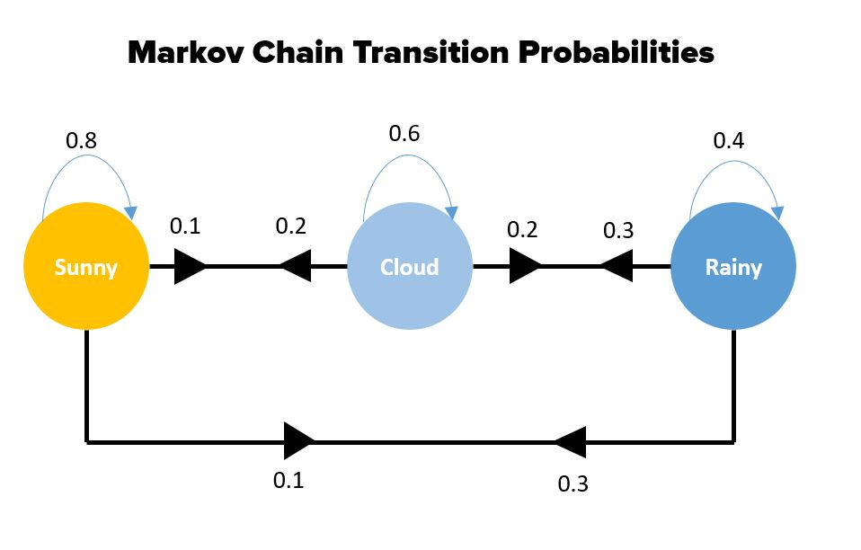
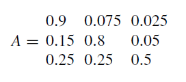

# 马尔科夫链概述

## 简介

Markov 链是一种概率图模型（PGM），用于表示动态过程，即关注状态如何随时间变化。

假设想要模拟某个地方的天气随时间的变化，在一个简化模型中，假设天气全天保持不变，并且只有三种可能：晴天、多云和下雨。

对任何要用马尔科夫链建模的过程，都必须假设**马尔科夫特性**（Markov Property）。

> [!NOTE]
> 
> **马尔科夫特性**
> 马尔科夫特性指出，时间 $t+1$ 的状态只依赖于当前状态 $t$，而与之前的状态 $t-1$, $t-2$,... 无关。简而言之，要了解未来状态，我们只需要知道当前状态。

将天气模型视为马尔科夫链，其中任何一天都有一个状态变量，即三种可能天气。这些变量以链的形式连接在一起，从一天到下一天。如下图所示：



## Markov 链的三组分

马尔科夫链（Markov chain, MC）是一种状态机，具有离散状态 $q_1$, $q_2$, ..., $q_n$，并且状态之间的转移是不确定的，即从状态 $q_i$ 到状态 $q_j$ 的转移用概率描述：$P(S_t=q_j|S_{t-1}=q_i)$。

对天气示例，有晴天$q_1$，多云 $q_2$ 和下雨 $q_3$ 三种状态。

时间也是离散的，因此在每个时间 $t$ 都有一个状态 $q_i$。它满足马尔科夫性质，即下一个状态的概率仅取决于当前状态。

所以，马尔科夫链由以下三部分组成：

1. 状态集合：$Q=\{q_1,q_2,\cdots,q_n\}$
2. 先验概率向量（每个状态发生的概率）：$\Pi=\{\pi_1,\pi_2,\cdots,\pi_n\}$，其中 $\pi_i=P(S_0=q_i)$。
3. 转移概率矩阵（从一个状态转移到另一个状态的概率变化矩阵）：$A={a_{ij}}$，其中 $i=[1,n],j=[1,n]$，$a_{ij}=P(S_t=q_j|S_{t-1}=q_i)$。

$n$ 为状态数，$S_0$ 为初始状态。

## Markov 链的性质

Markov 链具有以下性质：

1. 概率公理，即所有概率的加和为 1：$\sum \pi_i=1$, $\sum a_{ij}=1$
2. Markov 属性：$P(S_t=q_j|S_{t-1}=q_i,S_{t-2}=q_k,...)=P(S_t=q_j|S_{t-1}=q_i)$

例如，前面的天气模型，它有三种状态，使用先验概率向量指定三个概率：

| 晴   | 阴   | 雨   |
| ---- | ---- | ---- |
| 0.25 | 0.5  | 0.25 |

转移概率矩阵：

|      | 晴   | 阴   | 雨   |
| ---- | ---- | ---- | ---- |
| 晴   | 0.8  | 0.1  | 0.1  |
| 阴   | 0.2  | 0.6  | 0.2  |
| 雨   | 0.3  | 0.3  | 0.4  |

转移概率矩阵也可以用有向图表示，称为状态转移图（state transition diagram）。

## 计算转移概率

转移概率通常是在长期的连续数据中建立起来。

例如，假设我们知道一段较长时间（如 2 年）内晴天、多云和下雨的情况。比如，共有 100 天晴天，其中第二天 20% 是多云，那么晴天->多云的转移概率为 0.2.

按照该方式计算所有可能的组合，就形成了转移概率矩阵。

## Markov 链模型可以解决的问题

Markov 链模型可以帮助回答三个基本问题：

1. 某个状态序列的概率是多少？
2. 保持某个状态一段时间的概率是多少？
3. 保持某一状态的期望时间是多少？

首先，来看第一个问题。

1. **某个状态序列的概率**

状态序列的概率是状态序列的转移概率乘积：
$$
P(q_i,q_j,q_k,...)=a_{0i}a_{ij}a_{jk}...
$$
其中，$a_{0i}$ 为序列中的初始状态，可以是先验概率 $\pi_i$，也可以是从上一个状态转移的概率。

例如，在天气模型中，我们想知道以下状态序列的概率：Q=[晴, 晴, 雨, 雨, 晴, 阴, 晴]。假设晴是 MC 的初始状态，则：
$$
P(Q)=\pi_1a_{11}a_{13}a_{33}a_{31}a_{12}a_{21}=0.25*0.8*0.1*0.4*0.3*0.1*0.2=4.8\times 10^{-5}
$$

2. **保持某个状态一段时间的概率**

在状态 $q_i$ 停留 $d$ 个时间步等于在此状态停留 $d-1$ 个时间步，然后转换到不同状态的概率。即：
$$
P(d_i)=a_{ii}^{d-1}(1-a_{ii})
$$
对天气模型，连续三天阴天的概率为：
$$
P(d_2=3)=a_{22}^2(1-a_{22})=0.6^2(1-0.6)=0.144
$$

3. **保持某一状态的期望时间**

$$
E(d_i)=\sum_i d_ia_{ii}^{d-1}(1-a_{ii})
$$

## 如何估计 Markov 链的参数

如何确定 Markov 模型的参数，即参数估计。

对 MC，可以通过计算序列处于某个状态 $i$ 的次数以及从状态 $i$ 转移到状态 $j$ 的次数来估计参数。

假设有 $N$ 个观测序列，$\gamma_{oi}$ 是状态 $i$ 作为序列中的初始状态的次数，$\gamma_i$ 是观察到状态 $i$ 的次数，$\gamma_{ij}$ 是观察到从状态 $i$ 转移到状态 $j$ 的次数。

可以使用以下公式来估计参数。

初始概率：
$$
\pi_i=\gamma_{0i}/N
$$
转移概率：
$$
a_{ij}=\gamma_{ij}/\gamma_i
$$

> [!NOTE]
>
> 序列中最后一个状态，没有观察到下一个状态，因此计数不考虑所有序列的最后一个状态。

例如，对天气示例，令 $q_1=晴$，$q_2=阴$, $q_3=雨$，得到如下 4 条观测序列：

```
q2, q2, q3, q3, q3, q3, q1
q1, q3, q2, q3, q3, q3, q3
q3, q3, q2, q2
q2, q1, q2, q2, q1, q3, q1
```

计数：

| 项            | 个数 |
| ------------- | ---- |
| $\gamma_{01}$ | 1    |
| $\gamma_{02}$ | 2    |
| $\gamma_{03}$ | 1    |
| $\gamma_1$    | 3    |
| $\gamma_2$    | 7    |
| $\gamma_3$    | 11   |
| $\gamma_{11}$ | 0    |
| $\gamma_{12}$ | 1    |
| $\gamma_{13}$ | 2    |
| $\gamma_{21}$ | 2    |
| $\gamma_{22}$ | 3    |
| $\gamma_{23}$ | 2    |
| $\gamma_{31}$ | 2    |
| $\gamma_{32}$ | 2    |
| $\gamma_{33}$ | 7    |

计算先验概率：

| 晴        | 阴        | 雨        |
| --------- | --------- | --------- |
| 0.2 (1/4) | 0.5 (2/4) | 0.3 (1/4) |

计算转移概率：

|      | 晴   | 阴   | 雨   |
| ---- | ---- | ---- | ---- |
| 晴   | 0    | 1/3  | 2/3  |
| 阴   | 2/7  | 3/7  | 2/7  |
| 雨   | 2/11 | 2/11 | 7/11 |

## 使用 Perron-Frobenius 定理进行收敛

另一个有趣的问题是：如果一个序列从一个状态转移到另一个状态的次数为 M（即序列长度为 M），那么当 $M\rightarrow \infty$ 时，每个状态的概率 $q_0$ 是多少？

给定初始概率向量 $\Pi$ 和转移矩阵 $A$，每个状态经过 M 次迭代的概率 $P={p_1,p_2,...,p_n}$ 为：
$$
P=\pi A^M
$$
Perron-Frobenius 定理指出，当满足以下条件：

1. 不可约性：对每个状态 $i$，都有概率 $a_{ij}>0$ 转移到任意状态 j
2. 非周期性：链不形成循环

那么当 $M\rightarrow\infty$ 时，链收敛到不可变分布 $P$，使得 $P\times A=P$，其中 A 为转移概率矩阵。

收敛速度由矩阵 A 的第二个特征值决定。 

例如，考虑具有三个状态的 MC 以及以下转移概率矩阵：



可以证明，稳态收敛到 $P={0.625,0.3125,0.0625}$。

