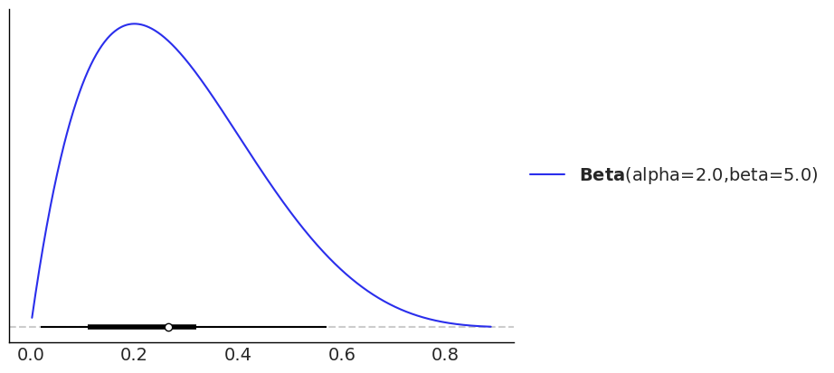
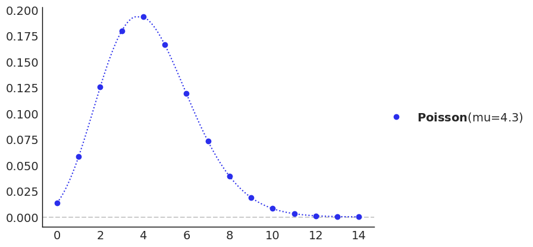
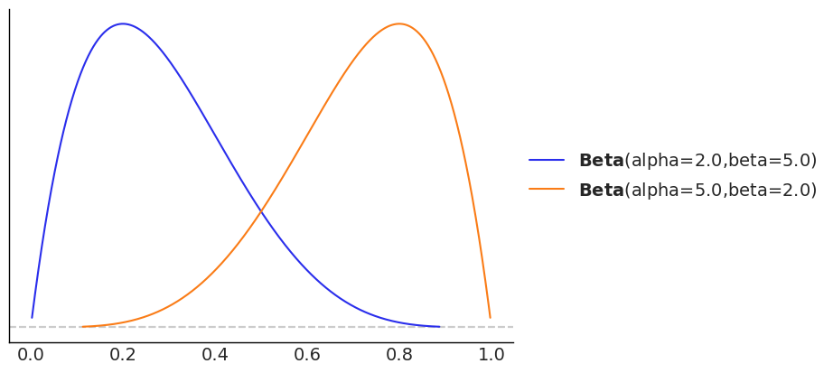
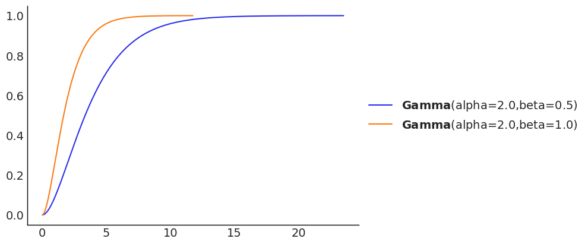
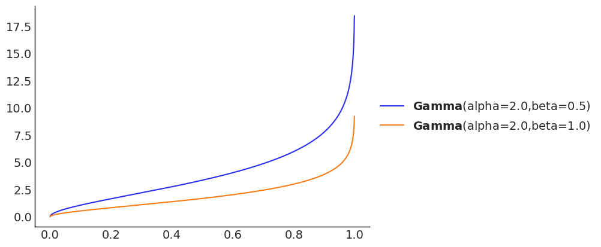
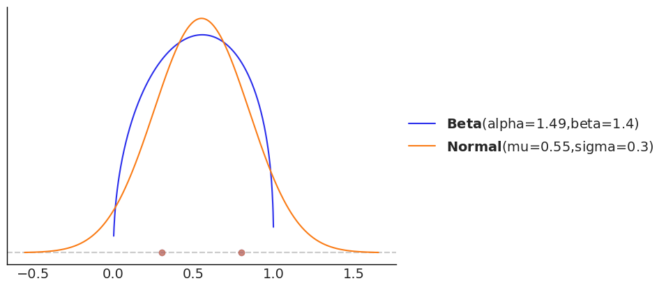
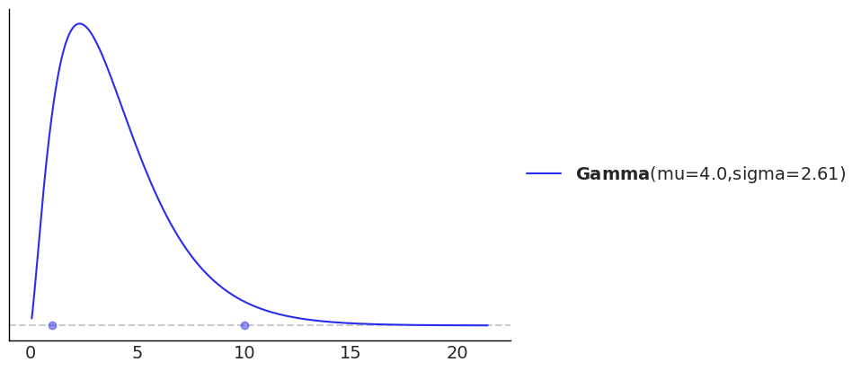
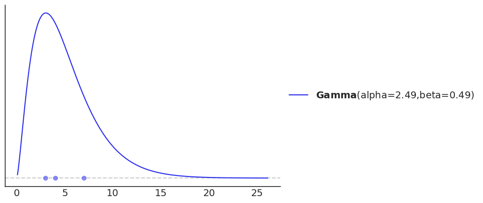

# 1D 启发示例

## 简介

导入包：

```python
import arviz as az
import preliz as pz

az.style.use("arviz-white")
```

## 分布

为贝叶斯模型设置先验时，有时只是需要快速检查分布的形状。我们通常想要确定分布的主题在哪里，或者 tail 厚度。即使我们熟悉某个分布 family，获得正确的参数也需要修改好几次，以得到接近我们所需的分布。

使用 preliz 很容易绘制指定分布的概率密度函数（pdf）：

```python
pz.Beta(2, 5).plot_pdf(pointinterval=True)
```



其中蓝色曲线为 pdf，使用参数 `pointinterval=True` 得到底部类似 box-plot 的部分，有注意理解 `Beta(2,5)`：

- 白点表示中位数；
- 粗线表示四分位数，即 0.25 和 0.75 分位数；
- 细线定义 0.05 和 0.95 分位数。

为了简单起见，对离散分布也可以使用 `plot_pdf` 函数（而不是 `plot_pmf`）：

```python
pz.Poisson(4.3).plot_pdf();
```



可以在同一个图中包含多个分布。这对比较不同分布，或相同分布不同参数非常有用。

```python
pz.Beta(2, 5).plot_pdf()
pz.Beta(5, 2).plot_pdf();
```



绘制**累计分布函数（cdf）** 也很容易：

```python
pz.Gamma(2, 0.5).plot_cdf()
pz.Gamma(2, 1).plot_cdf()
```



也可以绘制**分位数函数**（quantitle），也称为百分位函数（percentile），其实就是 cdf 的倒数：

```python
pz.Gamma(2, 0.5).plot_ppf()
pz.Gamma(2, 1).plot_ppf();
```



PreliZ 还支持使用滑块与分布进行**交互**：

```python
pz.Gamma(mu=2, sigma=1).plot_interactive()
```

PreliZ 一般不为分布提供默认参数。但是，`plot_interactive()` 提供了默认初始化参数。

### 备选参数化

有些分布可以使用多种方式定义。例如，Gamma 可以使用 `mu` 和 `sigma` 定义，也可以使用 `alpha` 和 `beta` 定义。

### 分布属性

设置分布参数后，就可以查询其性质。`summary` 方法返回 mean, median, standard deviation 和等尾区间的上限和下限值。

```python
dist = pz.Beta(2, 5)
dist.summary()
```

```
Beta(mean=0.29, median=0.26, std=0.16, lower=0.05, upper=0.63)
```

另外，可以计算两种不同类型的区间，即**等尾区间**和**最高密度区间**。区间的默认质量为 0.94.

```python
dist.eti(), dist.hdi()
```

```
((0.05, 0.63), (0.02, 0.57))
```

还可以**随机抽样**：

```python
dist.rvs(10)
```

```
array([0.14411251, 0.1826814 , 0.25667721, 0.18857005, 0.07015343,
       0.0745282 , 0.11029293, 0.27757459, 0.20498378, 0.15666745])
```

计算**分位数**：

```python
dist.ppf([0.1, 0.5, 0.9])
```

```
array([0.09259526, 0.26444998, 0.51031631])
```

计算概率密度函数的**对数**：

```python
dist.logpdf(0.5)
```

```
-0.06453852113757241
```

## 从区间到最大熵分布

有时，调整给定分布的参数不是获得有用先验的最佳途径。相反，而是希望某个分布能够满足指定约束。`pz.maxent` 找到在指定区间具有一定 mass 的最大熵的分布。具有最大熵的先验，意味着在给定约束条件下拥有较少信息的分布。

例如，比较 Beta 和 Normal 分布，约束在区间 [0.3-0.8] 之间的概率质量为 0.6：

```python
pz.maxent(pz.Beta(), 0.3, 0.8, 0.6)
pz.maxent(pz.Normal(), 0.3, 0.8, 0.6);
```



也可以将参数值传递给分布，从而固定这些参数。例如，找到一个均值为 4，90% 的概率质量在 1 到 10 之间的 Gamma 分布：

```python
pz.maxent(pz.Gamma(mu=4), 1, 10, 0.9);
```



`maxent` 原位更新分布，所以也可以：

```python
dist = pz.Gamma(mu=4)
pz.maxent(dist, 1, 10, 0.9);
```


然后可以继续使用 `dist`，例如，查询其参数：

```python
dist.alpha, dist.beta
```

```
(2.341680163267631, 0.5854200408169078)
```

`maxent` 和其它优化函数返回 `OptimizeResult`，用户可以通过该对象获取更多信息：

```python
_, opt = pz.maxent(pz.Normal(), -1, 1, 0.68, plot=False)
opt
```

```
message: Optimization terminated successfully
success: True
  status: 0
     fun: -1.4244960108798204
       x: [-1.330e-08  1.006e+00]
     nit: 4
     jac: [ 0.000e+00 -9.945e-01]
    nfev: 12
    njev: 4
```

## 从区间和四分位数到分布

除了 `maxent`，还可以用四分位数来定义分布，即用 3 个点将分布分成 4 分布，每个部分占总的挂绿质量的 25%。

```python
pz.quartile(pz.Gamma(), 3, 4, 7);
```

```
The expected masses are 0.25, 0.5, 0.75
The computed ones are: 0.29, 0.44, 0.77
```



