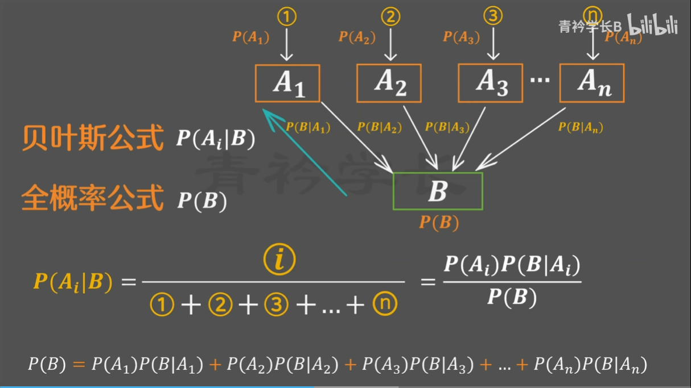
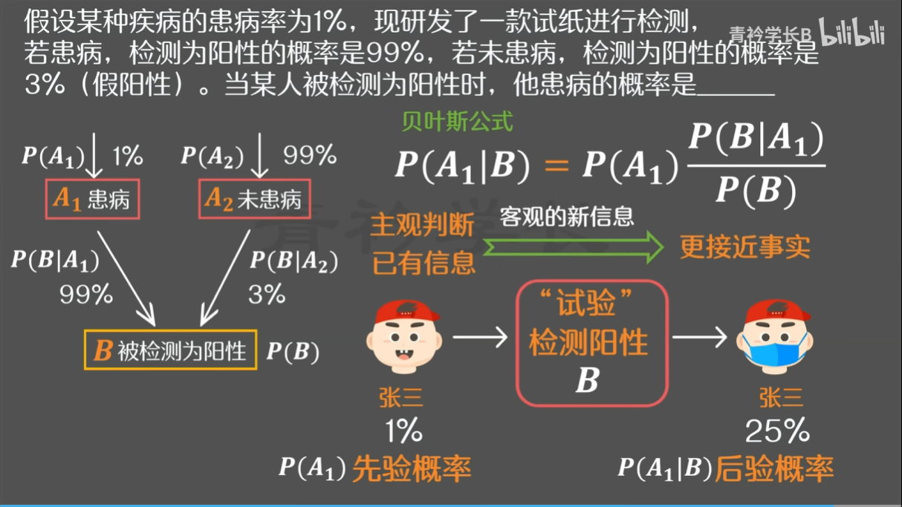

# 贝叶斯定理

2025-12-08⭐
@author Jiawei Mao

***

## 全概率公式

**示例**：现有甲乙丙三个袋子，甲袋中有3个绿球和2个红球，乙袋中有2个绿球和4个红球，丙袋有1个绿球和3个红球。如果随机选一个袋子取出2个球，则取出1个绿球和1个红球的概率是？

拆分为两个事件：

1. 选袋：选择甲、乙、丙，用 $A_1$, $A_2$, $A_3$
2. 取球：在选袋的条件在进行

取出 1 个绿球和 1 个红球的事件记为 $B$，那么：

1. 选择甲袋 $P(A_1)$，从甲袋取球 $P(B|A_1)$
2. 选择乙袋 $P(A_2)$，从甲袋取球 $P(B|A_2)$
3. 选择丙袋 $P(A_3)$，从甲袋取球 $P(B|A_3)$

总概率：
$$
P(B)=P(A_1)P(B|A_1)+P(A_2)P(B|A_2)+P(A_2)P(B|A_3)
$$
总结：

- 分步相乘（乘法公式），如先 $A_1$，再到 $B$，分两步
- 分类相加（加法公式），$A_1$, $A_2$, $A_3$ 不同类别相加

这就是全概率公式，通用形式为：
$$
P(B)=\sum_{i=1}^n P(A_i)P(B|A_i)\tag{1}
$$

前提条件：

- 事件 $A_1,A_2,\cdots,A_n$ 是样本空间的一个完备事件组（不重、不漏）
  - 两两互斥
  - 并集是整个样本空间

## 贝叶斯公式

假设某种疾病的患病率为  1%，现研发了一款试纸进行检测，若患病，检测为阳性的概率是99%，若未患病，检测为阳性的率是 3%（假阳性）。当某人被检测为阳性时，他患病的概率是多少？

令：

- $B$ 为被检测为阳性，概率为 $P(B)$

- $A_1$ 为患病概率：1%；对应检测为阳性概率 99%，即 $P(B|A_1)=99\%$
- $A_2$ 为未患病概率：99%；对应检测为阳性概率 3%，即 $P(B|A_2)=3\%$

题目要求计算被检测为阳性时患病的概率，即 $P(A_1|B)$，根据条件概率定义，有：
$$
\begin{aligned}
P(A_1|B)&=\frac{P(A_1B)}{P(B)}\\
            &=\frac{P(B|A_1)P(A_1)}{P(A_1)P(B|A_1)+P(A_2)P(B|A_2)}\\
            &=25\%
\end{aligned}
$$

这就是贝叶斯公式的应用，贝叶斯公式为：
$$
\begin{aligned}
P(A_i|B)&=\frac{P(A_i)P(B|A_i)}{P(B)}\\
&=\frac{P(A_i)P(B|A_i)}{\sum_{k=1}^nP(A_k)P(B|A_k)}
\end{aligned}\tag{2}
$$

其中：

1. $P(A_i|B)$ 称为**后验概率**：观察到事件 $B$ 时事件 $A_i$ 的概率，事件 $B$ 可以是试验、数据或者证据
2. $P(A_i)$ 称为**先验概率**：在未观察到事件 $B$ 时事件 $A_i$ 的概率，或者在观察到 $B$ 之前事件 $A_i$ 的概率
   - $P(A_i)$ 可以来自历史数据、领域知识、假设或者经验
3.  $P(B)$ 是所有可能 $A$ 的情况下，$B$ 发生的总概率，称为**边缘概率**
   - 用于归一化，确保后验概率的总和为 1
   - 采用全概率公式计算，如果变量为连续型，全概率公式的求和改为积分
4. $P(B|A_i)$ 称为似然度（**likelihood**）：在事件 $A_i$ 发生的条件在，事件 $B$ 发生的概率
   - 观测数据 $B$ 对类别 $A_i$ 的支持程度
   - likelihood 越大，说明观察数据 $B$ 对类别 $A_i$ 的**支持程度**越大
   - 量化事件 $A_i$ 与事件 $B$ 之间的相关性

图示：

贝叶斯公式还可以写为：
$$
P(A_i|B)=P(A_i)\cdot\frac{P(B|A_i)}{P(B)}
$$
其中：$\frac{P(B|A_i)}{P(B)}$ 称为调节因子。即：

$$
\text{后验概率}=\text{先验概率}\times\text{调节因子}
$$

通过考虑客观数据或信息，从先验概率到后验概率，结果更接近事实。

$P(B|A_1)$ 就是“检测为阳性”这个结果，对患病可能性的支持程度。

## 示例

下面通过示例解释贝叶斯定理。

**例 1：** 设碗 B1 包含 2 个红色和 4 个白色筹码，碗 B2 包含 1 个红色和 2 个白色筹码，碗 B3 包含 5 个红色和 4 个白色筹码。设选择碗的概率分别为 $P(B_1)=1/3$，$P(B_2)=1/6$，$P(B_3)=1/2$，其中 $B_1$, $B_2$, $B_3$ 分别是选择 B1、B2 和 B3 碗的概率。实验包含两步，选择一个碗，然后从碗中随机抽取一个筹码。设 R 为抽出红色筹码事件，计算 $P(R)$。需要注意，R 依赖于选择哪个碗，然后取决于从选择的碗中取出红色筹码的概率。即事件 R 是互斥事件 $B_1 \cap R$, $B_2 \cap R$, $B_3 \cap R$ 的并集。因此：
$$
\begin{align}
P(R)&=P(B_1\cap R)+P(B_2\cap R)+P(B_3\cap R)\\
&=P(B_1)P(R|B_1)+P(B_2)P(R|B_2)+P(B_3)P(R|B_3)\\
&=\frac{1}{3}\cdot\frac{2}{6}+\frac{1}{6}\cdot\frac{1}{3}+\frac{1}{2}\cdot\frac{5}{9}=\frac{4}{9}
\end{align}
$$

现在假设一次试验结果为红色筹码，但是不知道从哪个碗里取出。计算该筹码从 B1 中取出的条件概率，即 $P(B_1|R)$。即：

$$
\begin{align}
P(B_1|R)&=\frac{P(B_1\cap R)}{P(R)}\\
&=\frac{P(B_1)P(R|B1)}{P(B_1)P(R|B_1)+P(B_2)P(R|B_2)+P(B_3)P(R|B_3)}\\
&=\frac{(1/3)(2/6))}{(1/3)(2/6)+(1/6)(1/3)+(1/2)(5/9)}=\frac{2}{8}
\end{align}
$$

同理：

$$
P(B_2|R)=\frac{P(B_2\cap R)}{P(R)}=\frac{1}{8}
$$

$$
P(B_3|R)=\frac{P(B_3\cap R)}{P(R)}=\frac{5}{8}
$$

## 参考

- https://www.bilibili.com/video/BV1gEdVYeEcz
- https://statswithr.github.io/book/
