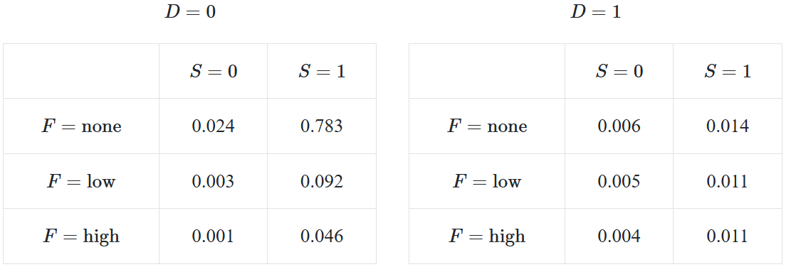

# 联合概率

2025-12-12⭐
@author Jiawei Mao
***
## 简介

许多问题涉及多个变量的相互作用。为了对现实问题进行推理，需要学会联合考虑多个随机变量。

下面以疾病预测为例，介绍概率模型涉及的概念。问题：一个人有一组观察到的症状，基于这些症状，患每种疾病的概率是多少？

我们已经了解独立事件和条件概率等概念。下面介绍：

1. 如何处理共同发生的随机变量
2. 如何在大型概率模型中进行推理

## 联合概率函数

对单个随机变量，最重要的信息是 PMF（对连续变量为 PDF）。当涉及两个或多个变量，等效函数称为**联合函数**（joint function）。对离散随机变量，该函数返回每个变量分别取特定值的概率（对连续变量为概率密度）。例如，如果有两个离散变量，则联合函数为：
$$
P(X=x,Y=y)\quad\text{X 和 Y 的联合函数}
$$

其中逗号可以读作 "and"，也就是 $X=x$ 且 $Y=y$ 的概率。省略变量名称：
$$
P(x,y)
$$
对连续变量，则使用概率密度函数：
$$
f(X=x,Y=y)\quad\text{联合概率密度函数}
$$
该原理可适用于多个变量。三个离散随机变量的联合概率函数可以表示为 $P(X=x,Y=y,Z=z)$。

## 联合概率表

**联合概率表（Joint Probability Table）**

联合概率表是一种表示多个随机变量之间联合分布的方法。通过一个多维表格（每个变量一个维度）指定联合概率。

**示例**：2020 年 Covid-19，许多人在家隔离无法去医院，只能在家自己判断是否生病。下面构建一个非常简单的概率模型，通过观察到的症状预测患病概率。假设有一种疾病称为 Determinitis，有发烧和嗅觉丧失两个症状。

| Variable         | Symbol | Type                                     |
| ---------------- | ------ | ---------------------------------------- |
| Has Determinitis | D      | Bernoulli (1 indicates has Determinitis) |
| Fever            | F      | Categorical (none, low, high)            |
| Can Smell        | S      | Bernoulli (1 indicates can smell)        |

联合概率表是存储概率分布的暴力方式。下面是一个针对三个随机变量的概率模型：

结果：

- 表格中的每个 cell 代表一种变量值组合的概率。例如，某人嗅觉丧失 $S=0$，低烧 $F=low$ 并且生病 $D=1$ 的概率 $P(D=1,S=0,F=\text{low})=.005$
- 联合概率不是条件概率。0.005 是有病、丧失嗅觉和低烧的概率，不是生病时丧失嗅觉和低烧的概率。存储条件概率的表格称为条件概率表（conditional probability table），现在讨论的是联合概率表
- 联合概率表所有 cells 值相加为 1。cell 之间为互斥事件，所有 cells 组合成覆盖所有可能的完备空间
- 假设 $n_i$ 是随机变量 $i$ 的不同取值数，那么联合表 cell 总数为 $\prod_in_i$

## 联合分布性质

| 性质                   | 表示                                          | 描述                           |
| ---------------------- | --------------------------------------------- | ------------------------------ |
| 分布函数（PMF 或 PDF） | $P(X=x,Y=y,\dots)$ 或 $f(X=x,Y=y,\dots)$ | 随机变量值到概率的映射         |
| 累计分布函数（CDF）    | $F(X<x,Y<y,\dots)$                            | 每个变量小于指定参数的概率     |
| 协方差（Covariance）   | $\sigma_{X,Y}$                                | 衡量两个随机变量一起变化的程度 |
| 相关（Correlation）    | $\rho_{X,Y}$                                  | 归一化协防差                   |

## 参考

- https://chrispiech.github.io/probabilityForComputerScientists/en/part3/joint/
