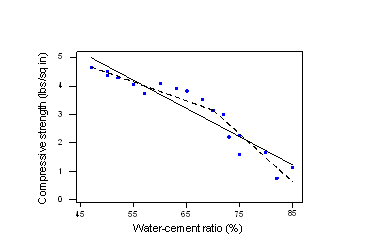
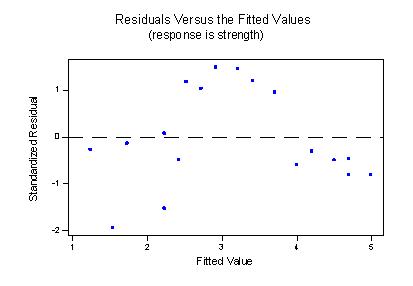
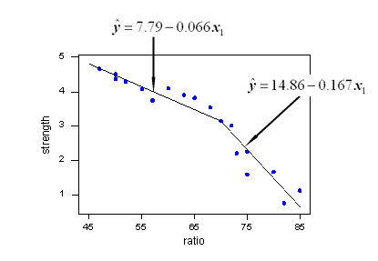
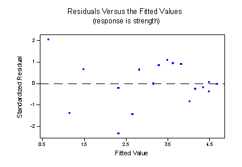

# 分段回归

## 简介

分段回归（piecewise regression, or segmented regression, broken-stick regression）是一种回归分析方法，该方法将自变量分为不同区间，在每个区间单独拟合。通过对不同自变量进行分区也可以多多元数据进行分段回归分析。当自变量在不同区间变量之间的关系不同，分段回归非常有用。片段之间的连接点称为 breakpoints 或 knot。

分段线性回归就是在每个区间采用线性回归的一种分段回归方法。

## 分段线性回归之 2 段

首先通过一个示例说明分段方法的必要性。考虑以下 $n=18$ 批次混泥土的抗压强度 $y$ 与混合水的比例 $x$ 的关系：

估计的回归线（实线）从某种意义上对数据拟合很好，但是显然还可以做得更好。残差与拟合值的关系图：

我们可以在水和水泥比例 70% 的地方将原始散点图分为两部分，然后拟合两条独立但相连的线。如图（1）虚线所示，此时拟合效果更好。

为这些数据制定一个分段线性回归模型，即两个在 $x=70$ 连接的线性模型：
$$
y_i=\beta_0+\beta_1x_{i1}+\beta_2(x_{i1}-70)x_{i2}+\epsilon_i
$$
也可以将其写为：
$$
y_i=\beta_0+\beta_1x_{i1}+\beta_2x_{i2}^*+\epsilon_i
$$
其中：

- $y_i$ 是第 $i$ 批次水泥抗压强度，单位磅每平方英寸
- $x_{i1}$ 第 $i$ 批次水和水泥的比例，以百分比记
- $x_{i2}$ 为虚拟变量，当 $x_{i1}\le 70$ 时为 0，当 $x_{i1}>70$ 时为 1
- $x_{i2}^*$ 表示 $(x_{i1}-70)x_{i2}$ 为交互项

$\epsilon_i$ 为误差项，满足均值为 0 方差为 $\sigma^2$。

上面公式得到的回归模型产生两个在 $x=70$ 处连接的单独的线性函数。模型连接的 x 值成为 knot-value (节点)。对上例为 70.

在 Minitab 中拟合改函数得到：
$$
y=7.79-0.0663\times \text{ratio}-0.101x_2^*
$$
在 $x=70$ 连接的两条回归线对数据拟合非常好：

残差图相对最初的线性模型有显著改善：

## 实现

假设有一个一维数据集，$X$ 为自变量，$y$ 为因变量，数据集为：

$$
\begin{bmatrix}
    x_1& y_1\\
    x_2 & y_2\\
    x_3 & y_3\\
    \vdots & \vdots\\
    x_n&y_n
\end{bmatrix}
$$

其中，$(x_1,y_1)$ 表示第一个数据点，这 $n$ 个数据满足 $x_1<x_2<x_3<\cdots<x_n$。分段线性函数可以表示为：

$$
y(x)=\begin{cases}
    \eta_1+\beta_1(x-b_1) &b_1<x\le b_2\\
    \eta_2+\beta_2(x-b_2) &b_2<x\le b_3\\
    \vdots&\vdots\\
    \eta_n+\beta_{n_b}(x-b_{n_b-1})&b_{n-1}<x\le b_{n_b}
\end{cases}
$$
 
其中，$b_1$ 是第一个断点的 $x$ 值，$b_2$ 是第二个断点的 $x$ 值，

## QA

- 分段回归 vs. 样条回归

分段回归获得的连续函数通常不可微，即不平滑。

使用样条线进行回归可以产生平滑的连续函数，平滑程度取决于使用的样条类型。

## 参考

- https://online.stat.psu.edu/stat501/lesson/8/8.8
- https://en.wikipedia.org/wiki/Segmented_regression
- https://jekel.me/2018/Continous-piecewise-linear-regression/