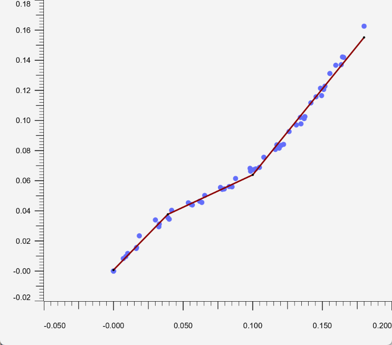

# 分段回归

## 简介

分段回归（piecewise regression, or segmented regression, broken-stick regression）是一种回归分析方法，该方法将自变量分为不同区间，在每个区间单独拟合。通过对不同自变量进行分区也可以多多元数据进行分段回归分析。当自变量在不同区间变量之间的关系不同，分段回归非常有用。片段之间的连接点称为 breakpoints 或 knot。

分段线性回归就是在每个区间采用线性回归的一种分段回归方法。

## 分段线性回归之 2 段

首先通过一个示例说明分段方法的必要性。考虑以下 $n=18$ 批次混泥土的抗压强度 $y$ 与混合水的比例 $x$ 的关系：


估计的回归线（实线）从某种意义上对数据拟合很好，但是显然还可以做得更好。残差与拟合值的关系图：


我们可以在水和水泥比例 70% 的地方将原始散点图分为两部分，然后拟合两条独立但相连的线。如图（1）虚线所示，此时拟合效果更好。

为这些数据制定一个分段线性回归模型，即两个在 $x=70$ 连接的线性模型：
$$
y_i=\beta_0+\beta_1x_{i1}+\beta_2(x_{i1}-70)x_{i2}+\epsilon_i
$$
也可以将其写为：
$$
y_i=\beta_0+\beta_1x_{i1}+\beta_2x_{i2}^*+\epsilon_i
$$
其中：

- $y_i$ 是第 $i$ 批次水泥抗压强度，单位磅每平方英寸
- $x_{i1}$ 第 $i$ 批次水和水泥的比例，以百分比记
- $x_{i2}$ 为虚拟变量，当 $x_{i1}\le 70$ 时为 0，当 $x_{i1}>70$ 时为 1
- $x_{i2}^*$ 表示 $(x_{i1}-70)x_{i2}$ 为交互项

$\epsilon_i$ 为误差项，满足均值为 0 方差为 $\sigma^2$。

上面公式得到的回归模型产生两个在 $x=70$ 处连接的单独的线性函数。模型连接的 x 值成为 knot-value (节点)。对上例为 70.

在 Minitab 中拟合改函数得到：
$$
y=7.79-0.0663\times \text{ratio}-0.101x_2^*
$$
在 $x=70$ 连接的两条回归线对数据拟合非常好：


残差图相对最初的线性模型有显著改善：


## 实现

假设有一个一维数据集，$X$ 为自变量，$y$ 为因变量，数据集为：

$$
\begin{bmatrix}
    x_1& y_1\\
    x_2 & y_2\\
    x_3 & y_3\\
    \vdots & \vdots\\
    x_n&y_n
\end{bmatrix}
$$

其中，$(x_1,y_1)$ 表示第一个数据点，这 $n$ 个数据满足 $x_1<x_2<x_3<\cdots<x_n$。分段线性函数可以表示为：

$$
y(x)=\begin{cases}
    \eta_1+\beta_1(x-b_1) &b_1<x\le b_2\\
    \eta_2+\beta_2(x-b_2) &b_2<x\le b_3\\
    \vdots&\vdots\\
    \eta_n+\beta_{n_b}(x-b_{n_b-1})&b_{n-1}<x\le b_{n_b}
\end{cases}
$$

其中，$b_1$ 是第一个断点的 $x$ 值，$b_2$ 是第二个断点的 $x$ 值，以此类推直到最后一个断点 $b_{n_b}$。断点也是有序的 $b_1<b_2<\cdots <b_{n_b}$。另外，第一个断点总是 $b_1=x_1$，最后一个断点总是 $b_{n_b}=x_n$。

如果强制分段线性函数连续，得到：
$$
y(x)=\begin{cases}
    \beta_1+\beta_2(x-b_1) & b_1\le x\le b_2\\
    \beta_1+\beta_2(x-b_1)+\beta_3(x-b_2)&b_2\lt x\le b_3\\
    \vdots\\
    \beta_1+\beta_2(x-b_1)+\beta_3(x-b_2)+\cdots+\beta_{n_b+1}(x-b_{n_b-1})&b_{n-1}\lt x\le b_{n_b}
\end{cases}
$$

表示为矩阵形式：
$$
\begin{bmatrix}
    1 & x_1-b_1&(x_1-b_2)1_{x_1>b_2}&(x_1-b_3)1_{x_1>b_3}&\cdots& (x_1-b_{n_b-1})1_{x_1>b_{n_b-1}}\\
    1&x_2-b_1&(x_2-b_2)1_{x_2>b_2}&(x_2-b_3)1_{x_2>b_3}&\cdots &(x_2-b_{n_b-1})1_{x_2>b_{n_b-1}}\\
    \vdots & \vdots & \vdots&\vdots&\ddots&\vdots\\
    1&x_n-b_1&(x_n-b_2)1_{x_n>b_2}&(x_n-b_3)1_{x_n>b_3}&\cdots &(x_n-b_{n_b-1})1_{x_n>b_{n_b-1}}
\end{bmatrix}\begin{bmatrix}
    \beta_1\\
    \beta_2\\
    \vdots\\
    \beta_{n_b}
\end{bmatrix}=\begin{bmatrix}
    y_1\\
    y_2\\
    \vdots\\
    y_n
\end{bmatrix}
$$

其中，$1_{x_n>b_2}$ 表示如下形式的分段函数：

$$
1_{x_n>b_2}=\begin{cases}
    0 & x_n\le b_2\\
    1 & x_n>b_2
\end{cases}
$$

其它函数类似。

现在就是见证奇迹的时候。因为已经对数据排序，这就是一个下三角矩阵，可以通过替换非零值快速组装矩阵。如果知道断点位置 $b$，问题不大。如果需要优化断点的理想位置（pwlf 的做法），则可能需要组装矩阵上千次。

可以将矩阵表达式表示为线程方程：
$$
\mathbf{A}\beta=\mathbf{y}
$$

其中 $\mathbf{A}$ 为回归矩阵，$\beta$ 是未知参数集合，$\mathbf{y}$ 是包含所有 $y$ 值的向量。可以使用最小二乘求解器来求解 $\beta$，在 Python 中，可以使用 numpy lstsq 中使用的 LAPACK 求解。

找到一组最佳参数 $\beta$ 后，就看恶意通过组装回归矩阵 $\mathbf{A}$ 来为新 $x$ 值预测。新的 $y$ 值通过乘法求解：

$$
\mathbf{A}\beta=\mathbf{y}
$$

### 示例数据

```java
double[] yArray = {0.00000000e+00, 9.69801700e-03, 2.94350340e-02,
        4.39052750e-02, 5.45343950e-02, 6.74104940e-02,
        8.34831790e-02, 1.02580042e-01, 1.22767939e-01,
        1.42172312e-01, 0.00000000e+00, 8.58600000e-06,
        8.31543400e-03, 2.34184100e-02, 3.39709150e-02,
        4.03581990e-02, 4.53545600e-02, 5.02345260e-02,
        5.55253360e-02, 6.14750770e-02, 6.82125120e-02,
        7.55892510e-02, 8.38356810e-02, 9.26413070e-02,
        1.02039790e-01, 1.11688258e-01, 1.21390666e-01,
        1.31196948e-01, 0.00000000e+00, 1.56706510e-02,
        3.54628780e-02, 4.63739040e-02, 5.61442590e-02,
        6.78542550e-02, 8.16388310e-02, 9.77756110e-02,
        1.16531753e-01, 1.37038283e-01, 0.00000000e+00,
        1.16951050e-02, 3.12089850e-02, 4.41776550e-02,
        5.42877590e-02, 6.63321350e-02, 8.07655920e-02,
        9.70363280e-02, 1.15706975e-01, 1.36687642e-01,
        0.00000000e+00, 1.50144640e-02, 3.44519970e-02,
        4.55907760e-02, 5.59556700e-02, 6.88450940e-02,
        8.41374060e-02, 1.01254006e-01, 1.20605073e-01,
        1.41881288e-01, 1.62618058e-01};
double[] xArray = {0.00000000e+00, 8.82678000e-03, 3.25615100e-02,
        5.66106800e-02, 7.95549800e-02, 1.00936330e-01,
        1.20351520e-01, 1.37442010e-01, 1.51858250e-01,
        1.64433570e-01, 0.00000000e+00, -2.12600000e-05,
        7.03872000e-03, 1.85494500e-02, 3.00926700e-02,
        4.17617000e-02, 5.37279600e-02, 6.54941000e-02,
        7.68092100e-02, 8.76596300e-02, 9.80525800e-02,
        1.07961810e-01, 1.17305210e-01, 1.26063930e-01,
        1.34180360e-01, 1.41725010e-01, 1.48629710e-01,
        1.55374770e-01, 0.00000000e+00, 1.65610200e-02,
        3.91016100e-02, 6.18679400e-02, 8.30997400e-02,
        1.02132890e-01, 1.19011260e-01, 1.34620080e-01,
        1.49429370e-01, 1.63539960e-01, -0.00000000e+00,
        1.01980300e-02, 3.28642800e-02, 5.59461900e-02,
        7.81388400e-02, 9.84458400e-02, 1.16270210e-01,
        1.31279040e-01, 1.45437090e-01, 1.59627540e-01,
        0.00000000e+00, 1.63404300e-02, 4.00086000e-02,
        6.34390200e-02, 8.51085900e-02, 1.04787860e-01,
        1.22120350e-01, 1.36931660e-01, 1.50958760e-01,
        1.65299640e-01, 1.79942720e-01};
```

### 已知 breakpoints 拟合

```java
double[] cs = new double[]{0.039, 0.10};
PiecewiseLinearFitting fitting = new PiecewiseLinearFitting(xArray, yArray);
FitResult result = fitting.fitWithBreaks(cs);

System.out.println(result);
fitting.show(result);
```



## QA

- 分段回归 vs. 样条回归

分段回归获得的连续函数通常不可微，即不平滑。

使用样条线进行回归可以产生平滑的连续函数，平滑程度取决于使用的样条类型。


## 参考

- https://online.stat.psu.edu/stat501/lesson/8/8.8
- https://en.wikipedia.org/wiki/Segmented_regression
- https://jekel.me/2018/Continous-piecewise-linear-regression/