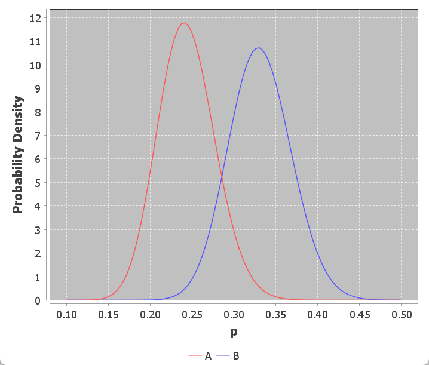

# A/B 测试

## 简介

检验：增加图片对博客的转化率是有帮助还是拖后腿？

测试时，每次发送两封电子邮件：一封包含图片，一封不包含。

该测试称为 A/B 测试，是因为我们对一个变量的不通知（有图片和无图片）进行比较，以确定哪一个表现更好。

假设博客有 600 个订阅者，对其中 300 人进行测试。将 300 人分为两组：A 组包含图片，B 组没有。

**先验概率**

首先需要确定使用什么先验概率。根据已有数据，用户点击其中链接的概率在 30% 左右。为简单起见，这两个测试使用相同的先验概率，同时选择一个较弱的先验分布，这意味着转换率的范围很大。

使用 Beta(3,7) 作为先验概率分布。该 beta 分布的均值为 0.3.

**似然**

接下来需要似然，这意味着需要收集数据。数据如下：

|      | 点击 | 未点击 | 观察的转化率 |
| ---- | ---- | ------ | ------------ |
| A    | 36   | 114    | 0.24         |
| B    | 50   | 100    | 0.33         |

将这两个变体视为要估计的单独参数。

为了得出每个变体的后验分布，需要分别结合它们各自的似然分布和先验分布。先验分布已经统一为 Beta(3,7)，代表一个相对较弱的信念。

对每个变体的似然，也是用 Beta 分布：

- A 的分布 Beta(36+3, 114+7)
- B 的分布 Beta(50+3, 100+7)

图示：

数据表明，B 更胜一筹，其转换率更高。

但是，真实的转化率只是一系列可能值中的一个。A 和 B 的分布有重叠，如果 A 只是因为运气不好，而其真实转化率实际要高很多呢？所以，这个的问题是，我们有多确定 B 更好？