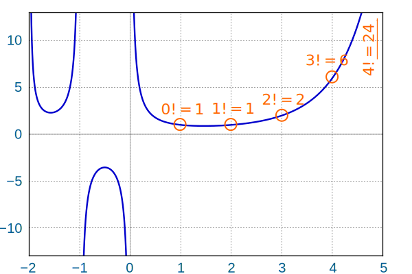

# Gamma 函数

2026-01-04⭐
@author Jiawei Mao
***
## 简介

完整的 Gamma 函数 $\Gamma (n)$ 是阶乘函数到复数和实数的扩展。它与阶乘的关系：

$$
\Gamma(n)=(n-1)!
$$

阶乘函数（factorial function）表示从 1 到所选择整数的所有数的乘积。例如：

$$
\begin{aligned}
    4!&=4\times 3\times 2\times 1=24\\
    7!&=7\times 6\times 5\times 4\times 3\times 2\times 1=5040\\
    1!&=1
\end{aligned}
$$

可以很容易从上一个数的阶乘计算当前数的阶乘：

表格：

| n    | n!                    |              |       |
| ---- | --------------------- | ------------ | ----- |
| 1    | **1**                 | 1            | 1     |
| 2    | 2 × **1**             | = 2 × **1!** | = 2   |
| 3    | 3 × **2 × 1**         | = 3 × **2!** | = 6   |
| 4    | 4 × **3 × 2 × 1**     | = 4 × **3!** | = 24  |
| 5    | 5 × **4 × 3 × 2 × 1** | = 5 × **4!** | = 120 |
| 6    | ...                   | ...          |       |

总结一下就是：
$$
n!=n\times (n-1)!
$$

### 扩展到非整数

阶乘只适用于整数，能够将其推广到浮点数或者复数？在浮点数和复数上是什么性质？

首先，定义函数形式，对所有数字：
$$
f(x)=x!
$$
然后，要求该函数满足：
$$
f(z)=zf(z-1)
$$
另外，还需要一个特殊的条件保证该函数平滑，称为**对数凸**（logarithmically convex），即该函数的对数是光滑的。平滑曲线使得函数的行为可预测，这在物理和概率领域很重要。

有许多函数具有该性质，它们各有优缺点。其中最流行的就是 Gamma 函数：
$$
\Gamma(z)=\int_0^\infty x^{z-1}e^{-x}dx
$$

这是从 0 到无穷大的定积分。

Gamma 函数对所有数字满足阶乘函数（不过要减 1）：
$$
\Gamma (n)=(n-1)!
$$
因此：

- $\Gamma(1)=0!$
- $\Gamma(2)=1!$
- $\Gamma(3)=2!$
- ...

例如，当 $n=1$：

$$
\begin{aligned}
    \Gamma(1)&=\int_0^\infty  x^{1-1}e^{-x}dx\\
    &=\int_0^\infty x^0e^{-x}dx\\
    &=\int_0^\infty e^{-x}dx\\
    &=\lim\limits_{x\rightarrow \infty} (-e^{-x})-(-e^0)\\
    &=0-(-1)\\
    &=1
\end{aligned}
$$

当 $z$ 不是整数是否有效？
$$
\Gamma(z+1)=z\Gamma(z)
$$
证明：
$$
\begin{aligned}
    \Gamma(z+1)&=\int_0^\infty x^{z+1-1}e^{-x}dx\\
    &=\int_0^\infty x^ze^{-x}dx
\end{aligned}
$$

可以采用分步积分的方式（Integration by Parts），令 $u=x^z$, $v=e^{-x}$。关键步骤：

$$
\Gamma(z+1)=[-x^ze^{-x}]_0^\infty+\int_0^\infty zx^{z-1}e^{-x}dx
$$

$$
\Gamma(z+1)=\lim\limits_{x\rightarrow\infty} (-x^ze^{-x})-(-0^ze^{-0})+z\int_0^\infty x^{z-1}e^{-x}dx
$$

当 $x\rightarrow\infty$ 时，$-x^ze^{-x}$ 趋于 0，简化得到：

$$
\Gamma(z+1)=z\int_0^\infty x^{z-1}e^{-x}dx
$$

得到：

$$
\Gamma(z+1)=z\Gamma(z)
$$

Gamma 函数图示：

它对 $x=0$ 和更小的整数不成立，其它情况都成立。

### 复数

Gamma 函数对实部大于 0 的复数也成立。

## 应用

和阶乘函数一样，Gamma 函数在组合学、概率论和统计学中有许多应用。

## 参考

- https://mathworld.wolfram.com/GammaFunction.html
- https://www.mathsisfun.com/numbers/gamma-function.html
- https://en.wikipedia.org/wiki/Gamma_function