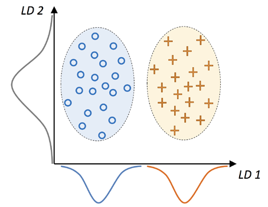

# 线性判别分析概述

- [线性判别分析概述](#线性判别分析概述)
  - [简介](#简介)
  - [PCA vs. LDA](#pca-vs-lda)
  - [线性判别分析流程](#线性判别分析流程)
    - [计算散点矩阵](#计算散点矩阵)

@author Jiawei Mao
***

## 简介

LDA (Linear Discriminant Analysis) 可以看作一种的特征提取技术，能够提高计算效率，降低非正则化模型中维度诅咒导致的过拟合。LDA 的概念与 PCA 相似，不过 PCA 试图找到数据集中方差最大的正交分量轴，而 LDA 的目标是找到能够最好区分类别的特征子空间。

基本思想：将样本投影到一条直线，使得同类别的点尽可能近，不同类的点尽可能远。即投影后类内方差最小化，类间方差最大化。

## PCA vs. LDA

PCA 和 LDA 都是线性变换技术，可以用来减少数据集的维度；其中 PCA 是一种无监督算法，而 LDA 是一种有监督算法。LDA 是一种用于分类任务的特征提取技术。

!!! note
    LDA 也称为 Fisher's LDA。Ronald A. Fisher 在 1936 年首次提出二分类问题的 Fisher 判别分析。1948 年，C. Radhakrishna Rao 在类协方差相等、且满足正态分布的假设下将 Fisher 判别分析推广到多分类问题，即现在的 LDA。

下图总结了二分类问题中的 LDA 概念。

{width="360"}

> 类别 1 用圈表示，类别 2 用叉表示

线性判别，如 x 轴（LD 1）所示，可以很好地分离两个正态分布的类别。尽管 y 轴（LD 2）捕获较多方差，但没有捕获任何类别信息，因此不是一个好的线性判别。

LDA 假设数据是正态分布的，各个类别有相同的协方差矩阵，并且训练样本在统计上彼此独立。不过，即使违背这些假设中的一个或多个，LDA 仍然可以很好地降维。

## 线性判别分析流程

LDA 的主要步骤：

1. 标准化 d 维数据集（d 是特征数）
2. 对每个类别，计算 d 维均值向量
3. 构造类间散点矩阵 $S_B$，和类内散点矩阵 $S_W$。
4. 计算矩阵的特征向量和特征值 $S_W^{-1}S_B$
5. 对特征值降序排序，以对相应的特征向量进行排序
6. 选择 k 个特征值最大的特征向量，构造 $d\times k$ 变换矩阵 **W**;特征向量为该矩阵的列
7. 使用变换矩阵 **W** 将样本投影到新的特征子空间

LDA 与 PCA 非常相似，将矩阵分解为特征值和特征向量，形成新的低维特征空间。不过，LDA 考虑了类标签信息，在步骤 2 中计算平均向量的形式存在。

### 计算散点矩阵

特征标准化在 PCA 中已经介绍过，步骤完全相同，这里略过，从计算均值向量开始。

均值向量 $m_i$ 表示类别 $i$ 的特征均值 $\mu_m$：

$$m_i=\frac{1}{n_i}\sum_{x\in D_i}x_m$$

Wine 数据集有三个类别，对应三个向量：

$$m_i=\begin{bmatrix}
    \mu_{i,alcohol}\\
    \mu_{i,malic acid}\\
    \vdots\\
    \mu_{i,proline}
\end{bmatrix}^T i\in \{1,2,3\}$$

1. 加载数据

```python
import pandas as pd

df_wine = pd.read_csv('https://archive.ics.uci.edu/ml/'
                      'machine-learning-databases/wine/wine.data',
                      header=None)

df_wine.columns = ['Class label', 'Alcohol', 'Malic acid', 'Ash', 'Alcalinity of ash',
                   'Magnesium', 'Total phenols', 'Flavanoids', 'Nonflavanoid phenols',
                   'Proanthocyanins', 'Color intensity', 'Hue',
                   'OD280/OD315 of diluted wines', 'Proline']
df_wine.head()
```

2. 拆分为训练集和测试集

```python
from sklearn.model_selection import train_test_split

X, y = df_wine.iloc[:, 1:].values, df_wine.iloc[:, 0].values

X_train, X_test, y_train, y_test = \
    train_test_split(X, y, test_size=0.3,
                     stratify=y,
                     random_state=0)
```

3. 标准化

```python
from sklearn.preprocessing import StandardScaler

sc = StandardScaler()
X_train_std = sc.fit_transform(X_train)
X_test_std = sc.transform(X_test)
```

4. 计算均值向量

```python
import numpy as np

np.set_printoptions(precision=4)

mean_vecs = []
for label in range(1, 4):
    mean_vecs.append(np.mean(X_train_std[y_train == label], axis=0))
    print(f'MV {label}: {mean_vecs[label - 1]}\n')
```

```
MV 1: [ 0.9066 -0.3497  0.3201 -0.7189  0.5056  0.8807  0.9589 -0.5516  0.5416
  0.2338  0.5897  0.6563  1.2075]

MV 2: [-0.8749 -0.2848 -0.3735  0.3157 -0.3848 -0.0433  0.0635 -0.0946  0.0703
 -0.8286  0.3144  0.3608 -0.7253]

MV 3: [ 0.1992  0.866   0.1682  0.4148 -0.0451 -1.0286 -1.2876  0.8287 -0.7795
  0.9649 -1.209  -1.3622 -0.4013]
```

对每个特征，13 个特征，对应 13 个均值。

使用均值向量，就可以计算类内散点矩阵 $S_W$：

$$S_W=\sum^c_{i=1}S_i$$

对每个类别 $i$：

$$S_i=\sum_{x\in D_i}(x-m_i)(x-m_i)^T$$

```python
d = 13  # number of features
S_W = np.zeros((d, d))
for label, mv in zip(range(1, 4), mean_vecs):
    class_scatter = np.zeros((d, d))  # scatter matrix for each class
    for row in X_train_std[y_train == label]:
        row, mv = row.reshape(d, 1), mv.reshape(d, 1)  # make column vectors
        class_scatter += (row - mv).dot((row - mv).T)
    S_W += class_scatter  # sum class scatter matrices

print('Within-class scatter matrix: 'f'{S_W.shape[0]}x{S_W.shape[1]}')
```

```
Within-class scatter matrix: 13x13
```

在计算散点矩阵时暗含假设训练集中类标签是均匀分布的，然而并非如此：

```python
print('Class label distribution:', np.bincount(y_train)[1:])
```

```
Class label distribution: [41 50 33]
```

因此，在将单个散点矩阵 $S_i$ 求和计算 $S_W$ 前，需要进行缩放。将散点矩阵除以样本数 $n_i$，此时可以发现，计算散点矩阵和计算协方差矩阵 $\Sigma_i$ 一样:

$$\Sigma_i=\frac{1}{n_i}S_i=\frac{1}{n_i}\sum_{x\in D_i}(x-m_i)(x-m_i)^T$$

因此，最终计算类内散点矩阵的方式如下：

```python
d = 13  # number of features
S_W = np.zeros((d, d))
for label, mv in zip(range(1, 4), mean_vecs):
    class_scatter = np.cov(X_train_std[y_train == label].T)
    S_W += class_scatter

print('Scaled within-class scatter matrix: '
      f'{S_W.shape[0]}x{S_W.shape[1]}')
```

```
Scaled within-class scatter matrix: 13x13
```

接下来计算类间散点矩阵 $S_B$：

$$S_B=\sum_{i=1}^c n_i(m_i-m)(m_i-m)^T$$

其中 $m$ 是包含所有类别的均值：

```python
mean_overall = np.mean(X_train_std, axis=0)
mean_overall = mean_overall.reshape(d, 1)  # make column vector

d = 13  # number of features
S_B = np.zeros((d, d))

for i, mean_vec in enumerate(mean_vecs):
    n = X_train_std[y_train == i + 1, :].shape[0]
    mean_vec = mean_vec.reshape(d, 1)  # make column vector
    S_B += n * (mean_vec - mean_overall).dot((mean_vec - mean_overall).T)

print('Between-class scatter matrix: '
      f'{S_B.shape[0]}x{S_B.shape[1]}')
```

```
Between-class scatter matrix: 13x13
```

