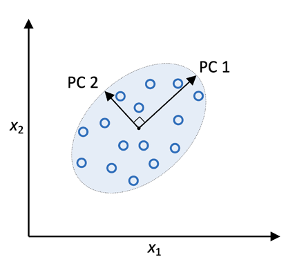
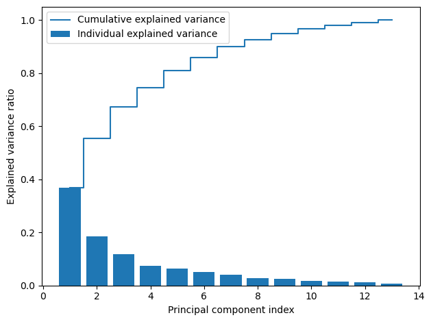
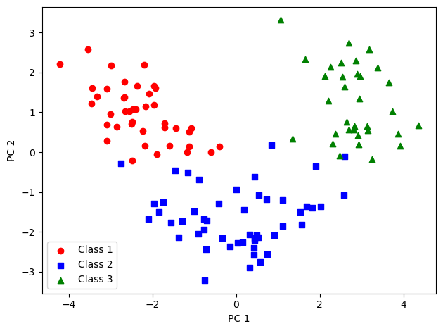
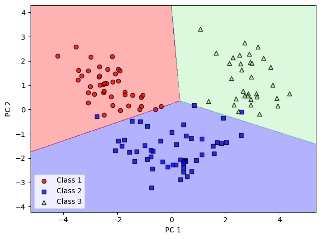
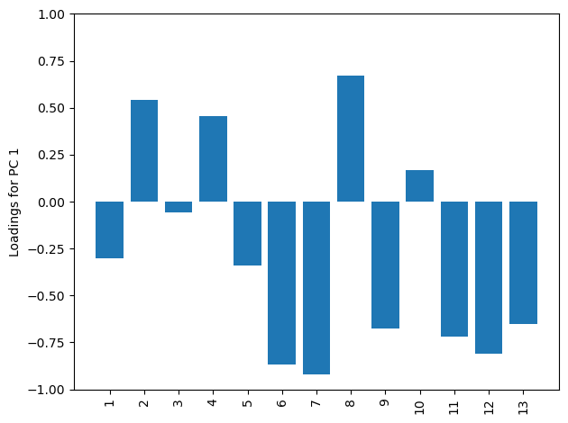

# 主成分分析概述

- [主成分分析概述](#主成分分析概述)
  - [简介](#简介)
  - [PCA 流程](#pca-流程)
  - [提取主成分](#提取主成分)
  - [解释方差比](#解释方差比)
  - [特征转换](#特征转换)
  - [使用 scikit-learn 执行 PCA](#使用-scikit-learn-执行-pca)
  - [特征贡献](#特征贡献)

2023-12-11, 16:35
@author Jiawei Mao
****

## 简介

与特征选择类似，**特征提取**也可以用来减少数据集中的特征数量。特征选择和特征提取的差别在与，特征选择保留原始特征，而特征提取将数据转换或投影到新的特征空间。

特征提取可以看作一种在保留大部分相关信息的前提下**压缩数据**的方法。在实践中，特征提取不仅用于提高学习算法的存储空间和计算效率，还通过减少维度诅咒来提高预测性能，特别是非正则化模型。

## PCA 流程

主成分分析（Principal Component Analysis, PCA）是一种广泛应用于不同领域的**无监督线性变换**技术，主要用于**特征提取**和**降维**。还用于探索性的数据分析，股票交易中的信号去噪，以及生物信息中基因组数据和基因表达水平的分析。

PCA 根据特征之间的相关性来识别数据中的模式。简而言之，PCA 旨在找到高维数据中方差最大的方向，并将数据投影到与原始数据维度相等或更少的子空间。新的子空间的正交轴（主成分）是方差最大的方向，如下图所示：

{width="300"}

> 图 1：用 PCA 找数据集中方差最大的方向

上图中，$x_1$ 和 $x_2$ 是原始特征轴，PC1 和 PC2 为主成分。

如果使用 PCA 降维，需要构建一个 $d\times k$变换矩阵 **W**，将训练样本 `x` 的特征向量映射到一个新的 k 维特征子空间，该子空间的维数要少于 *d*。例如，假设我们有一个特征向量 x：

$$x=[x_1,x_1,...,x_d], x\in \reals^d$$

用转换向量 $W\in \Reals^{d\times k}$ 转换：

$$xW=z$$

获得输出向量：

$$z=[z_1,z_2,...,z_k], z\in \Reals^k$$

将原始的 d 维数据转换到新的 k 维子空间（通常 `k<<d`），第一个主成分的方差最大。所有主成分之间相互正交。

PCA 方向对数据缩放高度敏感，如果特征是在不同尺度上测量的，需要在 PCA 之前对特征标准化。

PCA 步骤：

1. 标准化 d 维数据集
2. 构造协方差矩阵
3. 将协方差矩阵分解为特征向量和特征值
4. 对特征值降序排列，以对相应的特征向量排序
5. 选择 *k* 个特征向量，对应 *k* 个最大特征值，其中 *k* 为新的特征子空间维度（$k\le d$）
6. 使用前 *k* 个特征向量构造映射矩阵 **W**
7. 使用映射矩阵 **W** 将 *d* 维的输入数据集 **X** 转换为新的 K 维特征子空间

!!! info
    **特征分解**：将矩阵分解成特征向量和特征值，是 PCA 的核心。
    协方差矩阵是一种特殊的方阵：它是对称矩阵，即这个矩阵等于它的转置，$A=A^T$。
    当我们分解这样一个对称矩阵，特征值是实数，并且特征向量彼此正交（垂直）。
    如果将协方差矩阵分解为特征向量和对应的特征值，则与最高特征值相关的特征向量对应于数据集中方差最大的方向。
    **方向**，指数据集特征列的线性变换。

## 提取主成分

下面介绍 PCA 的前 4 步：

1. 标准化 d 维数据集
2. 构造协方差矩阵
3. 将协方差矩阵分解为特征向量和特征值
4. 对特征值降序排列，以对相应的特征向量排序

首先，加载数据集：

```python
import pandas as pd

df_wine = pd.read_csv(
    "https://archive.ics.uci.edu/ml/machine-learning-databases/wine/wine.data",
    header=None
)
```

拆分 Wine 数据集，70% 用作训练集，30% 用作测试集：

```python
from sklearn.model_selection import train_test_split

X, y = df_wine.iloc[:, 1:].values, df_wine.iloc[:, 0].values
X_train, X_test, y_train, y_test = train_test_split(X, y,
                                                    test_size=0.3,
                                                    stratify=y,
                                                    random_state=0)
```

对特征进行标准化，使得均值为 0，标准差为 1：

```python
from sklearn.preprocessing import StandardScaler

sc = StandardScaler()
X_train_std = sc.fit_transform(X_train)
X_test_std = sc.transform(X_test)
```

完成这些必需的预处理步骤后，下面开始构造协方差矩阵。

**协方差矩阵**是 $d\times d$的对称矩阵，存储不同特征之间的协方差，其中 d 是数据集维数。例如，两个特征 $x_i$ 和 $x_j$ 在总体水平上的协方差计算公式：

$$\sigma_{jk}=\frac{1}{n-1}\sum_{i=1}^n (x_j^{(i)}-\mu_j)(x_k^{(i)}-\mu_k)$$

其中，$\mu_j$ 和 $\mu_k$ 分别是样本特征 j 和 k 的均值。不过标准化后，数据集每个特征的均值都是 0.

协方差为正数表示两个特征一起增加或减少，协方差为负数表示两个特征变化方向相反。例如，三个特征的协方差矩阵可以写成如下形式：

$$\Sigma=\begin{bmatrix}
    \sigma^2_1 & \sigma_{12} & \sigma_{13}\\
    \sigma_{21} & \sigma^2_2 & \sigma_{23}\\
    \sigma_{31} & \sigma_{32} & \sigma^2_3
\end{bmatrix}$$

协方差的特征向量表示主成分（方差最大的方向），而相应的特征值定义它们的大小。

在 Wine 数据集中，将从 $13\times 13$ 协方差矩阵中获取 13 个特征向量和特征值。

特征向量和特征值满足：

$$\sum v=\lambda v$$

其中 $\lambda$ 是标量，为特征值。

手动计算特征值和特征向量繁琐而复杂，下面使用 NumPy 的 `linalg.eig` 函数计算 Wine 协方差矩阵的特征对：

```python
import numpy as np

cov_mat = np.cov(X_train_std.T)
eigen_vals, eigen_vecs = np.linalg.eig(cov_mat)
print("\nEigenvalues \n", eigen_vals)
```

```
Eigenvalues 
 [4.84274532 2.41602459 1.54845825 0.96120438 0.84166161 0.6620634
 0.51828472 0.34650377 0.3131368  0.10754642 0.21357215 0.15362835
 0.1808613 ]
```

这里使用 `numpy.cov` 函数计算标准化训练数据的协方差矩阵，使用 `linalg.eig` 函数执行特征分解，获得包含 13 个特征值的 `eigen_vals` 向量和对应的 $13\times 13$ 特征向量。

## 解释方差比

由于我们希望通过将数据集映射到一个新的特征子空间来降低数据集的维数，因此我们选择包含大多数信息（方差）的特征向量（主成分）的子集。特征值定义特征向量的大小，对特征值进行降序排序，根据特征值选择最上面的 k 个特征向量。不过在选择这 k 个包含最多信息的特征向量之前，绘制特征值的**方差解释比**（variance explained ratio）。特征值的**方差解释比**是特征值$\lambda_j$与特征值加和的比例：

$$方差解释比=\frac{\lambda_j}{\sum^d_{j=1}\lambda_j}$$

使用 NumPy 的 `cumsum` 函数，计算解释方差的累计加和，然后使用 matplotlib 的 `step` 函数绘图：

```python
tot = sum(eigen_vals)
var_exp = [(i / tot) for i in
           sorted(eigen_vals, reverse=True)]
cum_var_exp = np.cumsum(var_exp)
```

```python
import matplotlib.pyplot as plt

plt.bar(range(1, 14), var_exp, align="center",
        label="Individual explained variance")
plt.step(range(1, 14), cum_var_exp, where="mid",
         label="Cumulative explained variance")
plt.xlabel("Principal component index")
plt.ylabel("Explained variance ratio")
plt.legend(loc='best')
plt.tight_layout()
plt.show()
```

{width="450"}

从图中可以看出，第一个主成分大约占方差的 40%。前两个主成分加起来解释了数据集近 60% 的方差。

PCA 是一种无监督方法，即忽略了类标签信息。

## 特征转换

将协方差矩阵分解为特征对（特征值+特征向量），继续余下三个步骤：

1. 标准化 d 维数据集
2. 构造协方差矩阵
3. 将协方差矩阵分解为特征向量和特征值
4. 对特征值降序排列，以对相应的特征向量排序
5. 选择 *k* 个特征向量，对应 *k* 个最大特征值，其中 *k* 为新的特征子空间维度（$k\le d$）
6. 使用前 *k* 个特征向量构造映射矩阵 **W**
7. 使用映射矩阵 **W** 将 *d* 维的输入数据集 **X** 转换为新的 K 维特征子空间

将特征值按降序排序，使用选择的特征向量构建投影矩阵，然后使用投影矩阵将数据转换到低维子空间。

首先，将特征对按降序排序：

```python
eigen_pairs = [(np.abs(eigen_vals[i]), eigen_vecs[:, i])
               for i in range(len(eigen_vals))]
# 降序排序
eigen_pairs.sort(key=lambda k: k[0], reverse=True)
```

收集特征值最大的两个特征向量，以捕获数据集中大约 60% 的方差。之所以只选择两个特征向量，是便于后续通过二维散点图展示数据，在实践中，主成分的数量需要通过**计算效率**和**分类器性能**之间的权衡来确定：

```python
w = np.hstack((eigen_pairs[0][1][:, np.newaxis],
               eigen_pairs[1][1][:, np.newaxis]))
print('Matrix W:\n', w)
```

```
Matrix W:
 [[-0.13724218  0.50303478]
 [ 0.24724326  0.16487119]
 [-0.02545159  0.24456476]
 [ 0.20694508 -0.11352904]
 [-0.15436582  0.28974518]
 [-0.39376952  0.05080104]
 [-0.41735106 -0.02287338]
 [ 0.30572896  0.09048885]
 [-0.30668347  0.00835233]
 [ 0.07554066  0.54977581]
 [-0.32613263 -0.20716433]
 [-0.36861022 -0.24902536]
 [-0.29669651  0.38022942]]
```

这样就从两个特征向量创建了一个 $13\times 2$ 的投影矩阵 **W**。

使用投影矩阵，可以将样本，如 `x`（表示为 13 维行向量）变换带 PCA 子空间上，获得 `x'`，一个包含两个特征的二维向量：

$$x'=xW$$

```python
X_train_std[0].dot(w)
```

```
array([2.38299011, 0.45458499])
```

类似地，可以将整个 $124\times 13$ 训练集映射到两个主成分：

$$X'=XW$$

```python
X_train_pca = X_train_std.dot(w)
```

最后，将转换后的 Wine 训练数据集可视化，现在是 $124\times 2$ 矩阵：

```python
colors = ['r', 'b', 'g']
markers = ['o', 's', '^']

for l, c, m in zip(np.unique(y_train), colors, markers):
    plt.scatter(X_train_pca[y_train == l, 0],
                X_train_pca[y_train == l, 1],
                c=c, label=f'Class {l}', marker=m)

plt.xlabel('PC 1')
plt.ylabel('PC 2')
plt.legend(loc='lower left')
plt.tight_layout()
plt.show()
```

{width="450"}

可以看到，数据沿着第一个主成分（x 轴）比第二个主成分（y 轴）更分散。与之前方差解释比一致。从图中还可以看出，线性分类器能够对该数据很好地分类。

上面散点图中使用了类标签数据，只是为了便于解释，要记住，PCA 不适用任何类标签信息，是无监督技术。

## 使用 scikit-learn 执行 PCA

scikit-learn 提供了 `PCA` 类进行主成分分析。下面首先使用训练数据拟合模型，然后用模型转换训练集和测试集。并使用逻辑回归对转换后的示例进行分类。并使用如下函数绘制分类边界：

```python
from matplotlib.colors import ListedColormap

def plot_decision_regions(X, y, classifier, test_idx=None, resolution=0.02):
    # setup marker generator and color map
    markers = ('o', 's', '^', 'v', '<')
    colors = ('red', 'blue', 'lightgreen', 'gray', 'cyan')
    cmap = ListedColormap(colors[:len(np.unique(y))])

    # plot the decision surface
    x1_min, x1_max = X[:, 0].min() - 1, X[:, 0].max() + 1
    x2_min, x2_max = X[:, 1].min() - 1, X[:, 1].max() + 1
    xx1, xx2 = np.meshgrid(np.arange(x1_min, x1_max, resolution),
                           np.arange(x2_min, x2_max, resolution))
    lab = classifier.predict(np.array([xx1.ravel(), xx2.ravel()]).T)
    lab = lab.reshape(xx1.shape)
    plt.contourf(xx1, xx2, lab, alpha=0.3, cmap=cmap)
    plt.xlim(xx1.min(), xx1.max())
    plt.ylim(xx2.min(), xx2.max())

    # plot class examples
    for idx, cl in enumerate(np.unique(y)):
        plt.scatter(x=X[y == cl, 0],
                    y=X[y == cl, 1],
                    alpha=0.8,
                    c=colors[idx],
                    marker=markers[idx],
                    label=f'Class {cl}',
                    edgecolor='black')
```

```python
from sklearn.linear_model import LogisticRegression
from sklearn.decomposition import PCA

pca = PCA(n_components=2)
lr = LogisticRegression(multi_class="ovr",
                        random_state=1,
                        solver='lbfgs')
# 降维
X_train_pca = pca.fit_transform(X_train_std)
X_test_pca = pca.transform(X_test_std)
# 在降维后的数据上执行逻辑回归
lr.fit(X_train_pca, y_train)
plot_decision_regions(X_train_pca, y_train, classifier=lr)
plt.xlabel("PC 1")
plt.ylabel("PC 2")
plt.legend(loc='lower left')
plt.tight_layout()
plt.show()
```

{width="450"}

如果对不同主成分的方差解释比感兴趣 ，可以初始化 PCA 时将 `n_components` 参数设置为 None，这样可以保留所有主成分，然后通过 `explained_variance_ratio_` 属性访问方差解释比：

```python
pca = PCA(n_components=None)
X_train_pca = pca.fit_transform(X_train_std)
pca.explained_variance_ratio_
```

```
array([0.36951469, 0.18434927, 0.11815159, 0.07334252, 0.06422108,
       0.05051724, 0.03954654, 0.02643918, 0.02389319, 0.01629614,
       0.01380021, 0.01172226, 0.00820609])
```

`explained_variance_ratio_` 是按降序返回主成分，此时 `PCA` 不会执行降维操作。

## 特征贡献

下面简要介绍原始特征对主成分的贡献。PCA 创建了特征线性组合的主成分，有时，我们想知道每个原始特征对指定主成分的贡献有多大，这些贡献通常称为负载 **loading**。

负载因子可以通过将特征向量按特征值的平方根进行缩放来计算。返回值可以理解为原始特征和主成分之间的相关性。下面通过绘制第一个主成分的负载来进行说明。

特征向量乘以特征值的平方根获得 $13\times 13$负载矩阵：

```python
loadings = eigen_vecs * np.sqrt(eigen_vals)
```

绘制第一个主成分的负载：

```python
fig, ax = plt.subplots()
ax.bar(range(13), loadings[:, 0], align='center')
ax.set_ylabel('Loadings for PC 1')
ax.set_xticks(range(13))
ax.set_xticklabels(df_wine.columns[1:], rotation=90)
plt.ylim([-1, 1])
plt.tight_layout()
plt.show()
```

{width="450"}

可以看到，第一个特征（Alcohol）与第一主成分负相关（约 -0.3），而 Malic acid 则正相关（约 0.54）。

上面计算的是自定义实现的 PCA 的负载因子。与 scikit-learn 的 `PCA` 类，可以使用类似的方法计算：

```python
sklearn_loadings = pca.components_.T * np.sqrt(pca.explained_variance_)
```