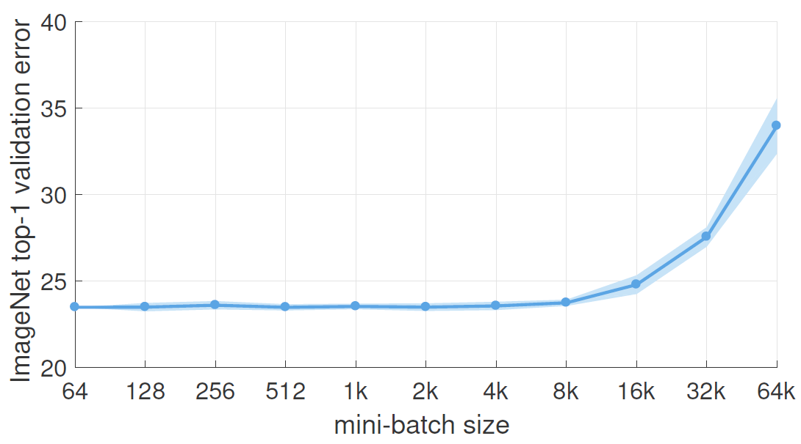

# Large Minibatch

## 简介

规模很重要，目前人工智能研究，通过不断增加数据和模型规模，迅速提高计算机视觉、语音和自然语言处理模型的准确性。以计算机视觉为例，深层卷积神经网络学到的视觉表示（representation）在挑战性任务（如 ImageNet 分类）上表现优异，并且可以迁移到困难的感知问题中，如目标检测和分割。更大的数据集和神经网络架构在所有预训练任务中始终能提高准确性。但随着模型和数据规模的增加，训练时间也在增长；要发现大规模深度学习和潜力和局限性，需要开发新的技术来确保训练时间可控。

本文的目的是证明分布式同步随机梯度下降 SGD 大规模训练的可行性，并提供实用指南。例如，我们将 ResNet-50 原始训练的 minibatch size 256 张图像（8 个 Tesla P100 GPUs，训练 29h）增加到更大的 minibatch (Figure 1)。重要的是，我们使用 8192 大型 minibatch，可以使用 256 个 GPU 在 1 小时内训练好 ResNet-50，同时保持与 256 minibatch baseline 相同的精度水平。虽然分布式同步 SGD 现在很常见，但是没有结果表明，使用 8192 minibatch 可以保持泛化精度，或者可以在如此短的时间内训练出这样的高精度模型。

> Figure 1. **ImageNet top-1 validation error vs. minibatch size.**
> 显示正负两个标准差的误差范围。本文提出了一种简单而通用的技术，用于将分布式同步 SGD 扩展到 8k minibatch 的同时，保持小批量训练的 top-1 error。对所有 minibatch 大小，将学习率设置为 minibatch 大小的线性函数，并且在训练的前几个 epoch 使用简单的预热（warmup）阶段。其它超参数保持固定。使用这种简单的方法，使模型的精度不受 minibatch 大小影响（minibatch 大小可达 8k）。当将 minibatch 增大时，该技术以 90% 的效率线性减少训练时间，从而在 1 小时内在 256 个 GPU 上训练一个 8k minibatch ResNet-50 模型。

为了实现超大 minibatch 问题，我们使用了一个简单的超参数-free 的缩放规则来调整学习率。为了使用时规则，我们提出了一个新的 warmup 策略，即在训练开始时使用较小的学习率，以克服早期优化困难问题。重要的是，我们的方法不仅在基线验证错误上不弱，训练错误曲线与小 minibatch 基线错误匹配。

我们的综合试验表明，大型 minibatch 的主要问题是优化较难，而不是泛化能力差（至少在 ImageNet 上）。此外，线性缩放规则和 warmup 可以推广到更复杂的任务，包括对象检测和实例分割，并使用 Mask R-CNN 进行演示。我们注意到，目前还没有可靠成功解决各种 minibatch size 的指南。

## Large Minibatch SGD

对监督学习，最小化损失函数 $L(w)$:

$$L(w)=\frac{1}{\lvert X\rvert}\sum_{x\isin X}l(x,w) \tag{1}$$

其中 $w$ 为网络权重，$X$ 是训练集标签，$l(x,w)$ 是从样本 $x\isin X$和对应标签 $y$ 计算的损失。$l$ 通常是分类损失（如交叉熵）和 $w$ 上的正则损失的加和。

**线性缩放规则**：当 minibatch size 乘以 k，学习率也乘以 k。

其它参数保持不变。

## 总结

- Large Batch 使收敛性变差，因为 Large Batch 更容易落入 Sharp Minima，而 Sharp Minima 属于过拟合，所以其泛化性比较差
- 线性缩放规则：当 batch size 相对 baseline 增加 N 倍，learning rate 也相应增加 N 倍，但 batch size 的提升也有上限，超过这个值泛化性变差。
- Batch Training 相对 Full Batch Training 来说引入了 Noise，而 Noise 具有波动，可以在更新时偏离 Sharp Minima，从而进入 Broad Minima，进而有了更好的泛化性，即 Noise 起了较大作用。

- 用贝叶斯理论证明 Board Minima 比 Sharp Minima 具有更好的泛化性

## 参考

- Goyal,P. et al. (2018) Accurate, Large Minibatch SGD: Training ImageNet in 1 Hour.
- https://www.cnblogs.com/deep-learning-stacks/p/10296637.html
