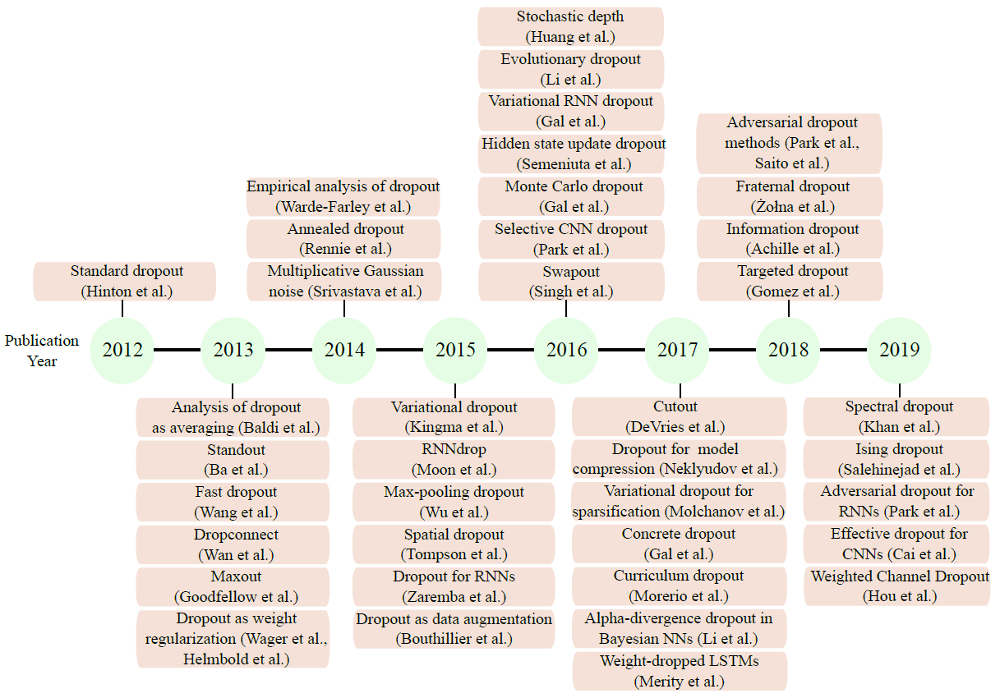

# Dropout

2022-02-22, 09:31
***

## 摘要

Dropout 方法是一系列用于神经网络训练和推理的随机技术，这些技术在实践中应该广泛。 

> 2012 到 2019 年 dropout 方法的推荐方法和理论进展

## 参考

- [Survey of Dropout Methods for Deep Neural Networks](https://arxiv.org/abs/1904.13310)