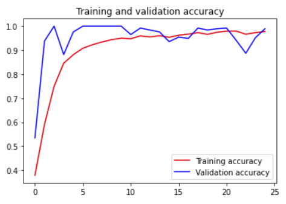

# 图像多分类

- [图像多分类](#图像多分类)
  - [数据集](#数据集)
  - [构建模型](#构建模型)
    - [创建训练集](#创建训练集)
    - [创建验证集](#创建验证集)
    - [创建模型](#创建模型)
    - [编译模型](#编译模型)
    - [训练并保存模型](#训练并保存模型)
  - [绘制图](#绘制图)

2022-01-18, 09:51
***

## 数据集

石头剪刀布图像数据集，通过图像识别是哪种手势，这是一个三分类任务。

数据集下载地址：https://storage.googleapis.com/laurencemoroney-blog.appspot.com/rps.zip

下载解压后，包含三个子目录，文档结构：

```txt
-rps
  - paper
  - rock
  - scissors
```

三个目录各包含 840 张图像，对应石头剪刀布的不同手势。

下载并解压数据集：

```python
import os
import zipfile

local_zip = r"D:\data\dataset\rps.zip"
zip_ref = zipfile.ZipFile(local_zip, 'r')
zip_ref.extractall('/tmp/')
zip_ref.close()

local_zip = r"D:\data\dataset\rps-test-set.zip"
zip_ref = zipfile.ZipFile(local_zip, 'r')
zip_ref.extractall('/tmp/')
zip_ref.close()
```

这里将文件解压到当前盘的 `tmp` 目录。

查看数据集:

```python
rock_dir = os.path.join('/tmp/rps/rock')
paper_dir = os.path.join('/tmp/rps/paper')
scissors_dir = os.path.join('/tmp/rps/scissors')

print('total training rock images:', len(os.listdir(rock_dir)))
print('total training paper images:', len(os.listdir(paper_dir)))
print('total training scissors images:', len(os.listdir(scissors_dir)))

rock_files = os.listdir(rock_dir)
print(rock_files[:10])

paper_files = os.listdir(paper_dir)
print(paper_files[:10])

scissors_files = os.listdir(scissors_dir)
print(scissors_files[:10])
```

```sh
total training rock images: 840
total training paper images: 840
total training scissors images: 840
['rock01-000.png', 'rock01-001.png', 'rock01-002.png', 'rock01-003.png', 'rock01-004.png', 'rock01-005.png', 'rock01-006.png', 'rock01-007.png', 'rock01-008.png', 'rock01-009.png']
['paper01-000.png', 'paper01-001.png', 'paper01-002.png', 'paper01-003.png', 'paper01-004.png', 'paper01-005.png', 'paper01-006.png', 'paper01-007.png', 'paper01-008.png', 'paper01-009.png']
['scissors01-000.png', 'scissors01-001.png', 'scissors01-002.png', 'scissors01-003.png', 'scissors01-004.png', 'scissors01-005.png', 'scissors01-006.png', 'scissors01-007.png', 'scissors01-008.png', 'scissors01-009.png']
```

这里可以看出训练集的大小，以及文件编号的样式。

使用 matplotlib 查看图片：

```python
import matplotlib.pyplot as plt
import matplotlib.image as mpimg

pic_index = 2

next_rock = [os.path.join(rock_dir, fname) for fname in rock_files[pic_index - 2:pic_index]]
next_paper = [os.path.join(paper_dir, fname) for fname in paper_files[pic_index - 2:pic_index]]
next_scissors = [os.path.join(scissors_dir, fname) for fname in scissors_files[pic_index - 2:pic_index]]

fig = plt.figure()
for i, img_path in enumerate(next_rock + next_paper + next_scissors):
    img = mpimg.imread(img_path)
    ax = fig.add_subplot(3, 2, i + 1)
    ax.imshow(img)
    plt.axis('off')
plt.show()
```

每类图像显示前两张：


## 构建模型

### 创建训练集

```python
import tensorflow as tf
import keras_preprocessing
from keras_preprocessing import image
from keras_preprocessing.image import ImageDataGenerator

TRAINING_DIR = "/tmp/rps/"
training_datagen = ImageDataGenerator(
    rescale=1. / 255,
    rotation_range=40,
    width_shift_range=0.2,
    height_shift_range=0.2,
    shear_range=0.2,
    zoom_range=0.2,
    horizontal_flip=True,
    fill_mode='nearest')
train_generator = training_datagen.flow_from_directory(
    TRAINING_DIR,
    target_size=(150, 150),
    class_mode='categorical'
)
```

创建训练集，`ImageDataGenerator` 执行数据增强：

- `rescale` 执行随机缩放；
- `rotation_range` 执行随机旋转；
- `width_shift_range` 和 `height_shift_range` 执行随机平移；
- `shear_range` 执行剪切；
- `zoom_range` 执行缩放；
- `horizontal_flip` 执行翻转；

图像操作后可能产生空白区域，`fill_mode` 用于设置填充空白区域的方式。

对多分类问题，需要设置 `class_mode='categorical'`。

### 创建验证集

```python
VALIDATION_DIR = "/tmp/rps-test-set/"
validation_datagen = ImageDataGenerator(rescale=1. / 255)

validation_generator = validation_datagen.flow_from_directory(
    VALIDATION_DIR,
    target_size=(150, 150),
    class_mode='categorical'
)
```

对验证集不需要执行数据增强，所以 `ImageDataGenerator` 只保留了缩放。

### 创建模型

在上面创建数据集时，已经将图片转换为 (150, 150)，所以这里输入 shape 为 （150， 150， 3）。

```python
model = tf.keras.models.Sequential([
    # Note the input shape is the desired size of the image 150x150 with 3 bytes color
    # This is the first convolution
    tf.keras.layers.Conv2D(64, (3, 3), activation='relu', input_shape=(150, 150, 3)),
    tf.keras.layers.MaxPooling2D(2, 2),
    # The second convolution
    tf.keras.layers.Conv2D(64, (3, 3), activation='relu'),
    tf.keras.layers.MaxPooling2D(2, 2),
    # The third convolution
    tf.keras.layers.Conv2D(128, (3, 3), activation='relu'),
    tf.keras.layers.MaxPooling2D(2, 2),
    # The fourth convolution
    tf.keras.layers.Conv2D(128, (3, 3), activation='relu'),
    tf.keras.layers.MaxPooling2D(2, 2),
    # Flatten the results to feed into a DNN
    tf.keras.layers.Flatten(),
    tf.keras.layers.Dropout(0.5),
    # 512 neuron hidden layer
    tf.keras.layers.Dense(512, activation='relu'),
    tf.keras.layers.Dense(3, activation='softmax') # 3 对应 3 个类别
])

model.summary()
```

```sh
Found 2520 images belonging to 3 classes.
Found 372 images belonging to 3 classes.
Model: "sequential"
_________________________________________________________________
 Layer (type)                Output Shape              Param #   
=================================================================
 conv2d (Conv2D)             (None, 148, 148, 64)      1792      
                                                                 
 max_pooling2d (MaxPooling2D  (None, 74, 74, 64)       0         
 )                                                               
                                                                 
 conv2d_1 (Conv2D)           (None, 72, 72, 64)        36928     
                                                                 
 max_pooling2d_1 (MaxPooling  (None, 36, 36, 64)       0         
 2D)                                                             
                                                                 
 conv2d_2 (Conv2D)           (None, 34, 34, 128)       73856     
                                                                 
 max_pooling2d_2 (MaxPooling  (None, 17, 17, 128)      0         
 2D)                                                             
                                                                 
 conv2d_3 (Conv2D)           (None, 15, 15, 128)       147584    
                                                                 
 max_pooling2d_3 (MaxPooling  (None, 7, 7, 128)        0         
 2D)                                                             
                                                                 
 flatten (Flatten)           (None, 6272)              0         
                                                                 
 dropout (Dropout)           (None, 6272)              0         
                                                                 
 dense (Dense)               (None, 512)               3211776   
                                                                 
 dense_1 (Dense)             (None, 3)                 1539      
                                                                 
=================================================================
Total params: 3,473,475
Trainable params: 3,473,475
Non-trainable params: 0
```

### 编译模型

```python
model.compile(loss='categorical_crossentropy', optimizer='rmsprop', metrics=['accuracy'])

```

对多分类模型，使用 `categorical_crossentropy` 损失函数。

### 训练并保存模型

```python
history = model.fit(train_generator, epochs=25, validation_data=validation_generator, verbose=1)

model.save("rps.h5")
```

> 图像处理需要 scipy 包，所以在执行训练前，确保安装了 scipy

```sh
Epoch 1/25
79/79 [==============================] - 19s 178ms/step - loss: 1.1622 - accuracy: 0.3794 - val_loss: 1.0447 - val_accuracy: 0.5349
Epoch 2/25
79/79 [==============================] - 13s 164ms/step - loss: 0.8937 - accuracy: 0.5909 - val_loss: 0.4031 - val_accuracy: 0.9382
Epoch 3/25
79/79 [==============================] - 13s 167ms/step - loss: 0.6260 - accuracy: 0.7496 - val_loss: 0.1442 - val_accuracy: 1.0000
Epoch 4/25
79/79 [==============================] - 14s 171ms/step - loss: 0.4038 - accuracy: 0.8456 - val_loss: 0.1983 - val_accuracy: 0.8817
Epoch 5/25
79/79 [==============================] - 13s 169ms/step - loss: 0.3138 - accuracy: 0.8810 - val_loss: 0.0510 - val_accuracy: 0.9758
Epoch 6/25
79/79 [==============================] - 13s 163ms/step - loss: 0.2489 - accuracy: 0.9079 - val_loss: 0.0301 - val_accuracy: 1.0000
Epoch 7/25
79/79 [==============================] - 13s 166ms/step - loss: 0.2101 - accuracy: 0.9226 - val_loss: 0.0228 - val_accuracy: 1.0000
Epoch 8/25
79/79 [==============================] - 13s 170ms/step - loss: 0.1780 - accuracy: 0.9341 - val_loss: 0.0368 - val_accuracy: 1.0000
Epoch 9/25
79/79 [==============================] - 13s 167ms/step - loss: 0.1648 - accuracy: 0.9437 - val_loss: 0.0084 - val_accuracy: 1.0000
Epoch 10/25
79/79 [==============================] - 13s 169ms/step - loss: 0.1465 - accuracy: 0.9500 - val_loss: 0.0250 - val_accuracy: 1.0000
Epoch 11/25
79/79 [==============================] - 14s 172ms/step - loss: 0.1664 - accuracy: 0.9476 - val_loss: 0.0791 - val_accuracy: 0.9651
Epoch 12/25
79/79 [==============================] - 14s 175ms/step - loss: 0.1074 - accuracy: 0.9595 - val_loss: 0.0277 - val_accuracy: 0.9919
Epoch 13/25
79/79 [==============================] - 14s 170ms/step - loss: 0.1313 - accuracy: 0.9552 - val_loss: 0.0861 - val_accuracy: 0.9839
Epoch 14/25
79/79 [==============================] - 14s 172ms/step - loss: 0.1247 - accuracy: 0.9603 - val_loss: 0.0374 - val_accuracy: 0.9758
Epoch 15/25
79/79 [==============================] - 13s 170ms/step - loss: 0.1422 - accuracy: 0.9536 - val_loss: 0.0930 - val_accuracy: 0.9355
Epoch 16/25
79/79 [==============================] - 13s 166ms/step - loss: 0.1112 - accuracy: 0.9623 - val_loss: 0.1078 - val_accuracy: 0.9543
Epoch 17/25
79/79 [==============================] - 13s 164ms/step - loss: 0.0996 - accuracy: 0.9667 - val_loss: 0.1041 - val_accuracy: 0.9489
Epoch 18/25
79/79 [==============================] - 13s 164ms/step - loss: 0.0915 - accuracy: 0.9730 - val_loss: 0.0223 - val_accuracy: 0.9919
Epoch 19/25
79/79 [==============================] - 13s 169ms/step - loss: 0.1159 - accuracy: 0.9659 - val_loss: 0.0320 - val_accuracy: 0.9839
Epoch 20/25
79/79 [==============================] - 13s 166ms/step - loss: 0.0893 - accuracy: 0.9746 - val_loss: 0.0555 - val_accuracy: 0.9892
Epoch 21/25
79/79 [==============================] - 13s 163ms/step - loss: 0.0802 - accuracy: 0.9790 - val_loss: 0.0257 - val_accuracy: 0.9919
Epoch 22/25
79/79 [==============================] - 13s 163ms/step - loss: 0.0724 - accuracy: 0.9794 - val_loss: 0.1716 - val_accuracy: 0.9409
Epoch 23/25
79/79 [==============================] - 13s 163ms/step - loss: 0.1123 - accuracy: 0.9663 - val_loss: 0.4004 - val_accuracy: 0.8871
Epoch 24/25
79/79 [==============================] - 13s 164ms/step - loss: 0.0879 - accuracy: 0.9730 - val_loss: 0.1417 - val_accuracy: 0.9516
Epoch 25/25
79/79 [==============================] - 13s 163ms/step - loss: 0.0679 - accuracy: 0.9774 - val_loss: 0.0335 - val_accuracy: 0.9892
```

最后训练精度为 97.7 %，验证精度为 98.9 %。

## 绘制图

```python
import matplotlib.pyplot as plt

acc = history.history['accuracy']
val_acc = history.history['val_accuracy']
loss = history.history['loss']
val_loss = history.history['val_loss']

epochs = range(len(acc))

plt.plot(epochs, acc, 'r', label='Training accuracy')
plt.plot(epochs, val_acc, 'b', label='Validation accuracy')
plt.title("Training and validation accuracy")
plt.legend(loc=0)
plt.show()
```


