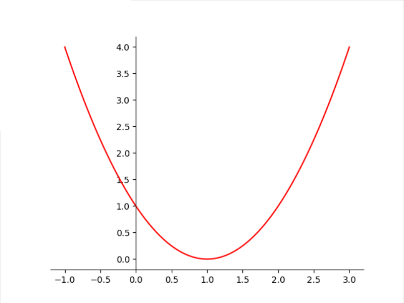

# 梯度下降

- [梯度下降](#梯度下降)
  - [简介](#简介)

## 简介

梯度下降是优化机器学习算法最常见的方法之一，用来解决损失函数最小化问题。

最小二乘对应的损失函数为：

$$E(\theta)=\frac{1}{2}\sum_{i=1}^n (y_i-f_{\theta}(x_i))^2$$

其中 $y_i$ 为实际值，$f_{\theta}(x_i)$ 为拟合值。

对回归问题，最小二乘将回归转换为上面函数取最小值的最优化问题。

而对函数求最小值，一般采用微分来求解。例如对函数 $g(x)=(x-1)^2$，其函数图像如下：

可以看出其最小值对应 $x=1$。

g(x) 的微分函数为:

$$\frac{d}{dx}g(x)=2(x-1)=2x-2$$
