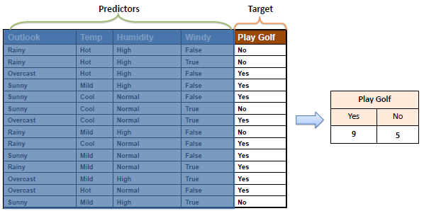
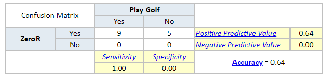

# ZeroR

ZeroR 是最简单的分类方法，该方法仅依赖于target，而不考虑任何的特征值。它只是给出最大的一个分类（class）。

虽然 ZeroR 没有任何预测能力，但是可以作为其他分类方法的基准，进行性能测试。

## 算法

为 target 构建一个频率表（Frequency Table），选择出现最多的值。

例如：

上面的频率表包含四个属性值（Predictor），Target 为 Play Golf。出现最多的为 "Play Golf = Yes"。

如果使全部为 "Play Golf = Yes"，则预测正确的为 9 个，错误的为5个。这就是 ZeroR 的方式。

    准确率=9/14=0.64

## 特征值贡献

ZeroR 不使用任何特征值，所以，特征值在该分类方法上，没有任何贡献。

## 模型评价

从下面的矩阵可以看出，ZeroR 只是给出最大的分类，只能作为其他分类方法的性能测试基准。

