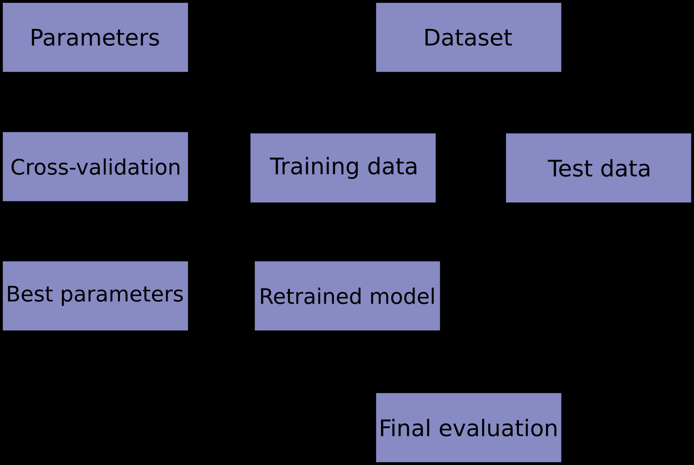

# 交叉验证

## 简介

​使用相同的数据集学习预测函数的参数、 通过对预测函数参数的训练，并在相同的数据集上进行测试，是一个错误的方法论：如果一个模型对相同样本标签进行训练和测试，模型的得分会很高，但在实验数据上的表现会很差，这种情况被称为过拟合。为了避免过拟合，在执行有监督的机器学习“实验”时，常见的方法是将已有数据集中保留一部分数据作为测试集，即Xtest, Ytest。需要注意的是：“实验”并不仅用于学术领域，因为在商业领域中，机器学习通常也是以实验为开端。如下是一个交叉验证流程图。最优参数选择可以参考grid search。

