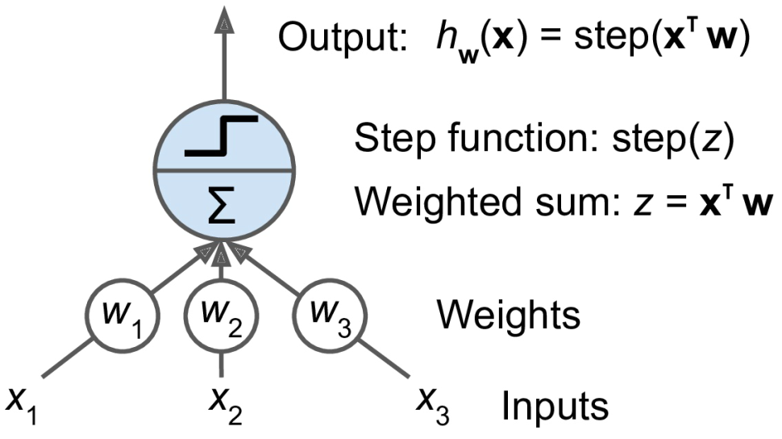
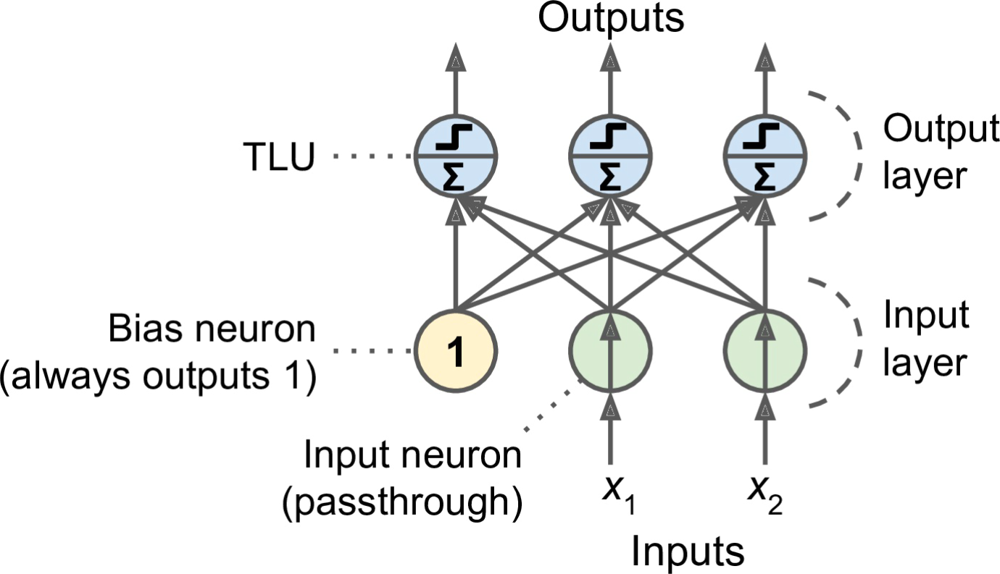
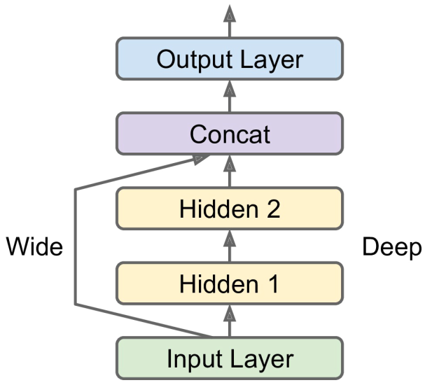
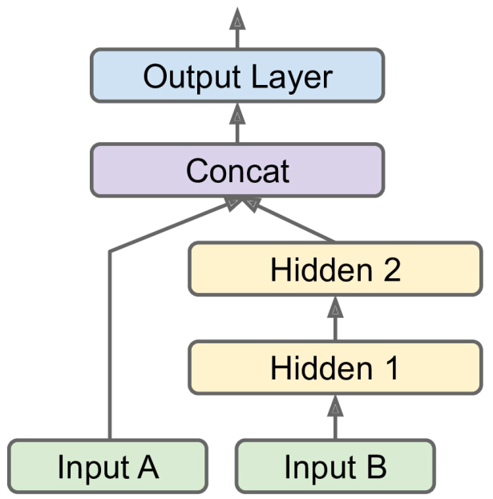

# 人工神经网络

- [人工神经网络](#人工神经网络)
  - [简介](#简介)
  - [感知机](#感知机)
  - [多层感知机](#多层感知机)
  - [回归 MLP](#回归-mlp)
  - [使用 Keras 实现 MLP](#使用-keras-实现-mlp)
  - [广域深度神经网络（Wide & Deep）](#广域深度神经网络wide--deep)
  - [超参数微调](#超参数微调)

2021-05-11, 12:22
***

## 简介

人工神经网络（artificial neutral networks, ANNs）是深度学习的核心。ANNs 通用性强、强大、可扩展，使其成为解决大型和高度复杂的机器学习任务的理想选择，如分类数十亿的图像（如 Google Images），语音识别服务（如 Apple 的 Siri），视频推荐系统（如 YouTube），以及下棋（DeepMind 的 AlphaGo）。

## 感知机

感知机是最简单的 ANN 架构之一，由 Frank Rosenblatt 于 1957 年发明。它基于一种稍微不同的人工神经元，称为阈值逻辑单元（threshold logic unit, TLU），也称为线性阈值单位（linear threshold unit, LTU）。其输入和输出为数字，每个输入连接对应一个权重值。TLU 计算输入加权和 $z=w_1x_1+w_2x_2+...+w_nx_n=x^Tw$，然后使用阶跃函数（step function）输出结果：$h_w(x)=step(z)$，其中 $z=x^Tw$。



Heaviside 是最常见的阶跃函数：

$$
heaviside(z)=\begin{cases}
    0 &\text{if } z\lt 0 \\
    1 &\text{if } z \ge 0
\end{cases}
$$

单个 TLU 可用于简单的线性二元分类问题。例如使用一个 TLU，根据花瓣的长度和宽度对鸢尾花进行分类，此时，训练 TLU 就是找到合适的 $w_0$, $w_1$ 和 $w_2$ 值。

感知机只有一层 TLU，每个 TLU 都连接所有的输入。当一层中的所有神经元都与上一层（如输入层）的每个神经元都连接，该层就称为**全连接层**（fully connected layer），或密集层（dense layer）。下图是包含两个输入和三个输出的感知机：



每个输出神经元的决策是线性的，所以感知机不能学习复杂的模型（和逻辑回归分类器一样）。

Scikit-Learn 提供了实现感知机类 `Perceptron`：

```py
import numpy as np
from sklearn.datasets import load_iris
from sklearn.linear_model import Perceptron

iris = load_iris()
x = iris.data[:, (2, 3)]  # petal length, petal width
y = (iris.target == 0).astype(np.int)  # Iris setosa?

per_clf = Perceptron()
per_clf.fit(x, y)
y_pred = per_clf.predict([[2, 0.5]])
print(y_pred)
```

感知机不输出概率值，而是根据固定的阈值输出一个结果。因此我们更愿意选择逻辑回归，而不是感知机。

Marvin Minsky 和 Seymour Papert 在 1969 年出版的专著 《Perceptrons》中重点提出了感知机的一些严重缺陷，特别是感知机无法解决一些简单的问题，如异或（XOR）分类问题。应该说任何线性分类模型都无法解决该问题，但研究人员对感知器期望要高很多，所以很多人直接放弃了神经网络。

不过事实证明，感知机的一些缺陷可以通过叠加感知机来消除。由此获得神经网络称为多层感知机（Multilayer Perceptron, MLP）。MLP 可以解决异或问题。

## 多层感知机

MLP 包含一个输入层（input layer），一层或多层 TLUs，称为隐藏层（hidden layer），以及最后一个 TLUs 层称为输出层（output layer）。接近输入层的称为低层（lower layer），接近输出层的称为高层（upper layer）。除了输出层每层都有一个 bias 神经元，并且和下层全连接。MLP 结构示例如下：


> 这种信号单方向传播（从输入到输出）的结构称为前馈神经网络（feedforward neutral network, FNN）。

研究人员寻找有效训练 MLP 的方法多年，直到 1986 年，David Rumelhard, Geoffrey Hinton 和 Ronald Williams 发表了一篇开创性论文，介绍了反向传播训练算法（backpropagation），该算法至今仍在使用。简而言之，它是一种梯度下降法，只是使用了一个可以自动计算梯度的高效技术。

该算法的大致流程为：
- 它一次处理一批数据（mini-batch，例如一批 32 个样本），并且多次迭代整个数据集。迭代一次称为一个 epoch。
- 每个 mini-batch 传递到输入层，然后发送到第一个隐藏层，对 mini-batch 的每个样本计算该层所有神经元的输出，并将结果输出到下一层，依次类推，知道获得输出层的结果。这个过程为向前遍历（forward pass），这和预测的过程一样，只是需要保留所有中间层的计算结果，因为向后遍历需要它们。
- 计算输出错误：使用损失函数比较期望输出和实际输出的差别，并返回误差的度量值。
- 然后计算每个输出连接对误差的贡献程度。这里应用链式规则（微积分基本规则）完成分析。
- 继续使用链式规则计算下一层多误差的贡献，一直向下直到输入层为止。这个反向传递可以有效度量网络中所有连接权重的误差梯度。
- 最后，执行梯度下降步骤，使用刚刚计算的误差梯度来调整网络中的连接权重。

总结：反向传播算法首先预测（正向传播）并计算误差，然后反向遍历每一层以计算每个连接对误差的贡献（反向传播），最后调整连接权重以减少误差（梯度下降）。

> 随机初始化所有隐藏层的连接权重很重要，否则训练容易失败。例如，如果将所有权重和 bias 初始化为 0，则给定层中所有神经元就完全相同，反向传播对它们的影响就完全一样，因此它们的权重值就一直相同。相反，如果随机初始化权重，则会打破这种对称性，从而允许反向传播调整不同神经元的权重。

## 回归 MLP

典型回归 MLP 结构：

|超参数|典型值|
|---|---|
|# input neurons|一个特征对应一个，例如 MINIST 为 28x28=784|
|# hidden layers|取决于问题，一般 1-5 个|
|# neurons per hidden layer|取决于问题，一般 10-100 个|
|# output neutrons|每个预测维度 1 个|
|Hidden activation|ReLU 或 SELU|
|Output activation|None，正输出（ReLU, softplus），指定范围输出（logistic/tanh）|
|Loss function|MSE or MAE/Huber|

## 使用 Keras 实现 MLP

## 广域深度神经网络（Wide & Deep）

WD 网络将全部或部分输入直接连接到输出层，如下所示：



这种结构使得神经网络既可以学习深度模式（使用深度路径），也可以学习简单规则（通过短路径）。相比之下，常规 MLP 强制所有数据流经所有层，数据中的简单模型可能最终被扭曲。

下面使用 California housing 数据集构建该网络模型：

```py
import tensorflow.keras as keras

input_=keras.layers.Input(shape=X_train.shape[1:]) # 创建 Input 对象
hidden1=keras.layers.Dense(30,activation="relu")(input_) # 创建 Dense 1 层，接收 input_ 输入
hidden2=keras.layers.Dense(30,activation="relu")(hidden1) # 创建 Dense 2 层，接收 Dense 1 的输入
concat=keras.layers.Concatenate()([input_,hidden2]) # 创建 Concatenate 层，连接 input 和 hidden 2 层
output=keras.layers.Dense(1)(concat) # 输出层
model=keras.Model(inputs=[input_],outputs=[output]) # 创建模型，指定输入和输出
```

如果我们需要部分 feature 走短路，部分 feature 走深路，如下所示：



此时可以采用多个输入。例如：

```py
input_A=keras.layers.Input(shape=[5],name="wide_input")
input_B=keras.layers.Input(shape=[6],name="deep_input")
hidden1=keras.layers.Dense(30,activation="relu")(input_B)
hidden2=keras.layers.Dense(30,activation="relu")(hidden1)
concat=keras.layers.concatenate([input_A,hidden2])
output=keras.layers.Dense(1,name="output")(concat)

model=keras.Model(inputs=[input_A,input_B],outputs=[output])
```

然后就可以编译并使用模型：

```py
model.compile(loss="mse",optimizer=keras.optimizers.SGD(lr=1e-3))

X_train_A,X_train_B=X_train[:,:5],X_train[:,2:]
X_valid_A,X_valid_B=X_valid[:,:5],X_valid[:,2:]
X_test_A,X_test_B=X_test[:,:5],X_test[:,2:]
X_new_A,X_new_B=X_test_A[:3],X_test_B[:3]

history=model.fit((X_train_A,X_train_B), # 注意这里是两个输入
                    y_train,epochs=20,
                    validation_data=((X_valid_A,X_valid_B),y_valid))
mse_test=model.evaluate((X_test_A,X_test_B),y_test)
y_pred=model.predict((X_new_A,X_new_B))
```

很多时候我们都需要多个输出：

- 任务需要。例如对图像中的主要对象定位并分类，包含回归任务（对象中心位置）和分类任务。
- 你可能有基于相同数据的多个独立任务。当然可以每个任务训练一个神经网络，但是在很多情况下，使用单个神经网络，每个任务对应一个输出效果会更好。
- 用作正则化技术。

## 超参数微调

神经网络的灵活性导致其有超级多的超参数需要调整。那么如何知道什么超参数组合最合适？

可以直接尝试多种超参数组合，看看哪个在验证集上效果最好。例如，使用 `GridSearchCV` 或 `RandomizedSearchCV` 搜索超参数空间。要做到这一点，