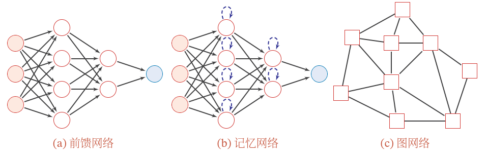

# 前馈神经网络

- [前馈神经网络](#前馈神经网络)
  - [网络结构](#网络结构)
    - [前馈网络](#前馈网络)
    - [记忆网络](#记忆网络)
    - [图网络](#图网络)
  - [前馈神经网络](#前馈神经网络-1)

2021-06-03, 20:30
***

## 网络结构

目前常用的神经网络结构有三种。如下图所示：

### 前馈网络

上一层的输出作为下一层的输入，这种神经网络叫作**前馈神经网络**。

前馈网络中各个神经元按接收信息的先后分为不同的组。每一组可以看作一个神经层。每一层中的神经元接收前一层神经元的输出，并输出到下一层神经元。整个网络中的信息朝一个方向传播，没有反向的信息传播，可以用一个有向五环图表示。前馈神经网络包括全连接前馈网络和卷积神经网络等。

前馈网络可以看作一个函数。通过简单非线性函数的多次复合，实现输入空间到输出空间的复杂映射。这种网络结构简单，易于实现。

### 记忆网络

记忆网络，也称为反馈网络，网络中的神经元不但可以接收其他神经元的信息，也可以接收自己的历史信息。和前馈网络相比，记忆网络中的神经元具有记忆功能，在不同时刻具有不同的状态。记忆神经网络中的信息传播可以是单向传递或双向传递，因此可用一个有向循环图或无向图来表示。

记忆网络包括循环神经网络、Hopfield 网络、玻尔兹曼机、受限玻尔兹曼机等。

记忆网络可以看作一个程序，具有更强的计算和记忆能力。

为了增强网络的记忆容量，可以引入外部记忆单元和读写机制，用来保存一些网络的中间状态，称为记忆增强网络（Memory Augmented Neutral Network, MANN），比如神经图灵记和记忆网络等。

### 图网络

前馈网络和记忆网络的输入都可以表示为向量或向量序列。但实际应用中很多数据是图结构的数据，比如知识谱图、社交网络、分子（Molecular）网络等。前馈网络和记忆网络很难处理图结构的数据。

图网络是定义在图结构数据上的神经网络。图中每个节点由一个或一组神经元构成。节点之间的连接可以是有向的，也可以是无向的。每个节点可以收到来自相邻节点或自身的信息。

图网络是前馈网络和记忆网络的泛化，包含很多不同的实现方式，比如图卷积网络（Graph Convolutional Network, GCN）、图注意力网络（Graph Attention Network, GAT）、消息传递神经网络（Message Passing Neural Network, MPNN）等。

## 前馈神经网络

前馈神经网络（Feedforward Neural Network, FNN）是最早发明的简单神经网络，也被称为多层感知器（Multilayer Perceptron，MLP），是最典型的深度学习模型。但多层感知器的叫法不是很合理，因为FNN其实是由多层 Logistic 回归模型（连续的非线性函数）组成，而不是由多层的感知器（不连续的非线性函数）组成。

前馈神经网络的目标是逼近某个函数 f*。
